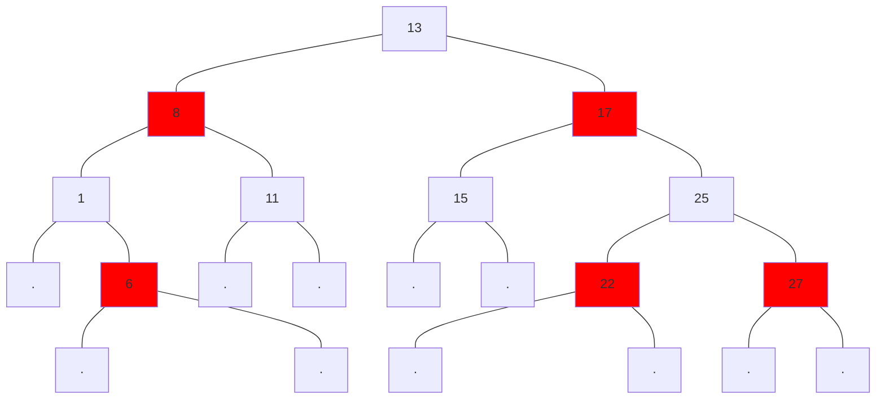

# 简单算法
## 1. 排序
### 冒泡排序
每一项与后一项对比，o(n^2)

### 选择排序
找到数组最小值，放在第一位，...以此类推。o(n^2)

```js
function selectSort(arr) {
  const len = arr.length;
  let minIndex = null;
  for (let i = 0; i < len - 1; i++) {
    // 假设当前索引为最小索引
    minIndex = i;
    for (let j = i +1; j < len; j++) {
      // 比假设值还小
      if (arr[j] < arr[minIndex]) {
        // 找到最小索引位置
        minIndex = j; 
      }
    }
    // 当前项值和最小值交换位置
    if (i !== minIndex) {
      [arr[i], arr[minIndex]] = [arr[minIndex], arr[i]];
    }
  }
  return arr;
}


```

### 插入排序
o(n^2)，类似打扑克牌排大小
思路：将第一个元素视为有序序列，遍历数组，将之后元素依次插入这个构建的有序序列中。
```js
function insertionSort(arr) {
  for (let i = 1; i < arr.length; i++) {
    const element = arr[i];
    for (let j = i - 1; j >= 0; j--) {
      const tmp = arr[j];
      if (tmp > element) {
        arr[j + 1] = tmp;
      } else {
        break;
      }
    }
    arr[j+1] = element;
  }
  return arr;
}

```

### 归并排序
数组分成足够小，合并2个有序数组，o(nlogn)
1. 把长度为n的输入排序分成2个长度为n/2的子序列；
2. 对这2个子序列分别归并排序；
3. 子序列合成一个最终排序；

```js

function merge(left, right) {
  const result = [];
  while(left.length && right.length) {
    if (left[0] <= right[0]) {
      result.push(left.shift());
    } else {
      result.push(right.shift());
    }
  }
  while(left.length) {
    result.push(left.shift());
  }
  while(right.length) {
    result.push(right.shift());
  }
  return result;
}
function mergeSort(arr) {
  const len = arr.length;
  if (len < 2) {
    return arr;
  }
  const middle = Math.floor(len / 2);
  const left = arr.slice(0, middle);
  const right = arr.slice(middle);
  return merge(mergeSort(left), mergeSort(right));
}
```


### 快排
时间复杂度：o(nlogn)  
快排三步： 
1. 任选一个元素作为“基准”
2. 将小于“基准”和大于“基准”元素分别放到2个新数组中，等于“基准”的元素可以放在任一数组
3. 对于2个新数组不断重复1.2步，直到数组只剩下一个元素，这时step2的数组已经有序（leftArray + 基准元素 + rightArray）

```js
function quickSort(arr) {
  if (arr.length <= 1) {
    return arr;
  }
  const mid = Math.floor(arr.length / 2);
  // 提取出midItem
  const midItem = arr.splice(mid, 1)[0];
  const left = [];
  const right = [];
  arr.forEach((item) => {
    if (item <= midItem) {
      left.push(item);
    } else {
      right.push(item);
    }
  });

  const _left = quickSort(left);
  const _right = quickSort(right);
  return _left.concat(midItem, _right);
}
```
优化？用一句话写快排？
```js
function quickSort(a) {
  return a.length <= 1 ? a : quickSort(a.slice(1).filter((item) => item <= a[0])).concat(a[0], quickSort(a.slice(1).filter((item) => item > a[0])));
}
```


### 桶排序原理
n个数据，m个桶，每个桶有k = n / m 个元素。
每个桶快排，时间复杂度o(klogk), m个桶o(m*klogk) = o(n* log n/m), 当n约定于m时，趋向于 o(n).

适用：数据存在外部磁盘中，数据大而内存有限。10G订单按照金额排序，内存几百MB?
1. 扫描下确定金额范围，比如1万-10万之间，分到100个桶中，[1, 1000],[1001, 2000] ...每个桶对应一个文件。
2. 金额分布均匀，每个文件大约100M数据，每个小文件读入内存，快排按顺序读取数据，写入另外一个文件中，即排好的顺序了。


### 基数排序原理
如有10万个手机号进行排序，怎么做到时间复杂度为o(n) ?
手机号a,b, a手机号前几位比b大，后面几位就不用看了。
从手机号码最后一位开始，按每一位数字对手机号码排序，依次往前，经11次排序。  
举个例子：
```js
h k e     i b a   h a c    i b a
i b a     h a c   i b a    i k f
h z g ->  h k e-> h k e -> h a c
i k f     i k f   i k f    h k e
h a c     h z g   h z g    h z g

```

## 2. 乱序
### 普通版
```js
function shuffle(arr) {
  return arr.sort(() => Math.random() - 0.5);
}
```
问题：并不是真正随机
v8处理sort时，当目标数组长度 < 10时使用插入排序，反之使用快速排序。
元素之间比较次数 << n*(n-1)/2, 某些元素之间没比较的机会（也就无交换的可能）。

### 真正的乱序(Fisher-Yates算法)
1. 排序好数组：1 2 3 4 5 6 7 8 9
2. 末尾开始，选最后一个数：1 2 3 4 5 6 7 8 「9」
3. 在9个位置中随机选中一个位置，与最后一个元素交换。
```js
1 2 [9] 4 5 6 7 8 [3]
     \____________/
```
4. 对倒数第2个元素，除去最后一个位置，再随机选一个变换；
```js
 [8] 2 9 4 5 6 7 [1] 3
  \______________/
```
5. 以此类推；
```js
function shuffles(arr) {
  let m = arr.length;
  while(m > 1) {
    let index = Math.floor(Math.random() * m--);
    [arr[m], arr[index]] = [arr[index], arr[m]];
  }
  return arr;
}
```


## 3. 遍历

### 广度优先遍历
Q: 期望给出广度优先遍历(BFS), 遍历每个节点，打印出节点的类型和类名。

```html
<div class="root">
  <div class="container">
    <section class="sidebar">
      <ul class="menu"></ul>
    </section>
    <section class="main">
      <article class="post"></article>
      <p class="copyright"></p>
    </section>
  </div>
</div>
```

A: 使用队列管理遍历节点。
```js

const printInfo = (node) => {
  console.log(node.tagName, `${node.className}`);
}
const traverse = (ndRoot) => {
  const queue = [ndRoot];
  while (queue.length) {
    const node = queue.shift();
    prinInfo(node);
    if (!node.children.length) {
      continue;
    }
    Array.from(node.chilren)
    .forEach(x=> queue.push(x));
  }
}
// 调用
traverse(document.querySelector('.root'));

```

### 广度优先搜索
breadth-first search BFS
例如：解决最短路径问题的算法称为广度优先搜索。
使用图来建立模型。  
解决2类问题：
1. 节点A出发，有到B的路径吗？
2. 节点A出发，到B,那条路径最短？

要求：按顺序添加，才能保证知道的是最短路径。 


栗子：在你的人际关系网中有芒果经销商吗？
```js
    anuj            daire ——> thom
     ^              ^ \
      \            /   ↓
      Bob <———— you    jonny
      ↓         ↓
     peggy <—— alice
    
    
// 利用散列表表示图
const graphy = {};
graph["you"] = ["alice", "Bob", "daire"];
graph.bob = ["anuj", "peggy"];
graph.alice = ["peggy"];
...
```

算法思路：
1. 创建**队列**，用于存储要检查的人；
2. 队列中弹出一人；
3. 检查这个人是否是芒果经销商；
4. 是：成功；否：将这个人的所有邻居加入队列；
5. 回到第二步；
6. 队列为空，你的人际关系中无经销商；

```js
function search(name) {
  const search_queue = [];
  search_queue.push(...graph[name]);
  const searched = [];
  while (search_quene.length) {
    const person = search_queue.shift();
    if (!searched.includes(person)) {
      if (person_is_searller(person)) {
        return true;
      }
      else {
        search_queue.concat(graph[person]);
        searched.push(person);
      }
    }
  }
  return false;
}
```
运行时间：O(人数 + 边数量)


## 4. 二叉树
二叉树查找：相对较小的值保存在左节点，较大的值保存在右边节点。

定义节点: 
```js
function Node(data, left, right) {
  this.left = left;
  this.right = right;
  this.data = data;
  this.show = () => this.data;
}


```


### 4.1 二叉树的遍历
* 前序遍历（根左右）：最后一个最大，第一个是root；
* 中序遍历（左根右）：从小到大；
* 后序遍历（左右根）：根节点在最后；

例如：
```js
              56
            /    \
           22     81
          /  \   /  \
         10  30 77   92

```
前序遍历：56 22 10 30 81 77 92
中序遍历：10 22 30 56 77 81 92
后序遍历：10 30 22 77 92 81 56


```js
// 中序遍历 easy
function inOrder(node) {
  if (node !== null) {
    inOrder(node.left);
    console.log(node.show());
    inOrder(node.right);
  }
}
// 前序遍历
function preOrder(node) {
  if (node !== null) {
    console.log(node.show());
    preOrder(node.left);
    preOrder(node.right);
  }
}
```

### 4.2 二叉搜索树查找
最小值
```js
function getMin(bst) {
  let current = bst.root;
  while (current.left !== null) {
    current = current.left;
  }
  return current.data;
}
```
最大值
```js
function getMax(bst) {
  let current = bst.root;
  while (current.right !== null) {
    current = current.right;
  }
  return current.data;
}
```

```js
function find(target, bst) {
  let current = bst.root;
  while (current !== null) {
    if (target === current.data) {
      return true;
    } else if (target > current.data) {
      current = current.right;
    } else if (target < current.data) {
      current = current.left;
    }
  }
  return false;
}
```

### 4.3 二叉树的插入
```js

function insertNodeByFather(parent, newNode) {
    // 新节点小
    if (newNode.data < parent.data) {
        // 判断左节点是否为空
        if (parent.left === null) {
            parent.left = newNode;
        } else {
            insertNodeByFather(parent.left, newNode);
        }
    } else {
        parent.right && insertNodeByFather(parent.right, newNode);
        !parent.right && (parent.right = newNode);
    }
}
// 默认根节点的值小于左节点的值，大于右节点的值
function insert(data) {
  const node = new Node(data, null, null);
  // 如果没有根节点，插入就是根节点
  if (this.root === null) {
    this.root = node;
  } else {
    insertNodeByFather(this.root, node);
  }
}

function BST () {
  this.root = null;
  this.insert = insert;
}
```

### 4.4 红黑树

二叉查找树缺陷：
```js
                         9
                        / \
                       8   12
                      /
                     7
                    /
                   6
                  /
                 5
                /
               4  
```
查找性能大打折扣。
解决：因为二叉查找树多次插入新节点而导致不平衡，用红黑树。

  



红黑树特性：
1. 节点红or黑；
2. 根节点是黑；
3. 每个叶子节点都是黑色的空节点（NIL节点）
4. 每个红节点的2个子节点都是黑色；
5. 从任一节点到其每个叶子的所路径都包含相同数目的黑色节点；

红黑树从根到叶子的最长路径不会超过最短路径的2倍。  
插入新节点需调整：  
* 变色
* 旋转
    * 左旋转
    * 右旋转


## 5. 分而治之
思路：
1. 找出简单的基线条件；
2. 确定如何缩小问题的规范，使其符合基线条件；

栗子：快速排序
