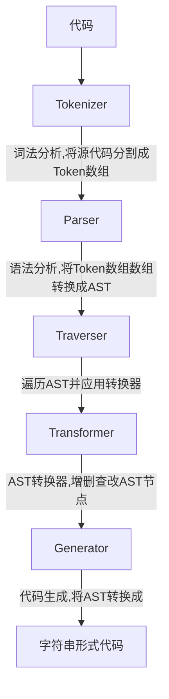

# Babel
js编译器，涉及创建操作抽象语法树（AST）
步骤：解析 ——> 转换 ——> 生成

## Babel处理流程



#### 解析
输出AST:
* 词法分析；代码——> 令牌流
* 语法分析：令牌流——> AST

#### 转换
接AST进行遍历，对节点添加、更新、移除

#### 生成
变换后AST ——> 字符串形式代码

## AST
AST每一层都有：
* type: "FunctionDeclaration"
* id: {...}
* params: [...]
* body: {...}

额外属性start/end/loc等，描述该节点在原始代码中的位置。

## 配置
**preset**: 插件集合。例如es2015包含十几二十转义插件，可单个安装也可使用preset套餐。
执行顺序：
* plugin: 运行在preset之前，从前到后顺序执行；
* preset：从后向前（保证向后兼容）,例如preset: ["es2015", "stage-0"]先执行stage-0才不报错。

**env**：通过配置得知目标环境的特点，只做必要转换。但是内置函数、新的实例方法无法转换！
解决？babel/polyfill.

**babel-polyfill**: 源码中import进来，大小约89k。
转换新的API(很大)，babel会转换js语法，但每个转化的文件都会插入一个段转换后定义的代码导致重复。
使用babel-plugin-transform-runtime之后，从定义方法改成引用，重复定义即重复引用，不存在代码重复了。
**babel-runtime** 是这些方法集合处:
1. core-js:转换一些内置类（Promise、Symbol等）、静态方法等；
2. regenerator:generator/yeild、async/await、
3. helpers


### 问题
#### Q: 只使用某个新方法，引入整个垫片又太大了？
A: 设置useBuiltIns参数。
```json
"preset": [
    ["@babel/preset-env", {
        "useBuiltIns": "usage",
        "corejs": 2
    }]
]
```
编译后仅把需要的垫片require进来。
举个栗子：

```js
const isHas = [1, 2, 3].includes(2);
const p = new Promise((resolve, reject) => {
    resolve(100);
});
```

编译后：
```js
"use strict"
require("core-js/modules/es.array.includes");
require("core-js/modules.es.object.to-string");
require("core-js/moduels/es.promise");
// ...
```


#### Q: 会使用小的辅助函数实现一些公共方法，多次使用多次inject到文件，冗余？比如_creaeClass的_classCallCheck()?
A: @babel/plugin-transform-runtime, 该插件会开启对babel注入辅助函数的复用，以节省代码体积。  
所有帮助程序（比如上边的_classCallCheck）都将引用模块@babel/runtime， 所以需要安装@babel/runtime。  
@babel/plugin-transform-runtime: 开发依赖；
@babel/rumtime: 生产依赖.
即_classCallCheck函数不再是注入式，而是require自@babel/runtime， 消除冗余。


#### Q: 以下的区别？
* babel/runtime
* babel/polyfill
* babel/plugin-transform-runtime

A: 
1. polyfill: 包括所有新的API等，让新的内置函数、实例方法等在低版本浏览器中也可以使用。需要在代码中先引用。
但是项目中如果只使用部分es6新api，引用整个垫片太大了，所以需要按需引入，直接注入垫片会有冗余问题。 
2. 可以使用plugin-transform-runtime用require方式引用一些帮助函数。
3. 这些帮助函数定义在runtime里。
