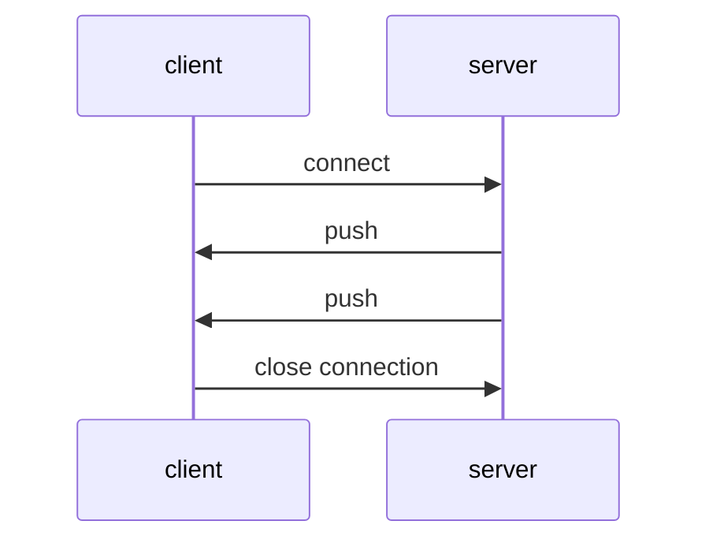
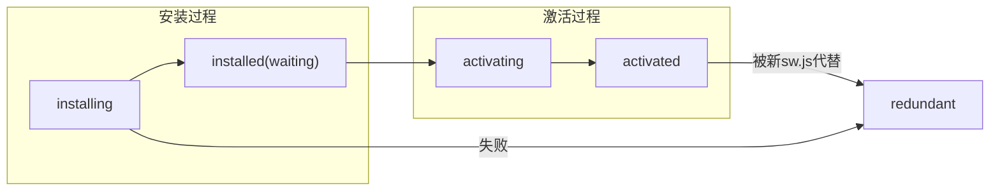
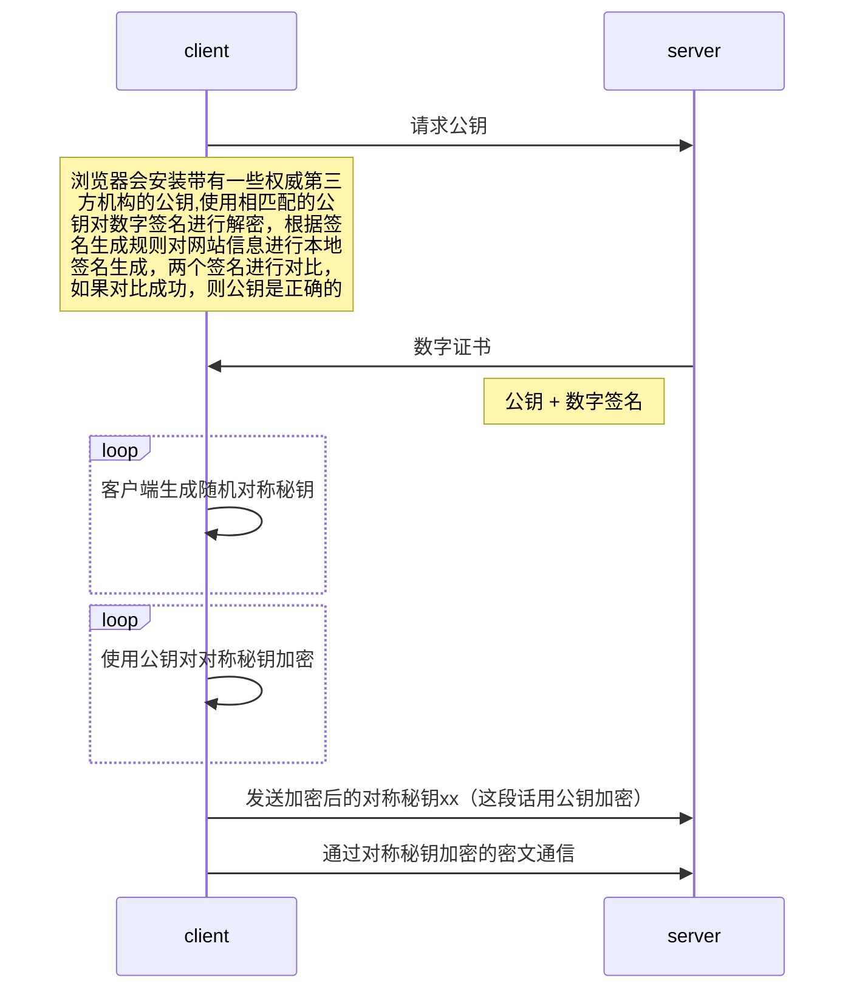
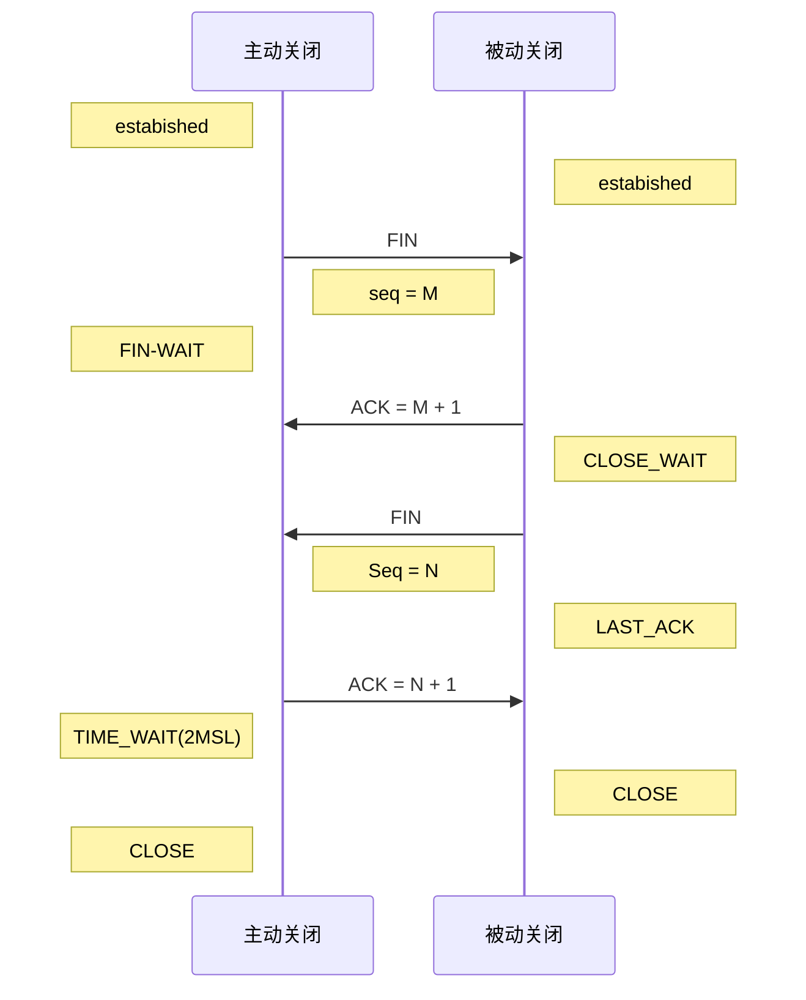

# http等
## 1. get/post
除了http层区别，在tcp/ip层面也有区别
get请求：
```
headers + data  --->   服务器
tcp数据包       <--- 200
```

post请求：
```js
headers  ----->    服务器
tcp包   <------
        100 continue

data     ----->    服务器
tcp包    <----
          200
```


### trace
TRACE:目的服务端发起一个环回诊断，最后一站的服务器会弹回一个TRACE响应并在响应主体中携带它收到的原始请求报文，用于诊断，用于验证请求是否如愿穿过了请求/响应链

### response报文
结构：
```js
HTTP/1.1 200 OK
DATE: tue, 08 Jul 2014 05:28:43: GMT
Server: Apache/2
...
{"name": "gin", "age": 25}
```
1. 首行是状态行包括HTTP版本，状态码，状态描述，后跟LRLF;
2. 若干行响应头，包括通用头部、响应头部、实体头部
3. 响应头部和响应实体之间用一个CRLF空行分隔；
4. 可能的消息实体。


### 区别
1. 关于GET请求参数必须放在url上，post参数放在body。http的行为准则，你要给GET加上request body, POST带上url参数，技术上行的通，但是不同服务器处理方式不同，不一定保证服务器会读出数据。

2. 关于GET参数有长度限制，POST没有。
理论上，url可无限添加参数，但是数据量太大对浏览器和服务器都是很大的负担。不成文规定，大多数浏览器会限制url长度在2k个字节，大多数服务器最多处理64k的url。

3. 安全性
GET请求的参数会显示在URL中，因此对于敏感信息不宜使用GET请求，因为敏感信息可能会被浏览器保存、历史记录或被其他人看到。

POST请求的参数在请求的正文中，相对来说更加安全，但仍然不是绝对安全，因为HTTP是明文传输的，只有使用HTTPS才能加密传输数据。

4. 幂等性
GET请求是幂等的，多次执行相同的GET请求，服务器的状态不会发生变化。这里来扯出幂等主要是为了处理同一个请求重复发送的情况,假如在请求响应之前失去连接,如果这个请求时幂等的,那么就可以放心的重发一次请求。所以可以得出get请求时幂等的,可以重复发送请求,post请求时不幂等的,重复请求可能会发生无法预知的后果。


## 2. 双向通信
### 2.1 webSocket
双向、按时到达的数据流。
允许服务器主动发送信息给客户端，双向数据流协议
与http是两码事。
* 传统TCP socket：标准化的API
* webSocket: 网络协议
```js
// 创建WebSocket协议请求
const socket = new WebSocket('ws://127.0.0.1/updates');
// 连接打开，每50ms向服务器端发送一次数据
socket.onopen = function() {
  setInterval(function() {
    if (socket.bufferedAmount === 0) {
      socket.send(getUpdateData());
    }
  }, 50);
}

// 接收服务器端传来的数据
socket.onmessage = function(event) {
  // todo
};
```
websocket握手：通过HTTP发起请求报文,只支持GET  
协议头区别：
从客户端到服务器：
* GET /chat HTTP/1.1
* Connection: Upgrade (要升级协议)
* Upgrade: websocket （升级到websocket协议）
* Sec-WebSocket-Version: 13 （websocket版本，如果服务端不支持，需返回一个Sec-WebSocket-Version header, 包含支持的版本）
* Sec-WebSocket-key:xxxx （提供基础防护，恶意连接）

从服务器到客户端：
* HTTP/1.1 101 WebSocket Protocol HandShake
* Upgrade: websocket
* Connection: Upgrade
* Sec-WebSocket-Accept:xxxx

**Sec-WebSocket-Accept** 计算：
* 将Sec-WebSocket-Key跟258EAFA5-E914-47DA-95CA-...拼接；
* 通过SHA1计算出摘要，并拼接成base64字符串；
* 主要并不是确保数据安全性，转换计算是公开的，且简单，主要是预防一些常见的意外情况。

#### 数据帧格式

```js
0 1 2 3 4 5 6 7 8 9 0 1 2 3 4 5 6 7 8 9 0 1 2 3 4 5 6 7 8 9 0 1
 | | | |       | |             |
F|R|R|R|opcode |M|Payload len  |Extend payload length
I|S|S|S|(4)    |A|  (7)        |   (16164)
N|V|V|V|       |S|             |
 |1|2|3|       |K|             |
```
**FIN**: 1个bit：
* 1： 这是消息的最后一个分片；
* 0：不是消息的最后一个分片；

**RSV1、RSV2、RSV3**: 各1bit（000）
当采用websocket扩展，这3个标志位可非0；

**Opcode**: 4个比特，应如何解析后续的数据载荷
* %x0:一个连续帧，当前数据帧为一其中一个数据分片；
* %x1: 一个文本帧；
* %x2: 二进制帧；
* %x3-7: 保留；
* %x8: 连续断开；
* %x9: ping操作；
* %xA: Pong操作；
* %B-F: 保留；

**MASK**: 1个bit，
* 1： 用掩码键对数据载荷进行反掩码。
* 0：不用。

数据掩码并不是为了防止数据泄密，为了防止早期版本的协议中存在的代理缓存污染攻击等问题。

**Masking-key**: 0 or 4字节（32位）


#### 用Nodejs实现websocket协议
1. 调用
客户端通过HTTP Upgrade 请求，由服务器进行协议转换。

伪代码：
```js
const server = http.createServer(function(req, res) {
    res.end('websocket test \r\n');
});
// upgrade请求
server.on('upgrade', function(req, socket, upgradeHead) {
    // 初始化ws
    const ws = new WebSocket(req, socket, upgradeHead);
    //...
});
```

2. 构造函数
```js
class WebSocket extends EventEmitter {
    construtor(req, socket, upgradeHead) {
        super();
        // 1. 构造响应头部分resHeaders
        // 2. 监听socket的data事件，以及error事件
        // 3. 初始化成员属性
    }
}

```

2. 1 返回相应头:
    * 将SecWebSocket-Key跟xx拼接；
    * 通过SHA1计算出摘要，并拼接成base64字符串；

```js
const reskey = hasWebSocketKey(req.headers['sec-websocket-key']);
// 构造响应头
const resHeaders = [
    'HTTP/1.1 101 Switching Protocols',
    'Upgrade:websocket',
    'Connection: Upgrade',
    'Sec-WebSocket-Key: '+ resKey
]
.concat(',')
.join('\r\n');
socket.write(resHeaders);

```

2. 2 监听事件

```js
socket.on('data', data => {
    thi.buffer = Buffer.concat([this.buffer, data]);
    while(this._processBuffer()) {}
});

```

3. 帧数据的处理Frame
Opcode操作码决定了如何解析后续的数据载荷。
Opcode：
* 数据帧
* 操作帧

```js
// 截取第一个字节后4位
const opcode = byte1 & 0x0f;
this._handleFrame(opcode, payload);

_handleFrame(opcode, buffer) {
    let payload;
    switch(opcode) {
        case OPCODES.TEXT:
            // 文本需要转换成utf8
            payload = buffer.toString('utf-8');
            this.emit('data', opcode, payload);
            break;
        case OPCODES.BINARY:
            // 二进制文件直接交付
            payload = buffer;
            this.emit('data', opcode, payload);
            break;
        case OPCODES.PING:
            this.doSend(OPCODES.PONG, buffer);
            break;
        case OPCODES.PONG:
            // 不做处理
            break;
        case OPCODES.CLOSE:
            // close有很多关闭码
            let code, reason;
            if (buffer.length >= 2) {
                code = buffer.readUInt16BE(0);
                reason = buffer.toString('utf8', 2);
            }
            this.close(code, reason);
            this.emit('close', code, reason);
            break;
        default:
            this.close(1002, 'unhandle opcode:' + opcode);
            break;
    }
}
```


### 2.2 轮询
借助于setInterval等方式，客户端不断发送请求并得到相应。但轮询间隔过长，用户收到消息不及时，轮询间隔太短，增加服务器负担。


### 2.3 长轮询
客户端发出请求后，服务端用while(true)等方式阻塞住请求，直到有可用数据发送响应，又称为“comet”、“反向ajax”。但仍然是基于http的一种慢响应。
### 2.4 HTTP流（基于iframe）





使用http1.1且响应头中包含Transfer-Encoding:chunked情况下，服务器发送给客户端数据可分成多个部分，保持打开，并周期性flush()分块传输。但数据响应可能会因代理服务器or防火墙等中间人造成延迟。
### 2.5 SSE(Server-Sent-Events)
服务端响应内容类型是text/event-stream,在浏览器端使用EventSource对象处理返回的数据。
但不支持CORS，单向通信，浏览器兼容性差。


## 3.http1.1与http2

### http1.0
**线头问题**：
http1.0允许通过一个TCP连接发出一个请求，浏览器需等待缓慢的响应后才能再发起另一个。
协议规定每个主机最多打开2个TCP连接。
解决：
域分片（多个主机，多个域名）
浏览器供应商违反协议，任意增加开放连接数(chrome: 24)


### http1.1
在HTTP1.1中，默认支持长连接（Connection: keep-alive），即在一个TCP连接上可以传送多个HTTP请求和响应，减少了建立和关闭连接的消耗和延迟。
此外，HTTP1.1还引入了更多的请求头和响应头来完善功能，例如：

* 引入了更多的缓存控制策略，如If-Unmodified-Since、If-Match、If-None-Match等缓存头来控制缓存策略。
* 引入了range头，允许请求资源的某个部分。
* 引入了host头，实现在一台WEB服务器上可以在同一个IP地址和端口号上使用不同的主机名来创建多个虚拟WEB站点。

同时，HTTP1.1还新增了其他的请求方法：PUT、DELETE、OPTIONS等。
缺点：
1. 客户端对同一域请求连接数有限制，不同浏览器有不同规定；
2. 线头阻塞问题：同一连接中的请求，需串行发送接收；
3. 请求和响应头大，无法压缩；
4. 只能单向请求；

### http2
升级：
* 多路复用
* HPACK头压缩
* 流十二进制帧
* 流优先级等

特性：
1. 传输内容使用二进制协议（更小的传输体积）
2. 使用帧作为最小传输单位（低延迟）
3. 多路复用（并发，同一流中帧交错传输，先到不一定先返回）
4. 头压缩
5. 服务器推送
6. 优先级与依赖性
7. 可重置
8. 流量控制

#### 多路复用（并发，同一流中帧交错传输，先到不一定先返回）
```js
                  请求/响应帧交织在一起
     ________________________________________________
    |    _________  ________   ________   ________   |
浏  |___/  frame1 |/  frame2 |/ frame2 |_/ frame1 |__|   服
览  |   \ HEADERS |\ HEADERS |\  DATA  | \  DATA  |  |   务
器  |    —————————  —————————  ————————   ————————   |   器
    |                ________   _________            |
    |_______________| frame3 \_| frame3  \___________|
    |               |  DATA  / | HEADERS /           |
    |                ————————   —————————            |
    |________________________________________________|
                所有帧在另一端重新组装
```


#### 头压缩
HTTP2.0使用**首部表**来跟踪和存储之前发送的键值对，对于相同的数据，不再通过每次请求和响应发送。

首部表在HTTP2.0的连接存续期内始终存在，由客户端和服务器共同渐进地更新。这样就实现了对HTTP1.x中冗余头部信息的压缩，减少了数据传输量，降低了开销。

例如，下图中的两个请求，请求一发送了所有的头部字段，第二个请求则只需要发送差异数据，这样可以减少冗余数据，降低开销。


## 4. 缓存
### 强缓存：
HTTP通过缓存将服务器文档的副本保留一段时间，在这段时间内，都认为文档是新鲜的，浏览器返回200状态码（from cache）
### 协商缓存
缓存要再次与服务器验证，已查看文档是否发生了变化，结果3种：
* 命中：发送一个小的HTTP 304 Not Modified响应；
* 未命中：服务器与缓存副本不同，服务器发带有完整内容的HTTP 200 OK；
* 对象被删除：服务器返回404响应，缓存也会删除其副本。

**cache-control和etag有什么区别？**

1. cache-control：缓存控制头部，有no-cache、max-age等多种取值，用来控制强制缓存，在时间之内直接返回本地缓存，值是绝对时间。
    * no-cache: 实际机制是，仍然对资源使用缓存，每一次使用前必须向服务器进行验证。
    * no-store: 不使用任务缓存。
    * must-revalidate: 如果配置了max-age，当缓存仍然新鲜，可用，否则验证。

2. IF-None-Match/Etag： 成对出现，属于协商缓存内容。服务端头部是Etag，浏览器端是IF-None-Match，发出请求后，如果这2种匹配，则代表内容未变，通知浏览器使用本地缓存。

**Max-Age和Expries相比？**
Expries是http1.0内容，使用服务端时间，如果客户端与服务端时间不同步，可能造成缓存无用or 无法过期。
而Max-Age是客户端本地时间的计算，Cache-Control比Expries优先级高。


### 离线缓存
ServiceWorker本质上充当web应用程序与浏览器之间的代理服务器，旨在创建有效的离线体验，拦截网络请求并基于网络是否可用、资源是否驻留来采取适当动作。
本质：web worker,独立于js引擎线程，不直接访问DOM、Window对象，可访问navigator对象，有自身生命周期。
需要在js主代码中使用以下来安装。
```js
if ('serviceWorker' in navigator) {
  navigator.serviceWorker.register('/sw.js').then(function(registration) {
    // 成功，installed
    console.log('成功安装', registration.scope);
  }).catch(function(err) {
    // 失败，redundant状态
    console.log(err);
  })
}
```
### 文件路径
当前域根目录下，即和网站是同源，能代理http://xx.com下网络请求。

### 生命周期
1. 下载
2. 安装
3. 激活




### sw.js
#### 安装过程
```js
self.addEventListener('install', function(event) {
  console.log('callback 1:' + (Date.now()/1000));
  // 回调里有event.waitUntil(promise1), 则promise1被resolved时
  // sw对象才被installed，如果被reject则sw安装失败，回到redundant
  event.waitUntil(new Promise(function(resolve) {
    setTimeout(() => {
      console.log('resolve 2s');
      resolve();
    }, 2000);
  }));
  event.waitUntil(new Promise((function (resolve) {
    // 事件对象被处理完前serviceWorker不会进入下一个状态(installed或redundant)
    setTimeout(() => {
      console.log('resolve 3s');
      resolve();
    }, 3000);
  })))
});
// install callback1: 1542173
// sw state is installing
// resolve 2s
// resolve 3s
// sw state is installed
// sw state is activating
// sw state is activated
```
可以有多个回调事件，即多个self.addEventListener('install', function(event) {})里可以有多次调用event.waitUntil(promise)方法。
所有的promise都被resolved时，sw对象才被installed，只要存在被reject则安装失败（redundant）.

#### 安装成功
安装成功便进入installed，等待进入激活过程。
进入activating状态，触发activate事件。
```js
self.addEventListener('activate', function(event) {
  event._form = "callback 1";
  console.log('activate callbac1:' + (Date.now()/1000));
  // 回调里调用event.waitUntil(promise1)方法，promise1
  //被resolve/reject时，sw对象才进入下一个状态activated
  // 与install回调不同的是，reject状态不影响
  // ServiceWorker进入activated状态
  event.waitUntil(new Promise(function(resolve, reject) {
    setTimeout(() => {
      console.log('resolve 2s');
      resolve();
    }, 2000);
  }))
})
```

#### activated
serviceWorker控制页面，可监听功能事件(fetch)
fetch事件：
1. 多个fetch事件，回调的fetchEvent是同一个对象；
```js
self.addEventListener('fetch', function(event) {
  // 不可多次调用，最好同步方式写
  event.responsedWith(
    caches.match(event.request)
    .then(function(reponse) {
      if (response) {
        // 缓存命中
        return response;
      }
      return fetch(event.request);
    });
  )
})
```
2. 成功回调了fetchEvent.responsedWith方法，后面回调不执行；
3. 回调不可多次调用responsedWith，即一个request一个response;
4. 最好是同步方式调用fetchEvent.responsedWith，异步不会阻止后面的回调，造成多个response；
5. 如果没有调用responsedWith，则采用浏览器默认fetch事件回调函数处理，即走网络请求。


#### redundant
是ServiceWorker的终态。
进入终态情况：
1. register失败，多次调用register，后注册的sw变成redundant;
2. 安装失败；
3. 被新版ServiceWorker变成redundant状态；


## 5.HTTPS
超文本传输安全协议。经由HTTP进行通信，但利用SSL/TLS来加密数据包，提供对网站服务器的身份认证，保护数据的隐私与完整性。
**TLS/SSL**: 依赖散列函数、对称加密和非对称加密。
**TCP**: 传输层控制协议，提供面向连接、可靠的字节流服务。
```js
             _____________
            | server 私钥 |
             —————————————
         ^               ^
    _____|______   ______|_____
   |clientA 公钥|  |clientB公钥 | ...
    ———————————     ———————————

```
若公钥传输中被掉包？
数据签名 + 证书。
若没有签名，中间人也向第三方认证机构申请，拦截后把所有信息都替换成自己。




更多信息： 
> https://zhuanlan.zhihu.com/p/43789231

## 6.请求资源
请求静态资源的流程：
```js
web页面       -------------------------             ____________
  __         |   ________________     |            | 服务器     |
 |  |        |  | 浏览器私有缓存  |     |            |           |
 |  |        |   ————————————————     |            |           |
 |  |GET请求  |        ______          |            |           |
 |  |——————————————> | 查询 |          |            |           |
 |  |        |        ——————          |            |           |
 |  |        |     _____|____         |            |  _____    |
 |  |        |    |新鲜度检查 |———N————————————————————|再验证|   |
 |  |        |     ——————————         |            |  —————    |
 |  |200(from cache)    |             |            |      |    |
 |  |<————————————Y—————|             |            |   ___|__  |
 |  |304(not modified)   _________     304         |  |通过? |  |
 |  |<——————————————————|更新新鲜度|<—————————————————Y—|_____|  |
 |  |        |           —————————    |            |      |    |
 |  |        |                        |            |      N    |
 |  | 200    |         _____________  |            |______|___ |
 |  |<————————————————|新内容存入缓存|<——————————Y———|资源是否存在| |
 |  |        |         —————————————  |            |—————————— |
 |  |        |                        |            |      |    |
 |  |404(not found)      __________   |            |      N    |
 |  |<——————————————————| 删除缓存  |<———————————————————— |    |
 |  |        |           ——————————   |            |           |
 |  |        |                        |            |           |
  ——         |                        |             ———————————
              ------------------------
```
### ETag
是服务器响应请求时，返回当前资源文件的一个唯一标识。
### If-None-Match
是客服端再次发起请求时，携带上次请求返回的唯一标识Etag值。服务器收到请求，根据If-None-Match字段与Etag对比，结果；
* 一致：返回304，资源无更新；
* 不一致，重新返回资源文件，状态码200


## 7.TCP
***

### 三次握手
客户端：close
服务端：listen状态
1. 第一次握手：客 ——> 服，发一个SYN报文，客户端初始化序列号ISN,处于SYN-send状态；
2. 第二次握手：服务端指明了初始化序列号ISN，同时把客户端的ISN + 1作为ACK的值，处于SYN-revd状态；
3. 第三次握手：客户端收到SYN报文，发送服务端ISN + 1作为ACK值，处于established；
4. 服务端收到ACK报文，也处于established状态；

作用：
1. 确认双方的接收、发送能力是否正常；
2. 指定自己的初始化序列号，为后面可靠传送做准备；

Q: ISN是固定的吗？
A: 动态生成。

Q: 什么是半连接队列？  
A: 服务器第一次收到客户端的SYN之后，处于SYN_REVD状态，此时双方还没有完全简历连接，将这种状态放在一个半连接队列，如果队列满了，就有可能出现丢包现象。
SYN-ACK重传：服务器发完SYN-ACK包，未收到客户端确认，服务器进行首次重传。第一段时间后未收到，再重传，超传重传太多次，将连接信息从半连接队列中删除。


### tcp关闭4次握手：
刚开始都处于estabished状态。
tcp是存在单向关闭，主动方虽然挥手了，但还可以继续接手，只是不再发送了。
tips：
ACK确认序号，Seq发送序号。





1. 第一次挥手： 主动方发送Fin = 1报文, 指定序列号Seq = M的报文，处于FIN-WAIT状态；

2. 第二次挥手：被动方收到FIN后，发送ACK = M + 1报文，处于CLOSE_WAIT状态；
3. 第三次挥手：被动方发送FIN = 1报文, 指定一个序列号Seq = N报文，处于LAST_ACK状态；
4. 第四次挥手：主动方收到FIN后，把服务端序列号 + 1 作为ACK报文序列号发送，发送ACK = N +1。处于TIME_WAIT状态。过一阵子以确保被动方收到后才进入CLOSE状态。等待的时间是2个MSL(报文最大生存时间)，在这段时间内如果被动方没有收到重发请求，那么表示ACK成功到达，挥手结束，否则重复发ACK。

5. 被动方收到ACK报文，关闭连接，处于CLOSE状态。

**Q: 为什么主动关闭方发送最后的ACK之后不直接关闭？**  
A: 确保被动方是否以收到ACK报文，如果没收到，被动方会重发FIN报文给主动方。主动方再次收到后就知道之前ACK报文丢失，会再发送ACK报文。
TIME_WAIT设置一个计时，过了计时没有再收到FIN报文，则代表成功，处于CLOSE状态。

**Q: 等待2MSL的意义？**  
A:
1. 1个MSL确保四次挥手中主动关闭方最后的ACK报文UI中到达对端。
2. 1个MSL确保对端没有收到ACK, 重传的FIN报文可以到达。

**Q: 为什么是四次挥手而不是三次？**  
A: 比如客户端是主动方，服务端在接收到FIN, 必须等到所有报文都发送完了，才能发送FIN, 因此先发一个ACK表示已收到客户端的FIN, 延迟一段时间才发FIN。


### socket
套接字，是应用层与TCP/IP协议族通信的中间软件抽象层，表现为一个封装了TCP/IP协议族的编程接口（API)。
socket不是一种协议，而是一个编程调用接口（API）,属于传输层。
成对出现。 Scoket = {(ip地址 |：PORT1), (ip地址2：PORT2)}

1. 串行连接
```js


      /\            /\        /\
请求1/   \响应1 请求2/  \响应2  /  \
   /     \        /    \    /    \
 ————————————————————————————————————————> 时间
   连接1          连接2      连接3
```
串行连接每次发起请求都必须建立新的TCP连接。

2. 持久连接

```js


      /\响应1 /\    /\
请求1/   \   /   \  /  \响应3
   /     \ /     \/     \
 —————————————————————————————————————————> 时间
```
持久连接多个http请求可以复用同一个tcp连接，但是下次请求必须在响应返回之后进行。
线头阻塞：如果上次的请求还没返回响应内容，下次请求只能等待。


3. 管道化持久化连接


```js


      /\ /\ /\
请求1/  /\ /\  \响应3
   /  /  /\ \  \
 —————————————————————————————————————————> 时间
```

管道化持久连接也可复用同一个tcp连接，并且可不用等待，发出多个请求，但响应必须按顺序返回。


## 8.DNS协议及完整的查询过程

### 一、DNS协议是什么？
DNS（Domain Name System），域名系统，是互联网中的一项服务，用于将域名（例如www.example.com）解析为对应的IP地址（例如192.0.2.1）。DNS相当于一个翻译官，负责将人类可读的域名翻译成计算机可理解的IP地址，从而实现网络通信。

在计算机网络中，数据通信的核心是IP地址，但是IP地址是一串数字，不方便人们记忆和使用。因此，DNS就像一个电话簿一样，通过域名来查找相应的IP地址，使得人们可以使用便于记忆的域名来访问网站，而不必记住复杂的IP地址。


### 二、域名结构
域名是一个具有层次结构的标识系统，由一系列以点分隔的名字组成。从右向左，域名的层级结构由低级到高级，例如：www.example.com，其中.com为顶级域名，example为二级域名，www为三级域名。
域名系统的结构如下图所示：

```js
. (根域名)
|
|-- com (顶级域名)
|   |
|   |-- example (二级域名)
|       |
|       |-- www (三级域名)
|           |
|           |-- ... (更多子域名)
|
|-- net (顶级域名)
|   |
|   |-- ...
|
|-- org (顶级域名)
|   |
|   |-- ...
|
... (更多顶级域名)

```

### 三、DNS查询的方式
DNS查询的方式有两种：

1. 递归查询
递归查询是一种由客户端向DNS服务器发起的查询方式，客户端会一直迭代查询直至得到最终的查询结果。在递归查询中，如果目标DNS服务器不知道某个域名的IP地址，它会向其他DNS服务器发起请求，直到找到能够解析该域名的DNS服务器为止。

2. 迭代查询
迭代查询是一种DNS服务器之间的查询方式，DNS服务器之间会相互请求信息，但不会一直迭代查询直至得到最终结果。每个DNS服务器只会返回下一级的DNS服务器地址给客户端，让客户端继续查询。

### 四、域名缓存
DNS查询过程中，为了减少查询时间和减轻DNS服务器负担，会在客户端和DNS服务器上设置缓存。查询过的域名和对应的IP地址会被缓存一段时间，以便下次查询时可以直接使用缓存结果，加快查询速度。

客户端和DNS服务器的缓存分别为：

浏览器缓存：浏览器在获取网站域名的实际IP地址后会对其进行缓存，减少网络请求的损耗。

操作系统缓存：操作系统的缓存其实是用户自己配置的 hosts 文件，可以手动添加一些常用域名和对应的IP地址，避免每次都进行DNS查询。


### 五、DNS解析过程？
浏览器缓存
寻找本地localhost，看有没有该域名对应的ip
路由器缓存
ISP（互联网服务提供商）DNS缓存，比如用的电信网络，则进入电信的DNS缓存服务器找。
根域名服务器：全球只有13台
顶级域名服务器：若无则将主域名服务器ip告诉DNS （例如.com）
主域名服务器：如果没有则进入下一级域名服务器，重复直到找到。
保存结果至缓存：本地域名服务器把返回保存。将结果返回给客户端，与web服务器建立连接。
