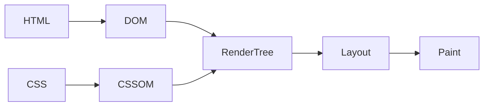

# 1. v8引擎
## 1.1 垃圾回收机制分代式垃圾回收机制。
* 新生代： --max-new-space-size 32M/16M
* 老生代： --max-old-space-size 1.4G/0.7G
### 1. 新生代：scavenge算法
1. Form空间分配对象
2. 回收时，存活对象-> To空间，非存活对象释放
3. Form空间 <=> To空间，存活对象互换

缺点:只能使用堆内存的一半；  
优点：只复制存活对象，效率高，而新生代对象生命周期短，故而适合。
在新生代多次复制后仍存活，*晋升*为老生代

### 2. 老生代：标记清除和标记整理相结合
#### 标记清除（**无法达到的对象**）
标记存活的对象，没被标记的清除。
1. 内存中所有变量加上标记📌；
2. 从根部出发，清除能触及到的对象的标记📌；
3. 还存在标记的变量被视为准备删除变量；
4. 销毁带标记的值并回收占用的内存空间；

```js
       ⭕️     /即将被删除的
       |     /
       ↓    /
       o   o   o
      / \      ↑
     o   o---->o
```
内存泄露：由于疏忽or错误造成程序未能释放不再使用的内存，造成内存的浪费。
识别方案：连续5次垃圾回收，内存占用一次比一次大。
常见案例：
1. 意外的全局变量；
2. 被遗忘的定时器和回调函数；
3. 闭包（有巨大数组，被反复使用）；
4. DOM引用：DOM的引用保存在数组中，即使删除了元素，仍然有引用；


#### 标记整理
标记后，将存活对象移动，清理边界外内存。
缺点： 内存碎片
v8主要用标记清除，空间不足时才使用标记整理。


### 3. 引用计数法
优势:
1. 即刻回收垃圾，当被引用数值为0，对象马上把自己作为空闲空间连到空闲链表上；
2. 最大暂停时间很短；
3. 不用遍历堆里面所有活动对象和非活动对象；  

劣势：
1. 计数器需要占很大位置；
2. 无法解决循环引用无法回收的问题


### js字符串拼接性能很差？
因为字符串是不可变的，只能被另外一个字符串代替。字符串拼接新建一个临时对象存储计算结果，然后再用临时对象替换变量。若有海量字符串拼接，js引擎GC需要大量工作清理临时变量，从而影响性能。

## 1.2 js引擎对js处理过程
1. 读取代码，进行词法分析，代码分解成词元（token）;
2. 对词元进行语法分析，整理成语法树AST;
3. 使用翻译器，将代码转为字节码;
4. 使用字节码解释器，遇到热点代码启动编译器进行编译，将字节码转成机器码，以优化执行效率；

所以js并不是完全的解释型语言。


### 词法分析
逐个扫描输入字符，转换为词法单元（Token）序列，传递给语法分析器进行语法分析。
Token:
* 关键字
* 标识符
* 操作符
* 标点符号

### 语法分析
产生式：
```js
产生式头         产生式体
  ↓               ↓
func  -> function  id (params)  {block}
            |       |_____|_______|
         终结符号           非终结符号
         (token)
```
扫描来自词法分析器产生的Token序列，根据文法和终点类型定义构造出一棵AST(抽象语法树)。
**文法**：构造规则
* 终结符号token
* 一组非终结符号
* 一组产生式
* 一个开始符号

**推导**：
不断替换文法产生式体的非终结符号直到全换转换。
分为最左推导和最右推导。
工作方式分：
* 自顶向下分析法(最左推导 => AST)
* 自底向上分析法（最右推导 => AST）

例如：var foo = "bar";  
Token序列：
* Token('var')
* Token('foo')
* Token('=')
* Token('"bar"')
* Token(';')

1. 根据FIRST集合（首个token集合），决定用哪种产生式展开。
2. 变量声明语句，顶层结点Variablke Declaration
Token('var') 加入结点属性中。
3. 根据产生式非终结符号左至右顺序，递归下降分析，生成AST.

```js
              ____________
             |Variable    |
             |Declaration |
              ————————————
                    |
               __________
              | Variable |
              |Declarator|
               ——————————
               /        \
      _________       _______
     |identifer|     |String |
      —————————      |Literal|
       foo            ———————
                        "bar"

```


## 结构
```js
call stack （空间小） memory heep（大）
 _____             __________
| 栈  |            |  堆     |
|     |  boolean   |         | 引用数据类型
|     |  number    |         |
|_____|  ...       |_________|

```
闭包函数里的变量存储？
* captured variables：即闭包中访问的外部变量，基本类型变量在闭包中也是存在堆中的；
* local variables：栈中；


# 2. cookie
http的无状态：
服务端对于客户端每次发送的请求都认为它是一个新请求，上一次会话和下一次会话没有联系。  
cookie机制：
客户端请求服务器时，如果服务器需要记录该用户状态，就使用response向client种cookie。当浏览器再请求服务器时，把cookie发送给服务器。服务器通过检查cookie来获取用户状态。


cookie优化：
客户端在域名A下有cookie,页面依赖很多静态资源，静态资源会默认带上cookie，造成浪费。  
解决：
多域名拆分，将静态资源分组，放到不同域名下


# 3. DNS解析过程？
1. 浏览器缓存
2. 寻找本地localhost，看有没有该域名对应的ip
3. 路由器缓存
4. ISP（互联网服务提供商）DNS缓存，比如用的电信网络，则进入电信的DNS缓存服务器找。
5. 根域名服务器：全球只有13台
6. 顶级域名服务器：若无则将主域名服务器ip告诉DNS （例如.com）
7. 主域名服务器：如果没有则进入下一级域名服务器，重复直到找到。
8. 保存结果至缓存：本地域名服务器把返回保存。将结果返回给客户端，与web服务器建立连接。


# 4. Event Loop
js在执行中产生执行环境，会被顺序加入到执行栈中。遇到异步代码，会被挂起并加入到Task(有多种task)。队列中，一旦执行栈为空，Event Loop从Task队列中拿出需要执行的代码并放入执行栈中执行。
任务源：
* 微任务
* 宏任务

不同任务源会被分配到不同的task队列中。
微任务：
* process.nextTick
* promise
* Object.observe
* MutationObserver

宏任务：
* script
* setTimeout
* setInterval
* setImmediate
* I/O
* UI rendering

Event Loop顺序:
1. 执行同步代码，这属于宏任务；
2. 执行栈为空，查询是否有微任务需要执行
3. 执行所有微任务
4. 必要的话渲染UI
5. 下一轮Event Loop, 执行宏任务中的异步代码。

# 5.浏览器执行时间线
1. 创建Document对象 &rarr; 解析HTML元素 &rarr; 添加Element对象和Text节点到文档，这个阶段
document.readystate: loading；
2. 遇到link外部css，创建线程，**异步**加载，并继续解析文档；
3. 遇到\<script\>（没defer、没async），浏览器**同步**加载并阻塞，解析器暂停，加载完并执行脚本，然后继续解析文档；
4. 遇到async的\<script\> &rarr; 开始下载脚本并继续解析文档，脚本会下载完后尽快执行，但解析器不会停下等它下载；
5. 遇到img等带src，正常解析dom，**异步**加载src，并继续解析文档；
6. 文档完成解析，document.readystate:interactive;
7. 所有defer的\<script\>按照文档出现顺序执行脚本；
8. 触发DOMContentLoaded事件 &rarr; 程序执行为异步事件驱动；
9. 等待图片载入  &rarr; 异步脚本载入与执行 &rarr; window触发load事件，document.readystate: complete;
10. 从此，异步响应方式处理用户输入等；


## css加载是否会阻塞dom树渲染？
css由单独的下载线程异步下载。
不会阻塞DOM树解析，但是会阻塞render树渲染（渲染时要等css加载完）。

## DOMContentLoaded事件
当一个HTML文档被加载和解析完成后，DDOMContentLoaded事件触发。





## 异步脚本defer和async的区别？

图例：
* <font color="purple">HTML解析</font>
* <font color="gray">HTML暂定</font>
* <font color="lightpurple">script下载</font>
* <font color="red">script执行</font>

同步脚本：停止解析，先加载脚本，执行脚本，继续解析HTML.

```mermaid
---
displayMode: compact
---
gantt
    title 同步脚本解析
    dateFormat HH:mm
    axisFormat %H:%M
    section 同步js
        解析: a1, 17:00,5m
        停止: done, stop1, after a1, 3m
        下载: active, download, after a1, 1m
        执行: crit, 2m
        解析: 2m
```





defer脚本：后台加载脚本，等文档解析完，defer脚本执行。

```mermaid
gantt
    title defer脚本解析
    dateFormat HH:mm
    axisFormat %H:%M
    section defer的js
        解析: a1, 17:00, 8m
        下载: active, 17:05, 1m
        执行: crit, after a1, 2m
```




async脚本：后台加载脚本，文档解析不中断，加载后文档停止解析，脚本执行。

```mermaid
---
displayMode: compact
---
gantt
    title async脚本解析
    dateFormat HH:mm
    axisFormat %H:%M
    section async的js
        解析: a1, 17:00, 5m
        下载: active, download, 17:04, 1m
        停止: done, stop, after a1, 2m
        执行: crit, after download, 2m
        解析: after stop, 2m
```





## 浏览器加载资源过程
1. 如何知道应加载哪些？
2. 按什么顺序？

将资源分类 ——> 资源安全策略检查——>资源优先级计算——>根据优先级下载资源

### 浏览器资源分类
* kMainResource
* kImage
* kCSSStyleSheet
* kScript
* kFont
* kRaw(比如ajax请求)
* kSVGDocument
* kLinkPrefetch
* kTextTrack(视频字幕)
* kMedia
* kMainfest
* 等等

### 安全策略检查
网页安全策略，比如限制非信任域名脚本的加载预防XSS攻击。
#### 1. 配置http请求头
Content-Security-Policy字段
#### 2. meta
```html
<meta http-equiv="Content-Security-Policy" content="script-src 'self'; style-src nos.netease.com xx.com">
```
即脚本资源只信任本域下的，样式资源除了本域还可以信任nos.netease.com和xx.com

```html
<meta http-equiv="Content-Security-Policy" content="upgrade-insecure-requests" >
```
所有http升级到https

```html
<meta http-equiv="Conent-Security-Policy" content="block-all-mixed-content">
```

### 默认优先级规则
网络层优先级：Highest、Medium、Low、Lowest、idle
控制台显示：Highest、high、Medium、Low、Lowest

html、css、font > preload、script、xhr请求 > 图片、语音、视频 > prefetch

根据实际，对优先级调整：
1. 同步的xhr请求 -> 最高，
2. 图片默认Low, 如果出现在首屏，将视口可见图片 -> high
3. defer/async脚本 -> Low
  脚本在第一张图片之前 -> high
  脚本在第一张图片之后 -> medium

### 关键请求链
可视区域渲染完毕，必须加载的资源请求队列。
优化关键请求链：
1. 利用preload和prefetch

```js
// 资源预加载：
<link rel="prefetch" href="test.css" />
// DNS预解析
<link rel="dns-prefetch" href="//xx.com" />
// http预连接,将建立对该域名的TCP连接
<link rel="prefetch" href="//www.xx.com" />
// 页面预渲染,预先加载链接文档的所有资源
<link rel="prerender" href="//m.xx.com" />
```

#### preload与prefetch区别？
* preload：告诉浏览器当前页需要的资源，提高资源请求优先级；
* prefetch:
用户将来可能在其他页（非本页）可能用的资源，浏览器空闲时预加载放在http缓存里（比如dns-prefetch）,prefetch会把资源优先级 ——> 最低。


# 6. 浏览器渲染过程

进程之间相互独立，一个进程由多个线程组成，多个线程在进程中协作完成任务。每打开一个Tab页，就相当于
创建了一个独立的浏览器进程。

浏览器进程：
* Browser进程：只有一个主进程，负责界面显示，各个页面管理、网络资源管理等；
* 第三方插件进程；
* CPU进程：3D绘制等；
* 浏览器渲染进程：每个tab页一个，互不影响，页面渲染（浏览器内核）。

多进程充分利用多核优势，避免单个page crash影响整个浏览器等。

## 渲染进程
```js
 _________________________________________________
| JavaScript | Style | Layout | Paint | Composite |
 —————————————————————————————————————————————————
```
* JavaScript: 执行js来触发视觉效果；
* Style: 计算元素匹配的css选择器，应用各规则计算元素最终样式；
* Layout: 根据样式，计算元素占据空间大小和位置；
* Paint: 填充可视部分，文本、图像、边框、阴影；
* Composite: 不同层按顺序绘制到屏幕上；

渲染进程：
* GUI渲染线程：解析HTML、css,布局，绘制，与js引擎线程互斥；
* js引擎线程：处理js脚本，运行代码，只有一个；
* 事件触发线程：控制事件循环，添加队列等js引擎处理（js有空）；
* 定时器触发线程：setTimeout、setInterval；
* 异步http请求线程：在XMLHttpRequest连接后开一个；

## 渲染图层
浏览器渲染图层：
* 普通图层；默认复合层，包括absolute等；
* 复合图层（硬件加速）：各个互不影响；

变成复合图层：translate3D、translatez、<video\> 、\<iframe >、\<canvas>、\<webgl\>等，独立于普通文档流，改动后避免整个页面重绘。

## 定时器线程
当使用setTimeout、setInterval时，由定时器控制线程计时，（js引擎自己都忙不过来），计时完成后将事件推入事件队列中。
* 宏任务：task（即执行栈中代码or回调事件）
* 微任务：jobs（当前task执行后立即执行的任务）
```js
task -> 渲染 -> task ...
      ↓
  执行完所有jobs
```
宏任务事件队列由事件触发线程维护；
微任务的微任务队列由js引擎线程维护；


# 7. 跨域
跨域解决方案：
## 方案1： jsonp
```html
<script>
  var script = document.createElement('script');
  script.type = 'text/javascript';
  script.src = 'http://xxx?user=admin&callback=onBack';
  document.head.appendChild(script);

  // 回调执行
  function onBack(res) {
    alert(JSON.stringfy(res));
  }
</script>
```
缺点：只能实现get请求。

## 方案2：document.domain + iframe
父窗口：
```html
<iframe id="iframe" src="htp://child.domain.com/b.html"></iframe>
<script>
  document.domain = 'domain.com';
  var user = 'admin';
</script>
```
子窗口：
```html
<script>
  document.domain = 'domain.com';
  alert(window.parent.user);
</script>
```
缺点：仅限主域相同，子域不同的应用场景。

### 方案3：location.hash + iframe
a域与b域相互通信，通过中间页c来实现，不同域利用iframe的location.hash传值，相同域之间js访问。
1. a.html(domain1.com)
```html
<iframe id="iframe" src="http://domain2.com/b.html" style="display:none"></iframe>
<script>
  var iframe = document.getElementById("iframe");
  // 向b传hash值
  setTimeout(() => {
    iframe.src = iframe.src + '#user=admin';
  }, 1000);
  // 开放给同域c.html回调
  function onCallback(res) {
    alert(res);
  }
</script>
```

2. b.html(domain2.com)
```html
<iframe id="iframe" src="http://domain1.com/c.html" style="display:none;"></iframe>
<script>
  var iframe = document.getElementByiId("iframe");
  // 监听a.html传来的hash值，再传给c.html
  window.onhashchange = function() {
    iframe.src = iframe.src + location.hash;
  }
</script>
```

3. c.html(domain1.com)
```html
<script>
  // 监听b.html传来的hash值
  window.onhashchange = function() {
    // 同域a.html的js回调
    window.parent.parent.onCallback('hello' + location.hash.replace('#user=', ''));
  };
</script>
```

### 方案4：window.name + iframe
window.name值在不同页面加载后依旧存在，可支持（2M）的值。  
iframe向b页面获取数据后存在window.name, 再将iframe的src修改到a页面的域名下，这时候iframe就可以与a页面进行数据传递了。

1. a.html(domain1.com/a.html)
```js
var proxy = function(url, callback) {
  var state = 0;
  var iframe = document.createElement('iframe');
  // 加载跨域页面
  iframe.src = url;
  // onload事件触发2次，第一次加载跨域页面，并留存数据window.name
  iframe.onload = function() {
    if (state === 1) {
      // 第二次onload（同域proxy）成功后，读取同域window.name中数据
      callback(iframe.contentWindow.name);
      destroyFrame();
    } else {
      // 第一次onload成功，切换到同域代理页
      iframe.contentWindow.location = 'http://domain1.com/proxy.html';
      state = 1;
    }
  }
  document.body.appendChild(iframe);
  // 获取数据后销毁
  function destroyFrame() {
    iframe.contentWindow.document.write('');
    iframe.contentWindow.close();
    document.body.removeChild(iframe);
  }
}

// 执行
proxy('http://domain2.com/b.html', function(data) {
  alert(data);
});
```

2. proxy.html
内容为空
3. b.html(domain2.com/b.html)
```html
<script>
  window.name = "This is domain2.com";
</script>
```

### 方案5：postMessage
1) 页面和其打开的新窗口的数据传递
2) 多窗口之间消息传递
3) 页面与嵌套的iframe消息传递

1. a.html(domain1/a.html)
```html
<iframe id="iframe" src="http://domain2.com/b.html"></iframe>
<script>
  var iframe = document.getElementById("iframe");
  iframe.onload = function() {
    var data = {
      name: 'aym'
    };
    // 向domain2传数据
    iframe.contentWindow.postMessage(JSON.stringify(data), 'http://domain2.com');
  };
  // 接收domain2返回数据
  window.addEventListener('message', function(e) {
    switch(e.origin) {
      case 'domain1.com':
         console.log(e.data);
         break;
      default:
        // 消息来源无法识别，忽略
        break;
    }

  }, false);
</script>
```

2. b.html(domain2.com/b.html)
```html
<script>
  // 接收域名1的数据
  window.addEventListener('message', function(e) {
    console.log(e.data);
     var data = JSON.parse(e.data);
     if (data) {
       data.number = 16;
       // 处理后发回域名
       window.parent.postMessage(JSON.stringify(data), 'http://domain1.com');
     }
  }, false);

</script>
```

### 方案6：CORS
普通跨域请求：服务端Access-Control-Allow-Origin, 前端无须设置。
前端代码：
```js
// 是否带cookie
xhr.withCredentials = true;
xhr.open('post', 'http://domain2.com:8080/login', true);
xhr.seRequestHeader('Content-Type', 'application/x-www-form-urlencode');
xhr.send('user=admin');
...
```
服务端设置：
```js
const http = require('http');
const server = http.createServer();
const qs = require('querystring');
server.on('request', function(req, res) {
  let postData = '';
  req.addListener('data', function(chunks) {
    postData += chunks;
  });
  // 数据接收完毕
  req.addListener('end', function() {
    postData = qs.parse(postData);
    // 跨域后台设置
    res.writeHead(200, {
      // 后端允许发cookie
      'Access-Control-Allow-Credentials': 'true',
      'Access-Control-Allow-Origin': 'http://domain1.com',
      'Set-Cookie': '/=a123356;Path=/;Domain=domain2.com'
    });
    res.write(JSON.stringify(postData));
    res.end();
  });
});
server.listen(8080);
```

### 方案7： nginx代理
浏览器跨域访问js/css/img等静态资源被同源策略许可，但iconfont例外，
可在nginx中配置
```
location / {
  add-header Access-Control-Allow-Origin *;
}
```
nginx反向代理接口跨域：
通过nginx配置一个代理服务器（域名与1相同，端口不同）做跳板机，反向代理domain2接口，并可修改cookie中domain信息，方案当前域
cookie写入，实现跨域登入。
```
server {
  listen 81;
  server_name domain1.com;

  location / {
    proxy-pass http://domain2.com:8080
    proxy-cookie_domain domain2.com domain1.com;
    index index.html index.htm;

    add_header Access-Allow-Origin http://domain1.com;
    add_header Access-Control-Allow-Credential true;
  }
}
```

### 方案8：Nodejs中间件代理跨域
1. http-proxy-middleware 中间件
2. 开发时，devServer配置proxy

### 方案9：WebSocket协议
实现浏览器与服务器全双工通信，允许跨域，可用socket.io
前端代码：
```html
<script src="./socket.io.js"></script>
<script>
  var socket = io('http://domain2.com:8080');
  // 连接成功
  socket.on('connect', function() {
    // 监听
    socket.on('message', function(msg) {
      console.log(msg);
    });
    // 监听服务端关闭
    socket.on('disconnect', function() {
      console.log('close');
    });
  });
  document.getElementByTagName('input')[0].onblur = function() {
    socket.send(this.value);
  };
</script>
```
nodejs 后台
```js
const http = require('http');
const socket = require('socket.io');
const server = http.createServer(function(req, res) {
  res.write(200, {
    'content-Type': 'text/html';
  });
  res.end();
});
server.listen(8080);
socket.listen(server).on('connection', function(client) {
  // 接收
  client.on('message', function(msg) {
    client.send(`hello ${msg}`);
  });
  // 断开处理
  client.on('disconnect', function() {});
});
```


# 8. Navigation Timing
页面加载性能指标
```js


          __________________Resource Timing_________________________________
         |                                                                  |
         |                                                                  |
         |                domainLookUpStart                                 |  domInteractive
         |                     |   domainLookUpEnd                          | |
        redirectStart          |   | connectStart                           | | domContentLoadedEventStart
         |     redirectEnd     |   | |  secureConnectionStart               | | |      domContentLoadedEventEnd
startTime|        | fetchStart |   | |  |       ConnectEnd                  | | |      | domComplete
↓ _____  ↓________↓ ↓________  ↓___↓ ↓__↓_______↓      ________   __________| ↓_↓______↓_↓  ______
|Pronpt| |Redirect| |AppCache| |DNS| |  TCP     |     |Request | | Response | |Processing| | Load |
|for   | |        | |        | |   | |          |     |        | |          | |          | |      |
|unload| |        | |        | |   | |          |     |        | |          | |          | |      |
↑——————↑  ————————   ————————   ———   ——————————      ↑————————  ↑——————————↑  ——————————  ↑——————↑
|      unloadEventEnd                                requestStart|          responseEnd    |      loadEventEnd
unloadEventStart                                                 responseStart             loadEventStart


```
页面加载时间：
```js
// 页面加载时间：
const [{domComplete}] = performance.getEntriesByType('navigation');

// 资源加载时间
const [{startTime, responseEnd}] = performance.getEntriesByType('resouce');
const loadTime = responseEnd - startTime;
```
资源的加载信息如下所示：
```js
{
  "connectEnd":: 462.95xxx,
  "connectStart": 462.94xxx,
  ...
  "entryType": "resouce",
  "initiatorType": "img",
  "name": "https://cn.xx.com/xx.png",
  ...
  "workerStart": 0
}
```
