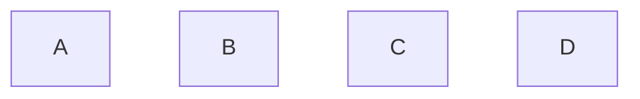

# CSS

## 1. 父元素高度坍塌
一个块级元素没有设置height, 其height由子元素撑开。子元素浮动后脱离标准文档流，父元素没有内容可撑开，其height被忽略。


## 2. Flex

### flex布局


$$
flex布局 
\begin{cases}
轴 
\begin{cases}
主轴 \\
交叉轴\\
\end{cases}

\\ 容器
\begin{cases}
父容器 \\
子容器 \\
\end{cases}
\end{cases}
$$ 


默认: 主轴从左向右；交叉轴垂直于主轴，逆时间90度。

**justify-content**: 子元素在主轴方向上对齐方式。

**align-items**: 子元素在交叉轴方向上的对齐方式。

**align-selft**作用： 单独子容器的交叉轴排列

比如：某个子容器位置靠上



**flex-flow**：
$$
flex-flow
\begin{cases}
flex-direction \\
flex-wrap
\end{cases}
的简写
$$


### flex-basis
作用与width一样。
在flex布局中，子项设置width无直接效果。
```css
flex-basis: auto;
/* 根据子列表项目自身尺寸渲染*/

```
优先级：
min-width > max-width > width > Content Size
flex-basis优先级 > width.

Q: 区别？
1. width: 100px;
2.  flex-basis: 100px;


A: 当最小内容宽度较大时，例如连续英文单词，content内容最小宽度超过了100px，“2”能正常显示，第"1"种写法字符溢出。


## 3. 格式化上下文
* BFC,block formatting context
* IFC, inline formatting context(一个区域仅包含水平排列元素)
* FFC, flex formatting context
* GFC, grid formatting context

### inline box(行框)
包含IFC内部的所有子元素的虚拟矩形区域，形成的每一行。
行框的模型结构：（6条线）
* top线
* text-top线
* middle线
* baseline线
* text-bottom线
* bottom线
```js
 _ _ _ _ _ _ _  ————> top线
|___________  |————> text-top
|_ _ _xaj_ _ _|----> middle
|_____________|____ bottom线


```
#### 图片留白问题？
因为：可置换行内元素如img和inline-block的元素，在被浏览器解析时，会和“文本”一样，默认在baseline线上显示，而不是在行框的bottom线上。


### BFC是什么？
Block Formatting Context(块级格式化上下文)
### BFC特性？
1. 内部box会在垂直方向，一个接一个的放置；
2. 每个元素的margin box的左边，与包含块border box的左边相接触；
3. box垂直方向的距离由margin决定，属于同一个bfc的2个相邻box的margin会重叠；
4. bfc区域不会与浮动区域的box重叠；
5. bfc是页面上独立的容器，外面元素不会影响bfc里的元素；
6. 计算bfc的高度时，浮动元素也参与计算；

### 触发BFC条件有：
* float值不为none
* overflow的值不为visible
* display的值为table-cell、table-caption、inline-block、flex、inline-flex
* position不为relative、static
* 根元素


## 4. 伪元素
::before 和 :after中双冒号和单冒号有什么区别？
单冒号用于css伪类；
双冒号用于css伪元素；

### 伪元素与伪类的区别？
**伪元素**是对元素中特定内容进行操作。选取某些内容前面or后面这种普通选择器无法完成的工作。本身只是基于元素的抽象，并不存在于文档中。
例如：
* ::before(元素内容之前插入额外生成的内容)
* ::after
* ::first-letter(首个字符)
* ::first-line(元素的第一行)
* ::selection
* ::grammar-error

**伪类**：一个元素特定状态改变时可能得到or失去某个样式功能，和class有些类似。
* :target
* :link
* :hover
* :active
* :visited
* :focus
* :not
* :lang
* :enabled
* :checked
* :empty


## 5. 流体布局
块级元素：
1. width固定，margin是auto，即margin撑满剩下的空间；
2. margin固定，width是auto，width撑满剩下的空间；

### css的外在盒子和内在盒子
例：display：inline-table;
外在盒子：inline,决定像内联元素一样并排显示；
内在盒子：table，决定了元素可以设置宽高、垂直方向的margin等。

### 块级元素
垂直方向发生margin合并：
1. 相邻兄弟元素之间margin合并；
2. 父的margin-top和子的margin-top；
  父的margin-bottom和子的margin-bottom；
3. 空块级元素自身的margin-top和margin-bottom;

阻止margin合并方法：
1. bfc;
2. border、padding阻隔margin；
3. 内联元素阻隔；
4. 父元素设高；

### 内联元素
vertical-align:
* sub super: 使元素的基线与父元素下标基线对齐；
* 20px 2em: baseline相当于0，使元素的基线对齐到父元素的基线之上给定长度；
* 20%：元素的基线对齐到父元素的基线之上的百分比，是line-height的百分比；


## 6. 层叠上下文
css3新增层叠上下文：
1. opacity !== 1;
2. transform !== none;
3. filter !== none;
4. isolution: isolate;
5. mix-blend-mode !== normal;
6. -webkit-overflow-scrolling: touch;
7. will-change: opacity/transform...;
8. z-index不为auto的弹性盒子的子元素

层叠上下文内元素的层叠水平：
```js
 ___________________
| border/background |
|    __________________
 ———|负值z-index       |
    |   ________________
     ——|块级盒子         |
       |   ________________
        ——|浮动盒子         |
          |   ________________
           ——|内联盒子         |
             |   ________________
              ——|z-index:auto/0  |
                |   ________________
                 ——|正z-index       |
                   |                |
                    ————————————————
```


## 7. css优先级计算规则？
ID > class > 元素选择器
选择器的特殊值为0,0,0,0表示。
* ID选择器的特殊值: 0,1,0,0
* 类、属性选择器、伪类：0,0,1,0
* 元素、伪元素：0,0,0,1
* 通配选择器*对特殊值没有贡献，即0,0,0,0,0
* !important(权重)，没有特殊值，优先级最高，可认为1,0,0,0,0
* 行间样式特殊值是1,0,0,0, 优先级高于ID选择器

例如：
```js
div a // 0, 0, 0, 2
a // 0,0,0,1
.demo a // 0,0,1,1
.demo input[type="text"] // 0,0,2,1
.demo *[type="text"] // 0,0,2,0
#demo a // 0,1,0,1
div#demo a // 0,1, 0, 2
```

规则：
1. 先看权重!important；
2. 权重相同比较规则特殊性；
3. 规则特殊性也一样时，按顺序排序，后声明优先级高；


## 小技巧
### 有切角的阴影
```css
filter: drop-shadow(2px 2px 10px rgba(0, 0, 0, 0.5));
```
### 两端对齐
```css
hyphens: auto;
```

### 小箭头自动继承背景和边框样式
```css
.callout {
  postion: relative;
}
.callout::before {
  content: '';
  position: absolute;
  background: inherit;
  boder: inherit;
  border-right: 0;
  border-bottom: 0;
  padding: 0.35em;
  transform: rotate(45deg);
}

```

### 禁止文本缩放
```css
-webkit-text-size-adjust: 100%;
```

### 字体在移动端比例缩小后出现锯齿
```css
-webkit-font-smoothing: antialiased;
```

### Retina下1px的解决方案
在devicePixelRatio = 2时，借助媒体查询来处理
```css
.border {
  border: 1px solid black;
}
@media (-webkit-min-device-pixel-ratio: 2) {
  .border {
    border-width: 0.5px;
  }
}
```

### css数据上报
比如根据某个按钮的点击事件
```css
.button:active::after {
  content: 'url(./pixel.gif?action=click&id=button)';
  display: none;
}
```
比如统计用户表单操作成功率
```css
.track:invalid {
  background: url(./pixel.gif?action=rogister&status=invalid);
}
```
### 输入大写字母
```css
text-transform: uppercase;
```

### 内边框
```css
div {
  outline: dashed red;
  outline-offset: -10px;
}
```

### 文字下划线
第一种：
```css
div {
  box-shadow: 0 -1px 0 0 #fff inset;
}
```
第二种：
```css
a {
  padding-bottom: 1px;
  background: linear-gradient(#000, #000) no-repeat;
  background-size: 100% 1px;
  background-position: 0 18px;
}
```

### 基于文件格式使用不同样式
比如对不同链接添加不同图表
```css
a[href^="http://"] {
  padding-right: 20px;
  background: url(xx.png) no-repeat center right;
}
a[href^="mailto:"] {
  padding-right: 20px;
  background: url(email.png) no-repeat center right;
}
a[href$=".pdf"] {
  /*... */
}
```

### word-break
控制单词如何拆分换行
* keep-all："单词"一律不拆分换行，只有空格触发自行换行；
* break-all: 碰到边界一律换行，强行拆分；

#### word-wrap
* break-word: 只有当一个单词整行都显示不下时才拆分换行；

### 说说你了解的圣杯布局和双飞翼布局？

```js
______________________
|  header             |
|—————————————————————
|left|   main   |right|
|    |          |     |
|    |          |     |
|____|__________|_____|
|       footer        |
|_____________________|
```

```html
<header>header</header>
<section class="wrapper">
  <aside>lef</aside>
  <section>main</section>
   <aside>right</aside>
</section>
<footer>footer</footer>
```

#### 1.圣杯
```css
.wrapper {
  padding: 0 100px 0 100px;
  overflow: hidden;
}
.main {
  position: relative;
  float: left;
  width: 100%;
  height: 200px;
}
.left {
  position: relative;
  float: left;
  width: 100px;
  height: 200px;
  margin-left: -100%;
  left: -100px;
}
.right {
  position: relative;
  float: left;
  width: 100px;
  height: 200px;
  right: -100px;
  margin-left: -100px;
}
```
问题：当main部分宽度 < left部分，发生布局混乱。

#### 2. 双飞翼布局
为了修复这个问题，中间变了，多层dom
```html
<section class="wrapper">
  <section class="pull-left main">
    <section class="main-wrap">main
    </section>
  </section>
  <aside class="pull-left left">left</aside>
  <aside class="pull-left right">
      right
  </aside>
</section>
```
```css
.wrapper {
  padding: 0;
  overflow: hidden;
}
.pull-left {
  float: left;
}
.main {
  width: 100%;
}
.main-wrap {
  margin: 0 100px 0 100px;
  height: 200px;
}
.left {
  width: 100px;
  height: 200px;
  margin-left: -100%;
}
.right {
  width: 100px;
  height: 2000px;
  margin-left: -100px;
}
```


