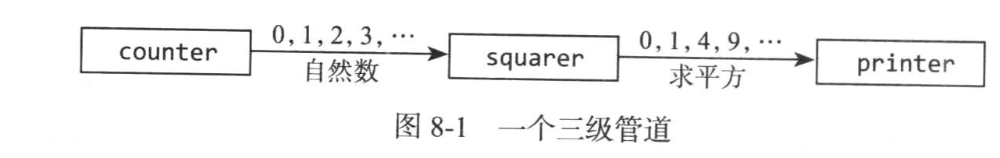

# goroutine和通道
并发编程
## goroutine
每一个并发执行的活动称为goroutine,类似线程。
一个程序启动，只有一个主goroutine来调用main函数。在普通函数或者方法调用前加上go关键字，就创建一个新的goroutine.

## 通道
**通道**是goroutine之间的连接，让一个goroutine发送特定值到另一个goroutine的通信机制。
每一个通道的具体类型，叫作通道的**元素类型**，例如有chat int.
同种类型的通道可以用==符号比较，二者都是同一个通道数据的引用，比值为true。
```go
ch <- x // 发送语句
x = <- ch // 赋值语句中的接收表达式
<- ch   // 接收语句，丢弃结果
```
通道支持关闭（close）操作，有标志位指示当前已经发送完毕，关闭后的又发送会宕机，在已经关闭的通道上接收，将直接获取所有已经发送的值，直到通道为空。

### 无缓冲通道
ch = make(chan int, 0),无缓冲通道也称为同步通道。
### 管道
**pipeline**可以用来连接goroutine,例如下图：


```go
package main

import "fmt"

func main() {
	naturals := make(chan int)
	squares := make(chan int)

	// Counter
	go func() {
		for x := 0; ; x++ {
            x, ok := <=
			naturals <- x
		}
	}()

	// Squarer
	go func() {
		for {
			x, ok := <-naturals
            if !ok {
                break // 通道关闭并且读完
            }
			squares <- x * x
		}
        close(squares)
	}()

	// Printer (in main goroutine)
	for {
		fmt.Println(<-squares)
	}
}
```
关闭一个已经关闭的通道会导致宕机。
### 单向通道类型
Go的类型系统提供了**单向通道类型**，仅仅导出发送操作or接收操作。
仅仅用来发送,只有发送goroutine才能调用close操作：
func counter (out chan int)
func squarer(out, in chan int)
func printer(in chan int)

### 缓冲通道
缓冲通道有一个元素队列， ch = make(chan string, 3)
cap(ch)可以获取通道缓冲区的容量。
例如并发向3个镜像地址发送请求，将响应通过一个缓冲通道进行发送，只接收第一个返回的响应。如果使用一个无缓冲通道，2个比较慢的goroutine会被卡住，即**goroutine泄露**，因为它们在发送响应到通道的时候没有groutine来接收。

## 并行循环
**高度并行**: 由一些完全独立的子问题组成的问题，高度并行的问题是最容易实现并行的。
例子:生成一批全尺寸图像的缩略图
想让每个工作的goroutine向主goroutine返回一个错误：
```go
// 如果任何一个步骤出错，返回一个错误
func makeThumbnails4(filenames []string) error {
	errors := make(chan error)

	for _, f := range filenames {
        // 工作的goroutine
		go func(f string) {
			_, err := thumbnail.ImageFile(f)
			errors <- err
		}(f)
	}
    // 有一个微妙的缺陷，遇到第一个非nil，将错误返回给调用者，这样没有groutine继续从errors返回通道上进行接收，工作的goroutine发
    // 送次通道永久堵塞，用不终止，导致内存耗尽
	for range filenames {
		if err := <-errors; err != nil {
			return err // 注意，goroutine泄露
		}
	}

	return nil
}
```
如何优化？使用一个缓冲通道
```go
func makeThumbnails5(filenames []string) (thumbfiles []string, err error) {
    type item struct {
        thumbfile string
        err       error
    }
    // 利用缓冲通道
    ch := make(chan item, len(filenames))
    ...
}
```
最后优化：返回新文件占用字节数，可以用sync.WaitGroup计算每个goroutine.
*sync.WaitGroup*:通常用于等待一组协程完成工作，而协程池则用于管理和复用协程资源.
方法作用‌：
* Add(delta int)：增加未完成任务计数（原子操作）
* Done()：等价于Add(-1)，减少计数
* Wait()：阻塞直到计数器归零
```go
func makeThumbnails6(filenames <-chan string) int64 {
	sizes := make(chan int64)
	var wg sync.WaitGroup // 协程个数
    for f := range filenames {
        // 递增计数器，必须在协程开始之前
		wg.Add(1)
		// worker
		go func(f string) {
            // 等价与Add(-1)
			defer wg.Done()
			thumb, err := thumbnail.ImageFile(f)
			if err != nil {
				log.Println(err)
				return
			}
			info, _ := os.Stat(thumb) // OK to ignore error
            //
			sizes <- info.Size()
		}(f)
	}
    
	// 关闭者协程
	go func() {
        // 等待所有的工作协程结束
		wg.Wait()
		close(sizes)
	}()

	var total int64
	for size := range sizes {
		total += size
	}
	return total
}
```
## 并发的Web爬虫
例子：以广度优先顺序探索网页的链接，当高度并发，系统总有限制，可以使用容量为n的缓冲通道来建议一个并发，称为**计数信号量**。
对于缓冲通道中的n个空闲槽，每个代表一个token，有token可以执行，发送一个值到通道中领取token，从通道中接收一个值来释放token，保持接收操作，同时最多有那个发送。

```go
// 确保并发请求限制在20个以内
// 通道元素不重要，struct{}占用空间是0
var tokens = make(chan struct{}, 20)

// 有问题，这个程序用不会结束，需要当列表为空时且爬取协程都结束以后，从主程序退出
func crawl(url string) []string {
	fmt.Println(url)
	tokens <- struct{}{} // 获取token
	list, err := links.Extract(url)
	<-tokens // 释放 the token

	if err != nil {
		log.Print(err)
	}
	return list
}
```

## 使用select多路复用
例子：火箭倒计时发射，一个协程倒计时，一个协程监听输入回车取消发射。可以使用select语句：
```go
select {
    caes <-ch1:
        //...
    case x:= <-ch2:
        // use x...
    case ch3 <-y:
        //...
    default:
        // ...
}
```
```go
func main() {
	// ...create abort channel...

	//!-

	abort := make(chan struct{})
	go func() {
		os.Stdin.Read(make([]byte, 1)) // read a single byte
		abort <- struct{}{}
	}()

	//!+
	fmt.Println("Commencing countdown.  Press return to abort.")
	tick := time.Tick(1 * time.Second)
	for countdown := 10; countdown > 0; countdown-- {
		fmt.Println(countdown)
		select {
		case <-tick:
			// Do nothing.
		case <-abort:
			fmt.Println("Launch aborted!")
			return
		}
	}
	launch()
}

//!-

func launch() {
	fmt.Println("Lift off!")
}

```

## 取消
一个goroutine无法直接终止另外一个，这样会让所有的共享变量状态处于不确定。在更多情况下，当一个goroutine从abord通道接收到值时，可能其他的协程是接收不到这个值的。对于取消操作，我们需要在一个通道上广播它。
