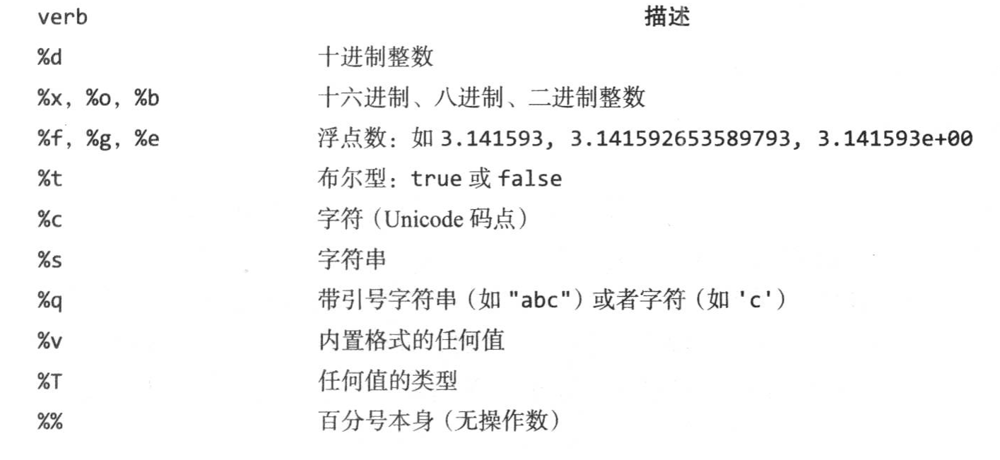

# 入门

go是编译型语言。最简单的命令是run，以.go为后缀的源文件进行编译、链接，然后运行生成可执行的文件。

**go build**可以编译输出一个可复用的程序（二进制程序），随时执行,例如
```go
go build helloword.go
./helloword
```


## 命令行参数

* 空标识符 _
* 短变量声明 :=
* fmt.Printf



## 其他
包：https://pkg.go.dev
