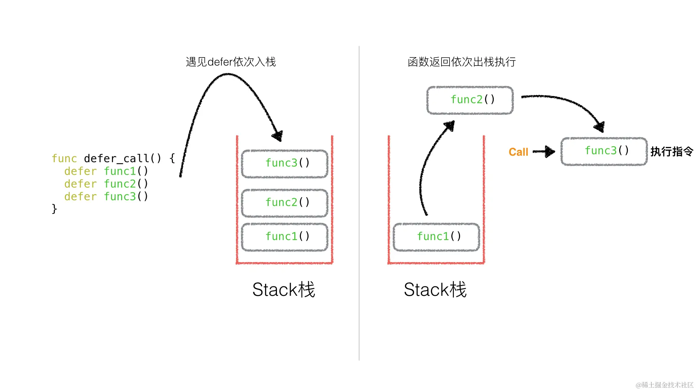

# 函数
func name(paramter-list) (result-list) {
    body
}
## 函数声明
例如：
func add(x int, y int) int {return x + y}
func sub(x, y int)(z int) {
    z = x - y;
    return
}
GO语言没有默认参数值，实参是**按值**传递的，函数收到的是每个实参的副本，修改函数的形参变量并不会影响到实参。除了使用指针、slice等，就有可能间接改变实参。

## 多返回值
例如标准包返回2个值，一个结果一个错误值，或者一个表示函数调用是否真确的布尔值。
**裸返回**
一个函数如果有命名的返回值，可以省略return语句的操作数。但是并不能拿使得代码更加易于理解，应保守使用。

## 匿名函数
当匿名函数需要递归，必须先声明一个变量然后将匿名函数赋给这个变量，如果将2个步骤合并成一个声明，编译报错：
```go
var visitAll func(items []string)
visitAll = func(items []string) {
    for _, item:= range items {
        if !seen[item] {
            ...
            visitAll(m[item])
            ...
        }
    }
}
// 合并一起声明
visitAll := func(items []string) {
    //...
    visitAll(m[item]) // 编译报错：undefined: visitAll
}
```

### 警告：捕获迭代变量
GO语言的**词法作用域规则陷阱**，举个例子，要求创建一些目录之后又删除它们：

```go
var rmdirs []func()
for _, d: = range tempDirs() {
    dir := d   // 注意，这一行是必须的
    os.MKdirAll(dir, 0755) // 也创建父目录
    rmdirs = append(rmdirs, func() {
        os.RemoveAll(dir)
    })
}
...
for _, rmdir := range rmdirs {
    rmdir() // 清理
}
```
为什么要多建一个dir = d？
因为循环变量的作用域的规则限制。在循环里创建的函数变量共享相同的变量，不是固定的值。dir一直在迭代更新，因此，当执行清理函数，dir变量实际取的是最后一次迭代的值。

类似前端的循环里有异步函数问题, 例如：

```js
for(var i = 0; i < 5; i++) {
    setTimeout(() => {
        console.log(i)
    }, 1000)
}
console.log(i) // 55555
```

## 变长函数
参数列表类型名之前用...,可以传递任意数目的参数。

```go
import "fmt"

//!+
func sum(vals ...int) int {
	total := 0
	for _, val := range vals {
		total += val
	}
	return total
}

//!-

func main() {
	//!+main
	fmt.Println(sum())           //  "0"
	fmt.Println(sum(3))          //  "3"
	fmt.Println(sum(1, 2, 3, 4)) //  "10"
	//!-main

	//!+slice
	values := []int{1, 2, 3, 4}
	fmt.Println(sum(values...)) // "10"
	//!-slice
}
```
变长函数的类型和一个普通slice参数的函数类型不相同。
func f(...int) {} // “func(...int)
func g([]int) {}  // "func([]int)
变长函数通常用于格式化字符串，函数后缀带f是变长函数广泛使用的命名习惯。

## 延迟函数调用
defer是go中一种延迟调用机制，defer后面的函数只有在当前函数执行完毕后才能执行，将延迟的语句按defer的逆序进行执行。
多个defer出现，把函数压入一个栈中延迟执行，先进后出规则调用。
常用于成对操作：打开和关闭，连接和断开连接，加锁和解锁等.


**defer 普通函数()**，延迟函数在return语句之后执行，并且可以更新函数的结果变量。
```go
func double (x int) (result int) {
    defer func() {
        fmt.Printf("double(%d) = %d\n", x, result)
    }()
    return x + x
}
_ = double(4)
// 输出 double(4) = 8
```
延迟函数的参数在defer声明时就决定了：

```go
func main(){
   i:= 0
   defer func(a int) {
		fmt.Println(a)
	}(i)
    i++
}
// 输出的是0，不是1，defer函数入栈保存的是入栈那一刻参数的值。
// 但是传的是引用就会变
```

延迟执行的匿名函数可改变函数返回：

```go
func triple (x int) (result int) {
    defer func() { result += x}()
    return double(x)
}
fmt.Println(triple(4)) // "12"
```
