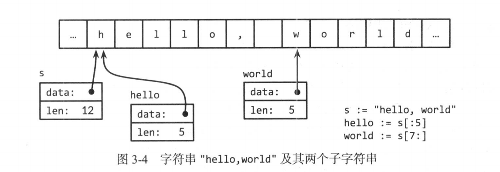

# 基本数据

## 整数
左移运算符 
X << n == x * 2 ^n
**int**
尽可能用有符号整型数，例如数据组的长度

```go
medals := []string{"gold", "red", "green"}
for i:= len(medals); i >= 0; i-- {
    fmt.Println(medals[i])
}
```
如果len是无符号整数，导致严重错误。i 变成unit类型，i >= 0恒成立，i--让i变成unit最大值，导致越界访问元素。

## 复数
complex64 complex128
内置的real函数和imag函数可以提取复数的实部和虚部：
```go
var x = complex128 = complex(1, 2) // 1+2i
var y = complex128 = complex(3, 4) // 3+4i
fmt.Println(x*y)                   // (-5 + 10i)
fmt.Println(real(x*y))              // -5
fmt.Println(imag(x*y))              // 10 
```

## 字符串
字符串是不可变的字节序列。字符串的第i个字节不一定就是第i个字符，因为非ASCII字符的UTF-8码点需要2个或者多个字节。
**s[i:j]**

```go
s := "hello,world"
fmt.Println(s[:5]) // "hello"
fmt.Println(s[7:]) // "world"
```
是产生新的字符串，直到j（不含边界值），j默认是len(s)
因为字符串不可改变，所以，
```go
s[0] = 'L' // 编译错误:s[0]无法赋值
```
不可变意味着2个字符串能安全共用同一段底层内存，复制任何长度字符串的开销都低廉。子串操作也低廉。


#### Unicode
囊括了世界上所有文书体系的全部字符等许多特有文字。这些字符记号称为文字符号（rune）
每个Unicode码点的编码长度相同都是32位。

#### UTF-8
UTF-8是以字节为单位对Unicode码点作变长编码。每个文字符号用1~4个字节表示。
变长编码的字符串无法按下标直接访问第n个字符。
range循环字符串被UTF-8隐式解码，因为可以用range得出文字字符个数。

```go
n := 0
for range s {
    n++
}
```
如果将一个整数转换成字符串，会按照文字符号类型解读

```go
fmt.Println(string(65)) // "A" ，而不是"65"
fmt.Println(string(0x4eac)) // "京"
```

#### 字符串和字节slice
字符串可以和字节slice相互转换。

```go
s := "abc"
b := []byte(s)
s2 := string(b)
```
bytes包为高效处理字节slice提供了Buffer类型，大小随着各种类型数据的写入而增长。


## 常量
#### 常量生成器iota
常量的声明可以用生成器iota，从0开始取值，逐项加1，创造一些列相关值，不是逐个值显示写出。

```go
type Flags unit
const (
    FlagUp Flags = 1 << iota // 向上
    FlagBroadcast           // 支持广播访问
    FlagLoopback            // 是环回接口
    FlagPointToPoint        // 属于点对点链路
    FlagMulticast           // 支持多路广播访问   
)
```
随着iota递增，每个常量都按 1<< iota赋值，即2的次幂。

#### 无类型常量 
从属类型待定的常量共有和6种，分别是 *无类型布尔*、 *无类型整数* 、*无类型文字符号*、*无类型浮点数*、*无类型复数*、*无类型字符串*。
常量除法表达式中，操作数选择不同的字面写法会影响结果：  

```go
var f float64 = 212
fmt.Println((f - 32) * 5 / 9)    //"100"
fmt.Println(5 / 9 * (f - 32))    // "0" 5/9是无类型整数， 0
fmt.Println(5.0 / 9.0 * (f -32)) // "100", 5.0/9.0 是无类型浮点数+

```
