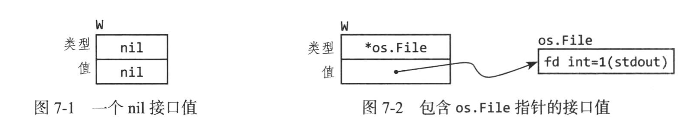

# 接口
接口类型是一种抽象类型，并没有暴露所含有的数据的布局或者内部接口，仅仅是一些方法。

## 接口即预定
例如实现字符串的格式化：fmt.Printf 和fmt.Sprintf,只是输出方式有差异，函数内大量内容不应该重写，可以用**接口机制**解决。

```go
package fmt

func Fprintf(w io.Writer format string, args ...interface{}) (int, error)

func Printf(format string, args ...interface{}) (int, error) {
    return Fprintf(os.Stdout, format, args...)
}

func Sprintf(format string, args ...interface(){}) string {
    var buf bytes.Buffer
    Fprintf(&buf, format, args...)
    return buf.String()
}
// &buf指向内存缓冲区的指针，与文件类型类似

```
```go
package io
type Writer interface {
    // wirte 从p 向底层数据流写入len(p)个字节数据
    // 返回实际写入的字节数
    // 如果没写完，会返回遇到的错误
    // 在返回 n < len(p)时，err必须非nil
    // write不允许修改p的数据
    Write(p []byte) (n int, err error)
}
```
io.Write就是个接口定义，要求调用者包含与其签名和行为一致的Write方法。满足同一接口的另一种类型的特性称为**可取代性**

## 实现接口
如果一个类型实现了一个接口要求的所有方法，那么这个类型实现了这个接口。
比如*os.File类型实现了io.Reader/Writer/Closer/ReaderWriter接口。
*bytes.Buffer是一个io.Writer
如果定义了一个变量是一个接口类型，赋值表达式要求实现了该接口，比如：

```go
var w io.Writer
w = os.Stdout  // OK :
w = time.Second // 编译错误：又没有Write方法
```
**空接口类型**
interface{},对实现类型没有要求，可以把任何值赋给空接口类型

## 使用flag.Value来解析参数
介绍一个标准接口flag.Value定义命令行标志。

```go
package flag
// Value接口代表存储在标志内的值
type Value interface {
    String() string // 格式化标志的值
    Set(string) error
}
```
下面定义了celsiusFlag类型允许参数使用摄氏温度或华氏温度。Celsius类假设已经有String方法了，为满足flag.Value接口，再定义一个Set方法：

```go
type celsiusFlag struct{ Celsius }
// 省略写了
func (f *celsiusFlag) Set(s string) error {
	...
}

func CelsiusFlag(name string, value Celsius, usage string) *Celsius {
	f := celsiusFlag{value}
	flag.CommandLine.Var(&f, name, usage) // 调用Var方法把标志加入到程序的命令行标记集合中
    // 通过调用Var方法把*celsiusFlag实参给flag.Value形参，编译器会检查*celsiusFlag类型是否有flag.Value所必需的方法
	return &f.Celsius
}
```
使用：
```go
var temp = tempconv.CelsiusFlag("temp", 20.0, "the temperature")

func main() {
	flag.Parse()
	fmt.Println(*temp)
}
```

## 接口值
var w io.Writer
接口会初始化接口的零值，即**动态类型**和**值**都是nil。

w = os.Stdout
和显示写法io.Writer(os.Stdout)等价。接口值的动态类型=指针类型*os.File的类型描述符，动态值是os.Stdout的副本，如下图所示。

利用**动态分发**，编译器生成一段代码从类型描述符拿到方法地址。
一个接口值可以指向多个任意大的动态值。



### 注意：含有空指针的非空接口
空接口 ！== 动态值为nil的接口值，有陷阱！！

```go
const debug = true
func main() {
    var buf *bytes.Buffer
    if debug {
        buf = new(bytes.Buffer)
    }
    f(buf) // 就是这里有陷阱！！！


}
func f(out io.Writer) {
    if (out != nil) {
        out.Writer([]byte("done!"))
    }
}
```
当debug是false，会宕机！空指针给了out，out的动态值是nil，动态类型是* bytes.Buffer，不满足out ！= nil。这个调用违背了(*bytes.Buffer).Write的前置条件是接收者不能是空, 修复：
var buf io.Writer

## 使用sort.Interface来排序
sort包提供针对任意序列根据任意排序函数原地排序的功能。sort.Interface接口有三个方法：
```go
package sort
type Interface interface {
    Len() int
    Less(i, j int) bool
    Swap(i, j int)
}
```
根据接口，定义新类型StringSlice：
```go
type StringSlice []string
func (p StringSlice) Len() int {
    return len(p)
}
func (p StringSlice) Less(i, j int) bool {
    return p[i] < p[j]
}
func (p StringSlice) Swap(i, j int) {
    p[i], p[j] = p[j], p[i]
}
```

## error接口
常用的error类型，是一个接口类型：
```go
type error interfaec {
    Error() string
}
```
完整的error包：
```go
package errors
type errorString struct {
    text string // 方便未来扩展
}
func New(text string) error {
    return &errorString{text}
}
//保证每次New分配的error实例都不相等
func (e * errorString) Error() string {
    return e.text
}
fmt.Println(errors.New("EOF") == errors.New("EOF")) // false
```

## 类型断言 （Type Assertion）
x.(T):作用在接口值的操作,T称为断言类型。类型断言会检查操作数的动态类型是否满足指定的T
* T是具体的类型（），检查x的动态类型== T?
* T是接口类型，x的动态类型满足T? 
    * 检查成功，动态值没有提取，只是结果的类型为T
    *  <=> 接口值表达式
```go
var w io.Writer
w = os.Stdout
rw := w.(io.ReadWriter) // 成功：*os.File有Read和Write
```
这种写法断言不会崩溃:
var w io.Writer
f, ok := w.(*os.File)
PS: 翻译真的拗口

## 使用类型断言类识别错误
os包定义了一个pathError类型来表示文件路径操作相关的错误：
```go
package os
type PathError struct {
    Op     string
    Path   sting
    Err    error
}
func (e * PathError) Error() string {
    return e.OP + " " + e.Path + ": " + e.Err.Error()
}
```
可以用类型断言检查错误的特定类型：
```go
improt {
    "errors"
    "syscall"
}
var ErrNotExitst = errors.New("file does not exitst")
func isNotExist(err error) bool {
    if pre, ok := err.(*PathError); ok {
        err = pre.Err
    }
    return err = syscall.ENOENT || err == ErrNotExist
}

_, err = os.Open("/no/such/file")
fmt.Println(os.IsNotExist(err)) // true
```

## 类型分支(type switch)
一个相似的类型分支语句，可以简化一长串的类型断言if-else语句，比如Go语言的数据库SQL查询API会替换？来避免SQL注入：
```go
func sqlQuote(x interfae{}) string {
    if x == nil {
        return "NULL"
    } else if _, ok := x.(int);ok {
        ....
    }
    ...
}
// 改成
func sqlQuote(x interface{}) string {
    switch x: = x.(type) {
        case nil:
            return "NULL"
        case int, uint:
            retutn fmt.Sprintf("%d", x)
        case bool:
            if x {
                return "True"
            }
            return "False"
        ...
        default:
            panic(fmt.Sprintf("unexpected type %T:%v", x, x))
    }
}

```
表面上x的类型是interface{},实际上是int、uint、bool...**可识别联合**。
