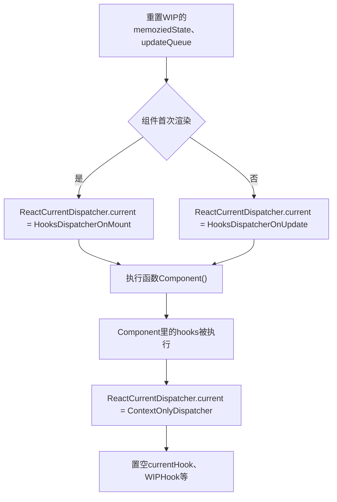
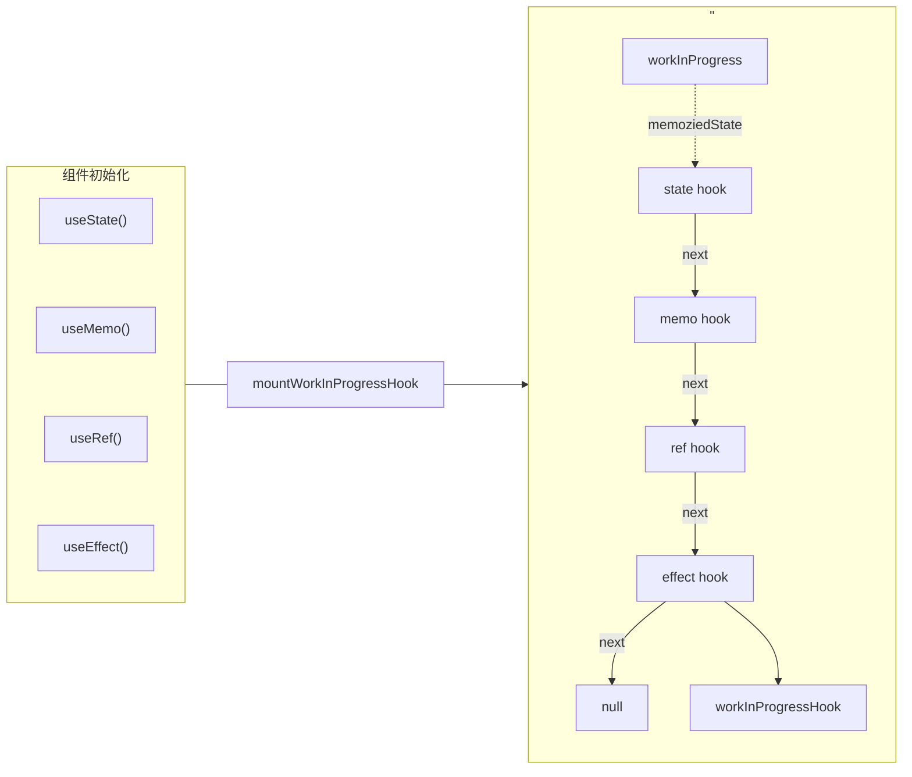
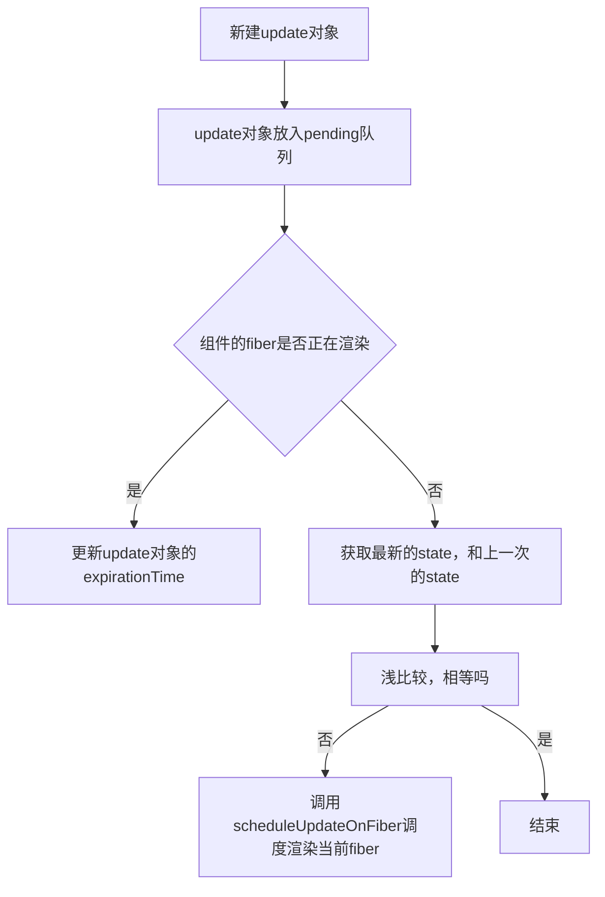
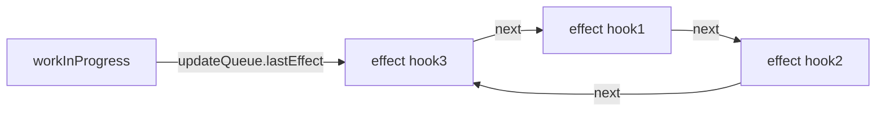
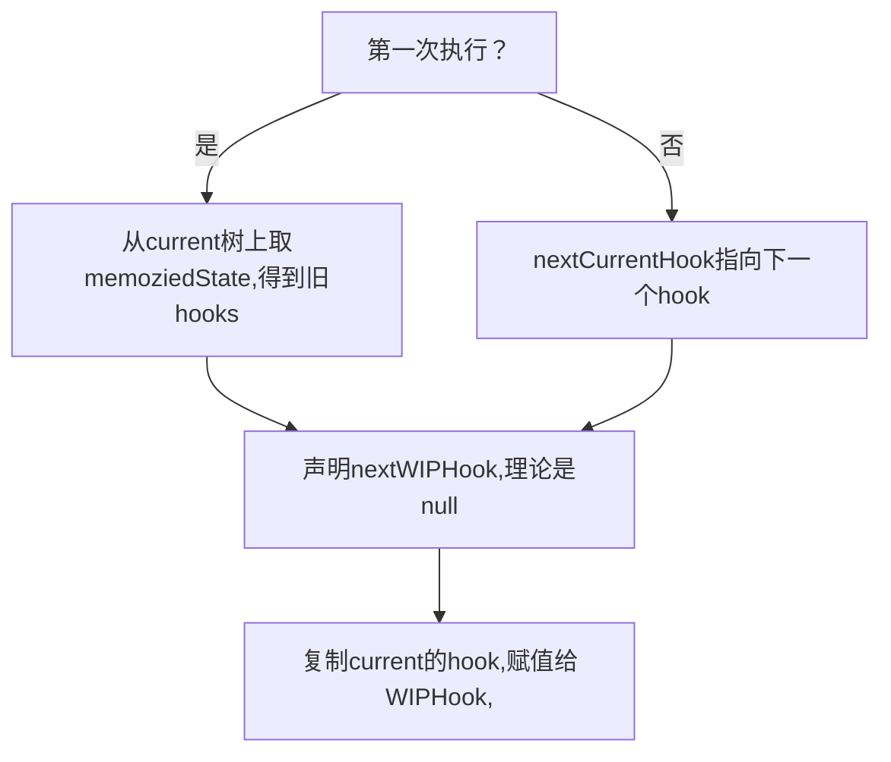

# react hook

Hook 是 React 16.8 的新增特性。它可以让你在不编写 class 的情况下使用 state 以及其他的 React 特性

**为什么引入hook?**
官方给出的动机是解决长时间使用和维护react过程中常遇到的问题，例如：

* 难以重用和共享组件中的与状态相关的逻辑
* 逻辑复杂的组件难以开发与维护，当我们的组件需要处理多个互不相关的 local state 时，每个生命周期函数中可能会包含着各种互不相关的逻辑在里面
* 类组件中的this增加学习成本，类组件在基于现有工具的优化上存在些许问题
* 由于业务变动，函数组件不得不改为类组件等等

在以前，函数组件也被称为无状态的组件，只负责渲染的一些工作。

因此，现在的函数组件也可以是有状态的组件，内部也可以维护自身的状态以及做一些逻辑方面的处理


## react-hook原理：
* 函数组件执行renderWithHooks
* 初始化hooks
    * mountWorkInProgressHook生成hooks链表
    * mountState初始化useState
    * dispatchAction控制无状态组件更新
    * mountEffect初始化useEffect
    * mountMemo初始化useMemo
    * mountRef初始化useRef
* 更新hooks
    * updateWorkInProgressHook更新hooks链表、找到对应hooks
    * updateState得到更新state
    * updateEffect更新updateQueue
    * updateMemo判断deps，获取/更新缓存值
    * updateRef获取ref对象

## 1. 引入hooks

```js
export function useState(initialState) {
    const dispatcher = resolveDispatcher();
    return dispatcher.useState(initialState);
}


```
resolveDispatcher

```js
function resolveDispatcher() {
    const dispatcher = ReactCurrentDispatcher.current;
    return dispatcher;
}

```
ReactCurrentDispatcher

```js
const ReactCurrentDispatcher = {
  current: null,
};
```

### 无状态函数执行

**current fiber树**: 当完成一次渲染之后，会产生一个current树,current会在commit阶段替换成真实的Dom树。

**workInProgress fiber树**: 即将调和渲染的 fiber 树。再一次新的组件更新过程中，会从current复制一份作为workInProgress,更新完毕后，将当前的workInProgress树赋值给current树。


**renderWithHooks**函数作用是调用function组件函数的主要函数。我们重点看看renderWithHooks做了些什么？
```js
// 可以理解 current树上的指向的当前调度的 hooks节点。
let currentHook = null;
// 可以理解 workInProgress树上指向的当前调度的 hooks节点。
let workInProgressHook = null;
export function renderWithHooks(
    current,
    workInProgress,
    Component,
    props,
    secondArg,
    nextRenderExpirationTime,
) {
    renderExpirationTime = nextRenderExpirationTime;
    currentlyRenderingFiber = workInProgress;

    workInProgress.memoizedState = null;
    workInProgress.updateQueue = null;
    workInProgress.expirationTime = NoWork;

    ReactCurrentDispatcher.current =
        current === null || current.memoizedState === null
            ? HooksDispatcherOnMount
            : HooksDispatcherOnUpdate;

    let children = Component(props, secondArg);

    if (workInProgress.expirationTime ===   renderExpirationTime) { 
        // ....这里的逻辑我们先放一放
    }

    ReactCurrentDispatcher.current = ContextOnlyDispatcher;

    renderExpirationTime = NoWork;
    currentlyRenderingFiber = null;

    currentHook = null
    workInProgressHook = null;

    didScheduleRenderPhaseUpdate = false;

    return children;
}

```

```js
const ContextOnlyDispatcher = {
    useState:throwInvalidHookError
}
function throwInvalidHookError() {
  invariant(
    false,
    'Invalid hook call. Hooks can only be called inside of the body of a function component. This could happen for' +
      ' one of the following reasons:\n' +
      '1. You might have mismatching versions of React and the renderer (such as React DOM)\n' +
      '2. You might be breaking the Rules of Hooks\n' +
      '3. You might have more than one copy of React in the same app\n' +
      'See https://fb.me/react-invalid-hook-call for tips about how to debug and fix this problem.',
  );
}

```




### 不同的hooks对象
挂载时候：**HooksDispatcherOnMount**
```js
const HooksDispatcherOnMount = {
  useCallback: mountCallback,
  useEffect: mountEffect,
  useLayoutEffect: mountLayoutEffect,
  useMemo: mountMemo,
  useReducer: mountReducer,
  useRef: mountRef,
  useState: mountState,
};

```

更新时候：**HooksDispatcherOnUpdate**

```js
const HooksDispatcherOnUpdate = {
  useCallback: updateCallback,
  useEffect: updateEffect,
  useLayoutEffect: updateLayoutEffect,
  useMemo: updateMemo,
  useReducer: updateReducer,
  useRef: updateRef,
  useState: updateState
};

```
react-hooks用了2套Api。


### hooks初始化
举个例子：

```js
import React , { useEffect , useState , useRef , useMemo  } from 'react'
function Index(){
    const [ number , setNumber ] = useState(0)
    const DivDemo = useMemo(() => <div> hello , i am useMemo </div>,[])
    const curRef  = useRef(null)
    useEffect(()=>{
       console.log(curRef.current)
    },[])
    return <div ref={ curRef } >
        hello,world { number } 
        { DivDemo }
        <button onClick={() => setNumber(number+1) } >number++</button>
     </div>
}


```

#### mountWorkInProgressHook

mountReducer、mountRef等都调用mountWorkInProgressHook()

```js
//...
let workInProgressHook = null;
let currentlyRenderingFiber = null;
//...
function mountWorkInProgressHook() {
    const hook = {
        // useState中 保存 state信息 ｜ useEffect 中 保存着 effect 对象 ｜ useMemo 中 
        // 保存的是缓存的值和deps ｜ useRef中保存的是ref 对象
        memoizedState: null, 
        baseState: null,
        baseQueue: null,
        queue: null,
        next: null,
    };
    // 例子中的第一个`hooks`-> useState(0) 走的就是这样。
    if (workInProgressHook === null) { 
        currentlyRenderingFiber.memoizedState = workInProgressHook = hook;
    } else {
        workInProgressHook = workInProgressHook.next = hook;
    }
    return workInProgressHook;
}


```
产生一个hook对象，每个hook以链表形式串联起来，存在了currentlyRenderingFiber.memoizedState里。
格式大概是：
```js
{
    baseQueue: null,
    baseState: null,
    memoizedState: null, 
    queue: null,
    next: {
        baseQueue: null,
        baseState: null,
        memoizedState: null
        next: null
        queue: null
    }
}

```
* **memoizedState**: useState中 保存 state 信息 ｜ useEffect 中 保存着 effect 对象 ｜ useMemo 中 保存的是缓存的值和 deps ｜ useRef 中保存的是 ref 对象。
* **baseQueue** : usestate和useReducer中 保存最新的更新队列。
* **baseState**: usestate和useReducer中,一次更新中 ，产生的最新state值。
* **queue** ： 保存待更新队列 pendingQueue ，更新函数 dispatch 等信息。
* **next**: 指向下一个 hook对象。


Q: 为什么不能条件语句中，声明hooks?
A: 因为一旦在条件语句中声明hooks，在下一次函数组件更新，hooks链表结构，将会被破坏，current树的memoizedState缓存hooks信息，和当前workInProgress不一致，如果涉及到读取state等操作，就会发生异常。


#### useState -> mountState

```js
function mountState(initialState) {
    // 形成链表结构，最后一个是空hook
    const hook = mountWorkInProgressHook();
    if (typeof initialState === 'function') {
        // 如果 useState 第一个参数为函数，执行函数得到state
        initialState = initialState();
    }
    // 最后一个hook设置数据
    hook.memoziedState = hook.baseState = initialState;
    const queue = (hook.queue = {
        padding: null, // 带更新的
        dispatch: null, // 负责更新函数
        lastRenderdReducer: basicStateReducer, // 用于得到最新的 state ,
        lastRenderedState: initialState, // 最后一次得到的 state
    });
    const dispatch = (queue.dispatch = (dispatchAction.bind(null, currentRenderingFiber, queue)));
    return [hook.memoziedState, dispatch];
}
```
1. 首先会得到初始化的state
2. 将它赋值给mountWorkInProgressHook产生的hook对象的 memoizedState和baseState属性，
3. 然后创建一个queue对象，里面保存了负责更新的信息。

**dispatchAction**

dispatchAction 就是 setXXXX

```js
function dispatchAction(fiber, queue, action) {

    // 计算 expirationTime 过程略过。
    /* 创建一个update */
    const update = {
        expirationTime,
        suspenseConfig,
        action,
        eagerReducer: null,
        eagerState: null,
        next: null,
    }
    /* 把创建的update */
    const pending = queue.pending;
    if (pending === null) {  // 证明第一次更新
        update.next = update;
    } else { // 不是第一次更新
        update.next = pending.next;
        pending.next = update;
    }
  
    queue.pending = update;
    const alternate = fiber.alternate;
    /* 判断当前是否在渲染阶段 */
    if ( fiber === currentlyRenderingFiber || (alternate !== null && alternate === currentlyRenderingFiber)) {
        didScheduleRenderPhaseUpdate = true;
        update.expirationTime = renderExpirationTime;
        currentlyRenderingFiber.expirationTime = renderExpirationTime;
    } else { /* 当前函数组件对应fiber没有处于调和渲染阶段 ，那么获取最新state , 执行更新 */
        if (fiber.expirationTime === NoWork && (alternate === null || alternate.expirationTime === NoWork)) {
            const lastRenderedReducer = queue.lastRenderedReducer;
            if (lastRenderedReducer !== null) {
                let prevDispatcher;
                try {
                    /* 上一次的state */
                    const currentState = queue.lastRenderedState;
                    const eagerState = lastRenderedReducer(currentState, action); /**/
                    update.eagerReducer = lastRenderedReducer;
                    update.eagerState = eagerState;
                    //!!!! 进行了浅比较，一样是不更新的
                    if (is(eagerState, currentState)) { 
                        return
                    }
                } 
            }
        }
        scheduleUpdateOnFiber(fiber, expirationTime);
    }
}


```



#### useEffect -> mountEffect

```js
function mountEffect(
  create,
  deps,
) {
    // 链表结构最后一个加入空hook 
    const hook = mountWorkInProgressHook();
    const nextDeps = deps === undefined ? null : deps;
    // 新hook设置值
    hook.memoizedState = pushEffect(
        HookHasEffect | hookEffectTag, 
        create, // useEffect 第一次参数，就是副作用函数
        undefined,
        nextDeps, // useEffect 第二次参数，deps
    );
}


```
workInProgress / current 树上的 memoizedState 保存的是当前函数组件每个hooks形成的链表。


每个hooks上的memoizedState 保存了当前hooks信息，不同种类的hooks的memoizedState内容不同。


**pushEffect**

```js
function pushEffect(tag, create, destroy, deps) {
    const effect = {
        tag,
        create,
        destroy,
        deps,
        next: null,
    };
    let componentUpdateQueue = currentlyRenderingFiber.updateQueue
    if (componentUpdateQueue === null) { // 如果是第一个 useEffect
        componentUpdateQueue = {  lastEffect: null  }
        currentlyRenderingFiber.updateQueue = componentUpdateQueue
        componentUpdateQueue.lastEffect = effect.next = effect;
    } else {  // 存在多个effect
        const lastEffect = componentUpdateQueue.lastEffect;
        if (lastEffect === null) {
            componentUpdateQueue.lastEffect = effect.next = effect;
        } else {
            const firstEffect = lastEffect.next;
            lastEffect.next = effect;
            effect.next = firstEffect;
            componentUpdateQueue.lastEffect = effect;
        }
    }
    return effect;
}

```

举个例子：

```js

useEffect(()=>{
    console.log(1)
},[ props.a ])
useEffect(()=>{
    console.log(2)
},[])
useEffect(()=>{
    console.log(3)
},[])

```
currentlyRenderingFiber.updateQueue保存形式：




#### useMemo -> mountMemo

```js
function mountMemo(nextCreate,deps) {
    // 链表后加入一个hook
    const hook = mountWorkInProgressHook();
    const nextDeps = deps === undefined ? null : deps;
    const nextValue = nextCreate();
    // 保存值和deps
    hook.memoizedState = [nextValue, nextDeps];
    return nextValue;
}


```
就是创建一个hook，然后执行useMemo的第一个参数,得到需要缓存的值，然后将值和deps记录下来，赋值给当前hook的memoizedState.

#### useRef -> mountRef

```js
function mountRef(initialValue) {
    // 链表后创建一个hook
    const hook = mountWorkInProgressHook();
    const ref = {current: initialValue};
    // 新hook上挂载值
    hook.memoizedState = ref;
    return ref;
}

```
mountRef初始化很简单, 创建一个ref对象， 对象的current 属性来保存初始化的值，最后用memoizedState保存ref，完成整个操作。


### hooks更新阶段

先要从current的hooks中找到与当前workInProgressHook，对应的currentHooks，然后复制一份currentHooks给workInProgressHook,接下来hooks函数执行的时候,把最新的状态更新到workInProgressHook，保证hooks状态不丢失。
所以函数组件每次更新，每一次react-hooks函数执行，都需要有一个函数去做上面的操作，这个函数就是updateWorkInProgressHook。

#### updateWorkInProgressHook

```js
// ... 
let currentHook = null;
let currentlyRenderingFiber = null;
let workInProgressHook = null;
function updateWorkInProgressHook() {
    let nextCurrentHook;
    // 第一个hook
    if (currentHook === null) {
        const current = currentlyRenderingFiber.alternate;
        if (current !== null) {
            nextCurrentHook = current.memoziedState;
        } else {
            nextCurrentHook = null;
        }
    } else {
         /* 不是第一个hooks，那么指向下一个 hooks */
        nextCurrentHook = currrentHook.next
    }
    
    let nextWorkInProgressHook;
     //第一次执行hooks
    if (workInProgressHook === null) {
        // 这里应该注意一下，当函数组件更新也是调用 
        // renderWithHooks ,memoizedState属性是置空的
        nextWorkInProgressHook = currentlyRenderingFiber.memoziedState;
    } else {
        nextWorkInProgressHook = workInProgressHook.next;
    }
    
     if (nextWorkInProgressHook !== null) { 
        /* 这个情况说明 renderWithHooks 执行 过程发生多次函数组件的执行 ，我们暂时先不考虑 */
        workInProgressHook = nextWorkInProgressHook;
        nextWorkInProgressHook = workInProgressHook.next;
        currentHook = nextCurrentHook;
    } else {
        currentHook = nextCurrentHook;
        // 创建新hook，值都复制过来
        const newHook = {
            memoziedState: currentHook.memoziedState,
            baseState: currentHook.baseState,
            baseQueue: currentHook.baseQueue,
            queue: currentHook.queue,
            next: null
        };
        // 第一个hook
        if (workInProgressHook === null) {
            currentlyRenderingFiber.memoziedState = workInProgressHook = newHook;
        } else {
            // 重新更新hook
            workInProgressHook = workInProgressHook.next = newHook;
        }
    }
    return workInProgressHook;
}

```




#### updateState

```js
function updateReducer(
    reducer,
    initialArg,
    init,
) {
    // 新hook，值从currentHooks中复制过来
    const hook = updateWorkInProgressHook();
    const queue = hook.queue;
    queue.lastRenderedReducer = reducer;
    const current = currentHook;
    let baseQueue = current.baseQueue;
    const pendingQueue = queue.pending;
    if (pendingQueue !== null) {
        // 这里省略... 第一步：将 pending  queue 合并到 basequeue
    }
    if (baseQueue !== null) {
        const first = baseQueue.next;
        let newState = current.baseState;
        let newBaseState = null;
        let newBaseQueueFirst = null;
        let newBaseQueueLast = null;
        let update = first;
        do {
        const updateExpirationTime = update.expirationTime;
        if (updateExpirationTime < renderExpirationTime) { //优先级不足
            const clone  = {
            expirationTime: update.expirationTime,
            ...
            };
            if (newBaseQueueLast === null) {
            newBaseQueueFirst = newBaseQueueLast = clone;
            newBaseState = newState;
            } else {
            newBaseQueueLast = newBaseQueueLast.next = clone;
            }
        } else {  //此更新确实具有足够的优先级。
            if (newBaseQueueLast !== null) {
                const clone= {
                    expirationTime: Sync, 
                    ...
                };
                newBaseQueueLast = newBaseQueueLast.next = clone;
            }
            /* 得到新的 state */
            newState = reducer(newState, action);
        }
        update = update.next;
    } 
    while (update !== null && update !== first);
        if (newBaseQueueLast === null) {
            newBaseState = newState;
        } else {
            newBaseQueueLast.next = newBaseQueueFirst;
        }
        hook.memoizedState = newState;
        hook.baseState = newBaseState;
        hook.baseQueue = newBaseQueueLast;
        queue.lastRenderedState = newState;
    }
    const dispatch = queue.dispatch
    return [hook.memoizedState, dispatch];
}

```


#### updateEffect

```js
function updateEffect(create, deps): void {
    // 从老的currentHooks中复制过来
    const hook = updateWorkInProgressHook();
    const nextDeps = deps === undefined ? null : deps;
    let destroy = undefined;
    if (currentHook !== null) {
        const prevEffect = currentHook.memoizedState;
        destroy = prevEffect.destroy;
        if (nextDeps !== null) {
            const prevDeps = prevEffect.deps;
            if (areHookInputsEqual(nextDeps, prevDeps)) {
                pushEffect(hookEffectTag, create, destroy, nextDeps);
                return;
            }
        }
    }
    currentlyRenderingFiber.effectTag |= fiberEffectTag;
    // 更新hook的值
    hook.memoizedState = pushEffect(
        HookHasEffect | hookEffectTag,
        create,
        destroy,
        nextDeps,
    );
}

```

useEffect 做的事很简单，判断两次deps 相等，如果相等说明此次更新不需要执行，则直接调用 pushEffect,这里注意 effect的标签，hookEffectTag,如果不相等，那么更新  effect ,并且赋值给hook.memoizedState，这里标签是 HookHasEffect | hookEffectTag,然后在commit阶段，react会通过标签来判断，是否执行当前的 effect 函数。

#### updateMemo

```js

function updateMemo(
    nextCreate,
    deps,
) {
    // 从老的currentHooks中复制过来
    const hook = updateWorkInProgressHook();
    const nextDeps = deps === undefined ? null : deps; // 新的 deps 值
    const prevState = hook.memoizedState; 
    if (prevState !== null) {
        if (nextDeps !== null) {
            const prevDeps = prevState[1]; // 之前保存的 deps 值
            if (areHookInputsEqual(nextDeps, prevDeps)) { //判断两次 deps 值
                return prevState[0];
            }
        }
    }
    const nextValue = nextCreate();
    // 更新 新hook的保存的值
    hook.memoizedState = [nextValue, nextDeps];
    return nextValue;
}

```
在组件更新过程中，我们执行useMemo函数，做的事情实际很简单，就是判断两次 deps是否相等，如果不想等，证明依赖项发生改变，那么执行 useMemo的第一个函数，得到新的值，然后重新赋值给hook.memoizedState,如果相等 证明没有依赖项改变，那么直接获取缓存的值。


#### updateRef

```js
function updateRef(initialValue){
    const hook = updateWorkInProgressHook();
    return hook.memoizedState;
}

```
