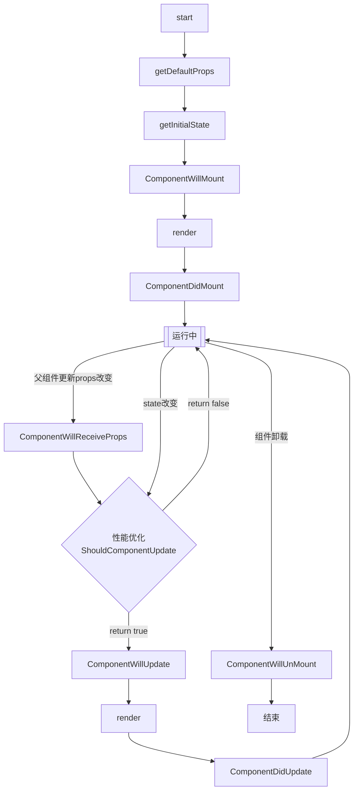

# React

## 1. React V16
新特性：
1. react hooks；
2. 允许在render函数返回节点数组和字符串
```jsx
return [
  <li>1</li>
  <li>2</li>
  ...
];
```
3. 更好的错误处理；
4. 支持自定义DOM属性；
5. 重写，改为Fiber异步渲染架构；

## 2. Fiber
Fiber是新的reconciler
* reconciliation: effect list
* commit: 同步


更新后： alternate成为新的current fiber
```js
fiber {
  tag: fiber类型,
  alternate: 更新时克隆出的fiber,
  'return': 指向fiber树中的父节点,
  child: 第一个节点,
  sibling: 兄弟节点,
  effectTag: side effect类型,
  pendingWorkPriority: 标记子树上更新任务优先级,
  nextEffect: 单链表结构，方便遍历fiber树上有副作用节点,
}
```
### reconciliation
fiber phase 1: render reconciliation, 调用的生命周期方法：
* componentWillMount
* componnetWillReceiveProps
* shouldComponentUpdate
* componentWillUpdate


### commiet
fiber phase 2: commit
* componentDidMount（commit 2阶段）
* componentDidUpdate(commit 2阶段)
* componentWillUnmount(commit 1阶段)

如果effectTag是Deletion, 调用commitDeletion做处理。
commitDeletion会递归地将子节点从fiber树上移除，对于节点上存在的ref做detach,调用componentWillUnmount生命周期钩子。最后调用renderer传入平台相关方法removeChild和removeChildFromContainer更新UI.

## 3. 生命周期

### react 16.4之前




* 获取父传props -> 初始化state -> （将会挂载、组件渲染、挂载）
* props改变 -> ComponentWillReceiveProps ——> ComponentShouldUpdate判定是否需要更新(默认true)
* state改变 -> ComponentShouldUpdate ? true: （组件将更新、渲染、更新完毕）

## 4. setState
调用this.updater.enqueneSetState  ——> addUpdate(向队列中推入需要更新fiber) ——> scheduleUpdate（触发调度器一次新更新）

**scheduleUpdate**:
从当前触发节点向上搜索。父节点不是hostRoot(ReactDOM.render()的根节点)，且更新父节点的peddingWorkPriority,标记这个节点上等待更新事务的优先级。
父节点是hostRoot, 调用scheduleRoot,根据优先级决定是否立即执行update。
有nextScheduleRoot指针指向下一个待更新HostRoot,构成链表结构。


## 5. diff算法

### diff策略
通过制定大胆的策略，将O(n^3)复杂度的问题转换成O(n)复杂度的问题。

1. DOM节点跨层级移动操作特别少，可以忽略不计；
2. 拥有相同类的2个组件将会生成相似的树形结构，拥有不同类的两个组件将会生成不同的树形结构；
3. 对于同一层级的一组子节点，它们可以通过唯一id进行区分。

### tree diff
2棵树分层比较，两棵树只会对同一层级的节点进行比较。当发现节点已经不存在，则该节点以及子节点会被完全删除掉，不会用于进一步的比较。这样只需要对树进行一次遍历，便能完成整个DOM树的比较。

react15 伪代码：
```js
updateChildren: function(nextNestedChildrenElements, transaction, context) {
    updateDepth++;
    var errorThrown = true;
    try {
        this._updateChildren(nextNestedChilrenElements, transaction, context);
        errorThrown = false;
    } finally {
        updateDepth--;
        if (!updateDepth) {
            if (errorThrown) {
                clearQuene();
            } else {
                processQueue();
            }
        }
    }
}
```


### element diff
同一层级，diff操作：INSERT_MARKUP、MOVE_EXISTING、REMOVE_NODE;

思路：2层循环，外层循环遍历新children, 内层老的，找到相同的key，可复用。 
是否需要移动? 如何移动？  
索引值变化趋势： 寻找过程中在旧children中所遇到最大索引值，如果发现存在比最大索引值小的节点，该节点需移动。 


react15 部分源码：
```js
_updateChildren: function(nextNestedChildrenElements, transaction, context) {
    var prevChildren = this._renderedChildren;
    var removedNoes = {};
    var nextChildren = this._reconcilerUpdateChildren(prevChildren, nextNestedChildrenElements, removedNodes, transaction, context);
    // 如果不存则prevChildren 和 nextChildren, 则不作diff处理
    if (!nextChildren && !prevChildren) {
        return;
    }
    var updates = null;
    var name;
    // lastIndex 是prevChildren中最后的索引，nextIndex是nextChildren中每个节点的索引
    var lastIndex = 0;
    var nextIndex = 0;
    var lastPlaceNode = null;
    for (name in nextChildren) {
        if (!nextChildren.hasOwnProperty(name)) {
            continue;
        }
        var prevChild = prevChildren && prevChildren[name];
        var nextChild = nextChildren[name];
        if (prevChild === nextChild) {
            // 移动节点
            updates = enqueue(
                updates,
                this.moveChild(prevChild, lastPlaceNode, nextIndex, lastIndex);
            );
            lastIndex = Math.max(prevChild._mountIndex, lastIndex);
            prevChild._mountIndex = nextIndex;
        } else {
            if (prevChild) {
                lastIndex = Math.max(prevChild._mountIndex, lastIndex);
            }
            updates = enqueue(
                updates,
                this._mountChildAtIndex(nextChild, lastPlaceNode, nextIndex, transaction, context);
            );
            nextIndex++;
            lastPlaceNode = ReactReconciler.getNativeNode(nextChild);
        }
        // 如果父节点不存在，则将其子节点全部移除
        for(name in removedNodes) {
            if (removedNodes.hasOwnProperty(name)) {
                updates = enqueue(
                    updates,
                    this._unmountChild(prevChildren[name], removeedNodes[name]);
                );

            }
        }
        // 处理更新队列
        if (updates) {
            precessQueue(this, updates);
        }
        this._renderedChildren = nextChildren;
    }
},

moveChild: function(child, afterNode, toIndex, lastIndex) {
    // 如果子节点index小于lastIndex，则移动
    if (child._mountIndex < lastIndex) {
        return makeMove(child, afterNode, toIndex);
    }
},
// 创建节点
createChild: function(child, afterNode, mountImage) {
    return makeInsertMarkup(mountImage, afterNode, child._mountIndex);
},
// 删除节点
removeChild: function(child, node) {
    return makeRomove(child, node);
},
// 卸载已经渲染的子节点
_unmountChild: function(child, node) {
    var update = this.removeChild(child, node);
    child._mountIndex = null;
    return update;
}
```


### react16 diff(fiber)
大致分为2类：
* 同级只有一个节点：oject、number、string
* 同级多个节点

简易代码：
```js
// 根据newChild类型选择不同diff函数处理
function reconcileChildFibers(
    returnFier: Fiber,
    currentFirstChild: Fiber | null,
    newChild: any,
): Fiber | null {
    const isObject = typeof newChild === 'object' && newChild !== null;

    if (isObject) {
        // 可能是react_element_type or react_portal_type
        switch(newChild.$typeof) {
            case REACT_ELEMENT_TYPE:
                //...
        }
    }
    if (typeof newChild === 'string' || typeof newChild === 'number') {
        // 调用reconcileSingleTextNode 处理
    }

    if (isArray(newChild)) {
        // 调用reconcileChildrenArray 处理
    }
    // ...
    // 如果没有命中，删除节点
    return deleteRemainingChildren(returnFiber, currentFirstFiberChild);
}
```
#### 同级只有一个节点的diff
先判断key是否相同，再判断type是否相同，只有都相同才可复用。

简易代码：
```js
function reconcileSingleElement(
    returnFiber: Fiber,
    currentFirstChild: Fiber | null,
    element: ReactElement
): Fiber {
    const key = element.key;
    let child = currentFirstChild;
    // 首先判断是否存在对应Dom节点
    while(child !== null) {
        // 可复用吗
        if (child.key === key) {
            switch(child.tag) {
                //...
                default: {
                    // type也一样，可以复用
                    if (child.elementType === element.type) {
                        return existing;
                    }
                    // ...
                    // type不同，跳出循环
                    break;
                }
            }
            // 不能复用,标记为删除
            deleteRemainingChildren(returnFiber, child);
            break;
        } else {
            deleteChild(returnFiber, child);
        }
        child = child.sibling;
    }
    // 创建新Fiber，并返回
}
```

#### 同级多个元素diff
为啥没有双指针？
newChildren是数组，但是比较的是上次Fiber节点，Fiber的同级节点是由sibling指针链行程的链表。单链表无法使用双指针。

两轮遍历：
第一轮遍历：
1. 遍历newChildren，i = 0，将newChildren[i]与oldFiber比较，判断DOM节点是否可复用。
2. 如果可复用，i++，比较newChildren[i]与oldFiber.sibling是否可复用。可以复用则重复步骤2。
3. 如果不可复用，立即跳出整个遍历。
4. 如果newChildren遍历完或者oldFiber遍历完（即oldFiber.sibling === null），跳出遍历。

**第二轮遍历：比如newChildren和oldFiber都没有遍历完。**
举例：

```js

// 之前 abcd

// 之后 acdb

//第一轮遍历开始
//a（之后）vs a（之前）
// key不变，可复用
//此时 a 对应的oldFiber（之前的a）在之前的数组（abcd）中索引为0
lastPlacedIndex =0;

// 继续第一轮遍历...

// c（之后）vs b（之前）
//key改变，不能复用，跳出第一轮遍历
// 此时
lastPlacedIndex =0;
// 第一轮遍历结束

// 第二轮遍历开始
newChildren === cdb，// 没用完，不需要执行删除旧节点
oldFibe === bcd，// 没用完，不需要执行插入新节点

// 将剩余oldFiber（bcd）保存为map

// 当前oldFiber：bcd
// 当前newChildren：cdb

// 继续遍历剩余newChildren

key === c // 在 oldFiber中存在
const oldIndex = c（之前）.index;
//即 oldIndex 代表当前可复用节点（c）在上一次更新时的位置索引
oldIndex=2;
// 之前节点为 abcd，所以c.index === 2
//比较 oldIndex 与 lastPlacedIndex;

//如果 oldIndex <= lastPlacedIndex 代表该可复用节点不需要移动, 并将
lastPlacedIndex = oldIndex;

// 如果 oldIndex < lastplacedIndex 该可复用节点之前插入的位置索引小于这次更新需要插入的位置索引，代表该节点需要向右移动

// 在例子中，oldIndex 2 > lastPlacedIndex =0,
则 lastPlacedIndex=2;
// c节点位置不变

// 继续遍历剩余newChildren

// 当前oldFiber：bd
// 当前newChildren：db

key === d  // 在 oldFiber中存在
const oldIndex = d（之前）.index;
oldIndex 3 > lastPlacedIndex 2
// 之前节点为 abcd，所以d.index =3
lastPlacedIndex =3;
// d节点位置不变

// 继续遍历剩余newChildren

// 当前oldFiber：b
// 当前newChildren：b

key=== b // 在 oldFiber中存在
const oldIndex = b（之前）.inde;
oldIndex 1 < lastPlacedIndex 3 // 之前节点为 abcd，所以b.index === 1
// 则 b节点需要向右移动
// 第二轮遍历结束

// 最终acd 3个节点都没有移动，b节点被标记为移动

```


## 6. 任务调度
利用requestIdleCallback实现task scheduling
```js
                                                      |
                      Frame#1                         |        Frame#2
  ______    __________   ___________________________  |   ______     ______
 |  run |  |  Update  | |       idle period         | |  |  run |   |  run |
 | task |  |Rendering | |  __________   __________  | |  | task |   | task |  ...
  ——————    ——————————  | |  idle    | |   idle   | | |   ——————     ——————
                        | | callback | | callback | | |
                        |  ——————————   ——————————  | |
                         ———————————————————————————  |
                                                      |
                                                      |
```
requestIdleCallback回调执行时间：
一帧开始，JS执行完，浏览器渲染后，到这帧结束之前。

### 如何调度时间才能保证流畅？
安排xxms来更新视图与虚拟DOM，再安排xxms给浏览器来做其他事情。
利用requestIdleCalllback(闲时调用)
```js
function updateFiberAndView(dl) {
    // 更新视图，会耗时
    updateView();
    if (dl.timeRemaining() > 1) {
        var dom = getVdomFromQueue();
        var fiber = vdom, firstFiber;
        var hasVisited = {};
        // 深度遍历优先
        do {
            var fiber = toFiber(fiber); // A处
            if (!firstFiber) {
                firstFiber = fiber;
            }
            if (!hasVisited[fiber.uuid]) {
                hasVisited[fiber.uuid] = 1;
                // 根据fiber.type实例化组件or创建真实dom
                // 耗时，check时间
                updateComponentOrElement(fiber);
                if (fiber.child) {
                    // 向下转换
                    if (dl.timeRemaining() > 1) {
                        queue.push(fiber.child);

                    } else {
                        // 时间不够，放入栈
                        break;
                    }
                    fiber = fiber.child;
                    continue; //跑回A处，不断转换child
                }
            }
            // 如果组件没有children，向右找
            if (fiber.sibling) {
                fiber = fiber.sibling;
                continue;
            }
            // 向上找
            fiber = fiber.return;
            if (fiber === firstFiber || !fiber) {
                break;
            }
        } while (1)
        if (queue.length) {
            requestIdleCallback(updateFiberAndView, {
                timeout: new Date + 100
            });
        }
    }
}

function updateComponentOrElement(fiber) {
    var {type, stateNode, props} = fiber;
    if (!stateNode) {
        if (typeof type === 'string') {
            fiber.stateNode = document.createElement(type);
        } else {
            var context = {};
            fiber.stateNode = new type(props, context);
        }
    }
    if (stateNode.render) {
        children = stateNode.render();
    } else {
        children = fiber.children;
    }
    var prev = null;
    for (var i = 0, n = children.length; i < n; i++) {
        var child = children[i];
        child.return = fiber;
        if (!prev) {
            fiber.child = child;
        } else {
            prev.sibling = child;
        }
        prev = child;
    }
}

```


## 7. 组件的实现与挂载
```js
<A />
```
属性：
* $$typeof: Symbol(react.element)
* key: null
* props: {}
* ref: null
* type: f A(props)
* _owner: null(创建当前组件的对象，默认是null)
* _store: {validated: false}

```js
function ReactComponent(props, context, updater) {
    this.props = props;
    this.context = context;
    this.refs = emptyObject;
    this.updater = updater || ReactNoopUpdateQueue;
}
ReactComponent.prototype.setState = function() {
    ...
}
```
### 组件的挂载
| Node     | 实际参数    |    结果        |
| ---------|------------|---------------|
|null or false |空|ReactEmptyComponent|
|object && type === string| 虚拟DOM|ReactDomComponent|
|object && type !== string|React组件|ReactCompositeComponent|
|string|字符串|ReactTextComponent|
|number|数字|ReactTextComponent|

```js
 ________
|_context|\
|_props__|\\
|_refs___|\\\
           \\\
            \\\______________      __________      __setState
            |_ReactComponent_|————|prototype_|————|
 __________/______________  |      ——————————      ——forceUpdate
|updator(ReactUpdateQueue)| |
 —————————————————————————  |
                            ↓
                    ———————————————————
                   |执行ReactElement方法|
                    ———————————————————
                            ↓
            ——————————————————————————————————————
           | 创建ReactElement类型的js对象 === <A /> |
            ——————————————————————————————————————
               ______________↓__________________
              |ReactDom.render(<A />, container)|
               —————————————————————————————————
                            ↓                     |————ReactDomEmptyComponent
             ________________________________     |————ReactDomComponent           ______________________________
            |根据<A />类型，内部封装为四大类型组件|————|————ReactCompositeComponent  -->| 解析ReactElement对对象获得HTML |
             ————————————————————————————————     |___ReactTextComponent            ——————————————————————————————
                                                                                                ↓
                                                                                        ___________________
                                                                                       | 将HTML插入真实DOM中 |
                                                                                        ———————————————————
```


ReactDom.render -> ReactMount.render -> ReactMount._renderSubtreeIntoContainer

伪代码:
```js
/**
 * @param parentComponent 当前组件父组件，第一次null
 * @param nextElement 要插入DOM的组件
 * @param callback 完成后回调
 * @param container 要插入的容器
*/
_renderSubtreeIntoContainer: function(parentComponent, nextElement, container, callback) {
    // 当前组件添加到前一级的props
    var nextWrapperdElement = ReactElement(TopLevelWrapper, null, null, null ,null, null, nextElement);
    var prevComponent = getTopLevelWrapperIntoContainer(container);
    // 判断当前容器下是否存在组件, 即preComponent
    // 如果true，执行更新流程，若不存在，则卸载
    if (preComponent) {
        var preWrappedElement = preComponnet._currentElement;
        var preElement = preWrappedElement.props;
        // 组件更新机制在生命周期部分进行解析
        if (shouldUpdateReactComponent(preElement, nextElement)) {
            var publicInst = prevComponent._renderedComponent.getPublicInstance();
            var updatedCallback = callback && function () {
                callback.call(publicInst);
            }
        }
        ReactMount._updateRootComponent(preComponent, nextWrappedElement, nextContext, container, updatedCallback);
    } else {
        // 卸载
        ReactMount.unmountComponentAtNode(container);
    }
}

// 不管更新or卸载，均要求挂载到真实dom上
_renderNewRootComponent: function(nextElement, container, shouldReuseMarkup, context) {
    var componentInstance = instantiateReactComponent(nextElement, false);
    ReactUpdates.batchedUpdates(batchedMountComponentIntoNode, componnetInstance, container, shouldReuseMarkup, context);
    // 方法返回组件对应的html， 记为变量markup
    var wrapperID = componentInstance._instance.rootID;
    instanceByReactRootID[wrapperID] = componentInstance;
    return componentInstance;
}
_mountImageIntoNode = function (markup, container, instance, shouldReuseMarkup, transaction) {
    setInnerHTML(container, markup);
    ReactDOMComponentTree.precacheNode(instance, container, firstChild);
}
function instaniateReactComponent(node, shouldHaveDebugID) {
    var instance;
    if (node === null || node === false) {
        instance = ReactEmptyComponent.create(instaniateReactComponent);
    } else if (typeof node === "object") {
        var element = node;
        if (typeof element.type === 'string') {
            instance = ReactHostComponet.createInternalComponnet(element);
        } else if (isInteralComponentType(element.type)) {
            instance = new Elementtype(element);
        } else {
            instance = new ReactCompositeComponentWrapper(element);
        }
    } else if (typeof node === 'string' || typeof node === 'number') {
        instance = ReactHostComponent.createInstanceForText(node);
    }
    return instance;
}
```

