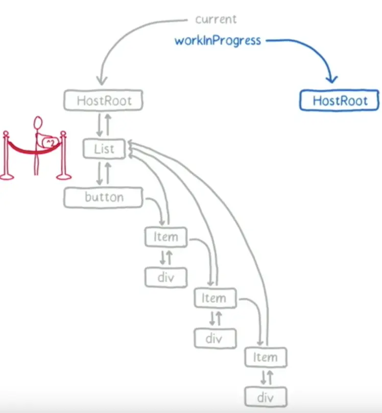
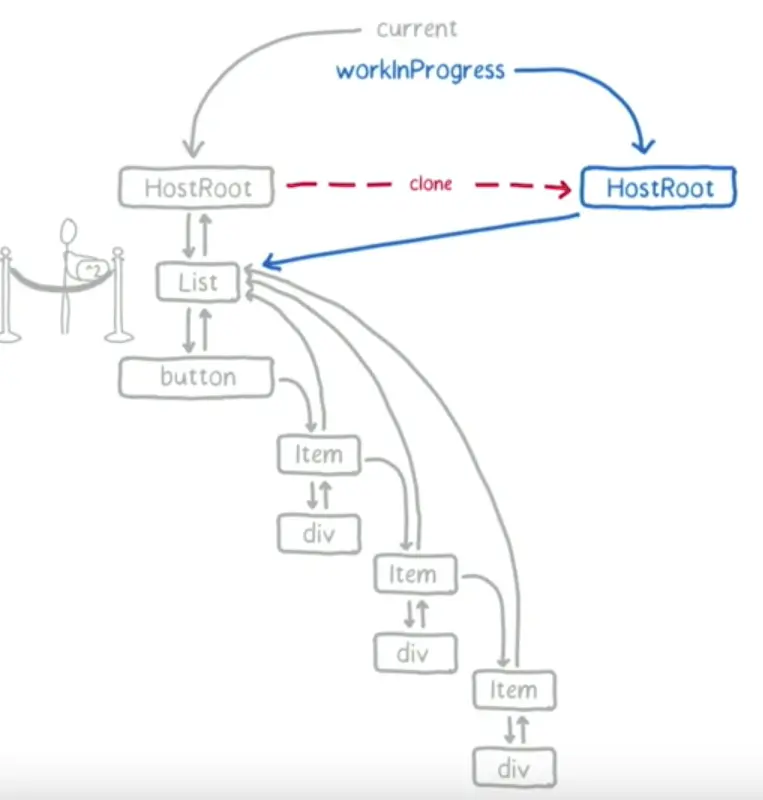
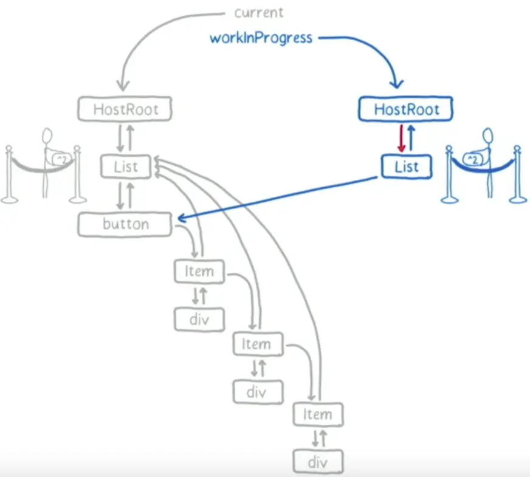
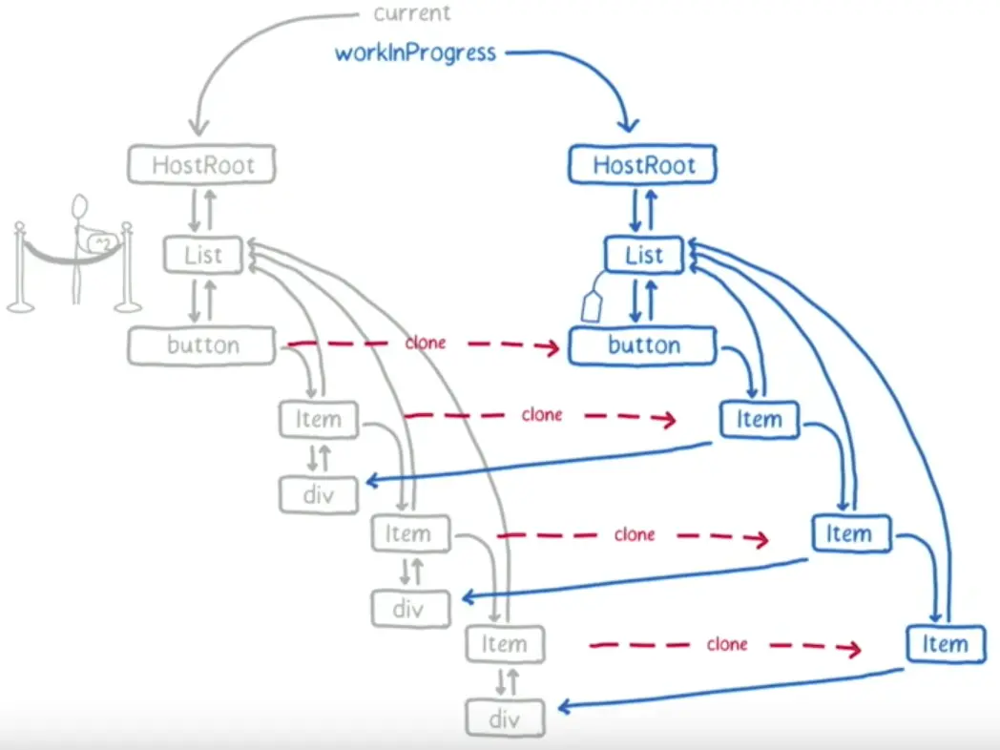
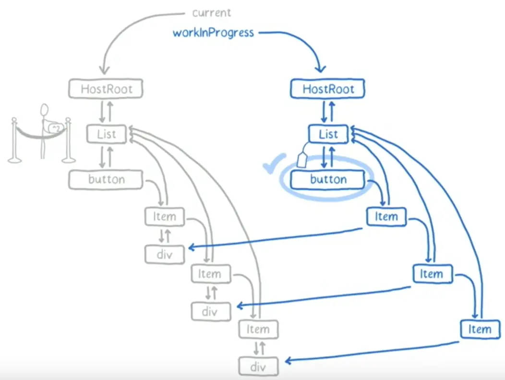
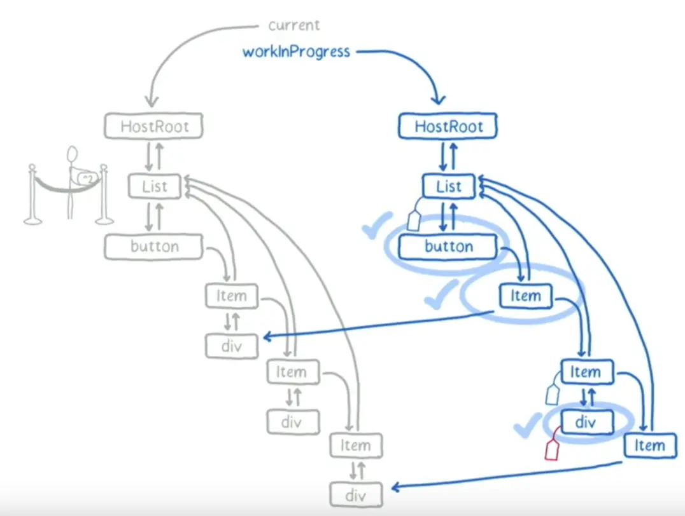

# React

* 用于构建用户界面的js库，提供UI层解决方案
* 虚拟DOM
* JSX语法
* 单向数据流
* 组件，可组合、嵌套，构成整体页面

## 1. React V16
新特性：
1. react hooks；
2. 允许在render函数返回节点数组和字符串

```jsx
return [
  <li>1</li>
  <li>2</li>
  ...
];
```
3. 更好的错误处理；
4. 支持自定义DOM属性；
5. 重写，改为Fiber异步渲染架构；

## 2. Fiber

什么是fiber，fiber解决了什么问题？

### v16之前的问题
用树这种数据结构来表示dom树，采用深度优先来遍历节点，树越大，遍历时间越久。 如果其中发生中断，那么整颗树都不能恢复。 
无法解决中断和树庞大的问题。

#### 卡顿原因
在setState后，react会立即开始reconciliation过程，从父节点（Virtual DOM）开始遍历，以找出不同。将所有的Virtual DOM遍历完成后，reconciler才能给出当前需要修改真实DOM的信息，并传递给renderer，进行渲染，然后屏幕上才会显示此次更新内容。对于特别庞大的vDOM树来说，reconciliation过程会很长(x00ms)，在这期间，主线程是被js占用的，因此任何交互、布局、渲染都会停止，给用户的感觉就是页面被卡住了


### react@16
狭义的fiber是一种数据结构，广义上Fiber是新的reconciler。

scheduling(调度)是fiber reconciliation的一个过程，主要决定应该在何时做什么。  
所以理想状况下reconciliation的过程应该是每次只做一个很小的任务，做完后能够“喘口气儿”，回到主线程看下有没有什么更高优先级的任务需要处理，如果又则先处理更高优先级的任务，没有则继续执行(cooperative scheduling 合作式调度)。


fiber中，保存了哪些信息，这些信息的作用是什么？

简单的分为四个部分，分别是Instance、Fiber、Effect、Priority


#### Instance
这个部分是用来存储一些对应element元素的属性


```js
export type Fiber = {
  tag: WorkTag,  // 组件的类型，判断函数式组件、类组件等（上述的tag）
  key: null | string, // key
  elementType: any, // 元素的类型
  type: any, // 与fiber关联的功能或类，如<div>,指向对应的类或函数
  stateNode: any, // 真实的DOM节点
  ...
}

```


#### Fiber
这部分内容存储的是关于fiber链表相关的内容和相关的props、state

```js
export type Fiber = {
  ...
  return: Fiber | null, // 指向父节点的fiber
  child: Fiber | null, // 指向第一个子节点的fiber
  sibling: Fiber | null, // 指向下一个兄弟节点的fiber
  index: number, // 索引，是父节点fiber下的子节点fiber中的下表
  
  ref:
    | null
    | (((handle: mixed) => void) & {_stringRef: ?string, ...})
    | RefObject,  // ref的指向，可能为null、函数或对象
    
  pendingProps: any,  // 本次渲染所需的props
  memoizedProps: any,  // 上次渲染所需的props
  updateQueue: mixed,  // 类组件的更新队列（setState），用于状态更新、DOM更新
  memoizedState: any, // 类组件保存上次渲染后的state，函数组件保存的hooks信息
  dependencies: Dependencies | null,  // contexts、events（事件源） 等依赖

  mode: TypeOfMode, // 类型为number，用于描述fiber的模式 
  ...
}

```

#### Effect
副作用相关的内容
```js
export type Fiber = {
  ...
   flags: Flags, // 用于记录fiber的状态（删除、新增、替换等）
   subtreeFlags: Flags, // 当前子节点的副作用状态
   deletions: Array<Fiber> | null, // 删除的子节点的fiber
   nextEffect: Fiber | null, // 指向下一个副作用的fiber
   firstEffect: Fiber | null, // 指向第一个副作用的fiber
   lastEffect: Fiber | null, // 指向最后一个副作用的fiber
  ...
}


```


#### Priority
优先级相关的内容


```js
export type Fiber = {
  ...
  lanes: Lanes, // 优先级，用于调度
  childLanes: Lanes,

  alternate: Fiber | null,

  actualDuration?: number,

  actualStartTime?: number,
  selfBaseDuration?: number,

  treeBaseDuration?: number,
  ...
}

```


#### 链表之间如何连接的？

在 Fiber中我们看到有return、child、sibling这三个参数，分别指向父级、子级、兄弟，也就是说每个element通过这三个属性进行连接。


#### Fiber执行阶段
**mount**

简单伪代码：
这个函数会创建rootFiber，也就是react应用的根，会调用FiberNode函数来进行对应的构建工作
```js
const createFiber = function(
  tag: WorkTag,
  pendingProps: mixed,
  key: null | string,
  mode: TypeOfMode,
): Fiber {
  // $FlowFixMe: the shapes are exact here but Flow doesn't like constructors
  return new FiberNode(tag, pendingProps, key, mode);
};

```
createFiberRoot： 它会调用FiberRootNode构造函数，创建fiberRoot，并且指向真正的根节点（root）

```js
export function createFiberRoot(
  containerInfo: any,
  tag: RootTag,
  hydrate: boolean,
  hydrationCallbacks: null | SuspenseHydrationCallbacks,
): FiberRoot {
  const root: FiberRoot = (new FiberRootNode(containerInfo, tag, hydrate): any);
  if (enableSuspenseCallback) {
    root.hydrationCallbacks = hydrationCallbacks;
  }

  const uninitializedFiber = createHostRootFiber(tag);
  root.current = uninitializedFiber; // 指向rootFiber
  uninitializedFiber.stateNode = root; // 指向fiberRoot

  initializeUpdateQueue(uninitializedFiber);

  return root;
}


```

beginWork: 这个函数正真走我们的jsx代码，也就是上面讲解的链表之间如何连接的部分。

```js
function beginWork(fiber: Fiber): Fiber | undefined {
  if (fiber.tag === WorkTag.HostComponent) {
    // 宿主节点diff
    diffHostComponent(fiber)
  } else if (fiber.tag === WorkTag.ClassComponent) {
    // 类组件节点diff
    diffClassComponent(fiber)
  } else if (fiber.tag === WorkTag.FunctionComponent) {
    // 函数组件节点diff
    diffFunctionalComponent(fiber)
  } else {
    // ... 其他类型节点，省略
  }
}


```


### reconciliation(协调阶段)

可以认为是 Diff 阶段, 这个阶段可以被中断, 这个阶段会找出所有节点变更，例如节点新增、删除、属性变更等等, 这些变更React 称之为'副作用(Effect)' 。  
一旦reconciliation过程得到时间片，就开始进入work loop。

举个栗子：
> 链接：https://juejin.cn/post/6844903582622285831

当前页面包含一个列表，通过该列表渲染出一个button和一组Item，Item中包含一个div，其中的内容为数字。通过点击button，可以使列表中的所有数字进行平方。另外有一个按钮，点击可以调节字体大小。

  
* current: 在视图层渲染的树。
* workInProgress：这个参数尤为重要，它就是在整个内存中所构建的 Fiber树，所有的更新都发生在workInProgress中，所以这个树是最新状态的，之后它将替换给current




1. 因为根节点上的更新队列为空，所以直接从fiber-tree上将根节点复制到workInProgressTree中去。根节点中包含指向子节点（List）的指针。



2. 根节点没有什么更新操作，根据其child指针，接下来把List节点及其对应的update queue也复制到workinprogress中。List插入后，向其父节点返回，标志根节点的处理完成。



3. 根节点处理完成后，react此时检查时间片是否用完。如果没有用完，根据其保存的下个工作单元的信息开始处理下一个节点List。


4. 在获取到最新的state值后，react会更新List的state和props值，然后调用render，然后得到一组通过更新后的list值生成的elements。react会根据生成elements的类型，来决定fiber是否可重用。对于当前情况来说，新生成的elments类型并没有变（依然是Button和Item），所以react会直接从fiber-tree中复制这些elements对应的fiber到workInProgress 中。并给List打上标签，因为这是一个需要更新的节点。



5. List节点处理完成，react仍然会检查当前时间片是否够用。如果够用则处理下一个，也就是button。加入这个时候，用户点击了放大字体的按钮。这个放大字体的操作，纯粹由js实现，跟react无关。但是操作并不能立即生效，因为react的时间片还未用完，因此接下来仍然要继续处理button。
button没有任何子节点，所以此时可以返回，并标志button处理完成。如果button有改变，需要打上tag，但是当前情况没有，只需要标记完成即可。





6. 处理完一个节点先看时间够不够用。注意这里放大字体的操作已经在等候释放主线程了。
接下来处理第一个item。通过shouldComponentUpdate钩子可以根据传入的props判断其是否需要改变。对于第一个Item而言，更改前后都是1,所以不会改变，shouldComponentUpdate返回false，复制div，处理完成，检查时间，如果还有时间进入第二个Item。  
第二个Item shouldComponentUpdate返回true，所以需要打上tag，标志需要更新，复制div，调用render，讲div中的内容从2更新为4，因为div有更新，所以标记div。当前节点处理完成。
这时候，需要将此节点改变产生的effect合并到父节点中。此时react会维护一个列表，其中记录所有产生effect的元素。



7. 下一个工作单元是Item，在进入Item之前，检查时间。但这个时候时间用完了。此时react必须交换主线程，并告诉主线程以后要为其分配时间以完成剩下的操作。  
主线程接下来进行放大字体的操作。完成后执行react接下来的操作，跟上一个Item的处理流程几乎一样，处理完成后整个fiber-tree和workInProgress如下：


8. 此时List向根节点返回并merge effect，所有节点都可以标记完成了。此时react将workInProgress标记为pendingCommit。意思是可以进入commit阶段了。


### commit(提交阶段)
提交阶段: 将上一个阶段计算出来的需要处理的**副作用(Effects)**一次性执行了。这个阶段必须同步执行，不能被打断. 


### 问题
1. 有react fiber，为什么不需要 vue fiber呢?
A: react中，调用setState方法后，会自顶向下重新渲染组件，自顶向下的含义是，该组件以及它的子组件全部需要渲染；  
而vue使用Object.defineProperty（vue@3迁移到了Proxy）对数据的设置（setter）和获取（getter）做了劫持，也就是说，vue能准确知道视图模版中哪一块用到了这个数据，并且在这个数据修改时，告诉这个视图，你需要重新渲染了。


2. 之前递归遍历虚拟dom树被打断就得从头开始，为什么有了react fiber就能断点恢复呢?  
A: 之前的dom树数据结构是树，节点只有子节点信息，打断之后，无法通过父节点继续遍历。  
fiber是链表结构，有3个指针：指向父节点、子节点、兄弟节点。当遍历发生中断时，只要保留下当前节点的索引，断点是可以恢复的——因为每个节点都保持着对其父节点的索引。


## 3. 生命周期

### react 16.4之前


* 获取父传props -> 初始化state -> （将会挂载、组件渲染、挂载）
* props改变 -> ComponentWillReceiveProps ——> ComponentShouldUpdate判定是否需要更新(默认true)
* state改变 -> ComponentShouldUpdate ? true: （组件将更新、渲染、更新完毕）


### 16.4之后


废弃了三个（v17中正式删除）：
* UNSAFE_componentWillMount：
    经常被用来做ajax请求数据，但是会导致请求多次。 
* UNSAFE_componentWillReceiveProps: 在更新中可能被调用多次，
* UNSAFE_componentWillUpdate： 大多数用户是想要配合ComponentDidUpdate，获取视图前后状态。 

16版本之后，**react异步渲染**等机制，渲染过程被分割多次，还可能暂停，这导致 componentWillUpdate 和 componentDidUpdate 执行前后可能会间隔很长时间。 render函数之前的生命周期钩子函数可能被执行多次，如果开发者把异步请求写在这里，导致执行多次，可能作用并不是用户想要的。 
* 进行重复的事件监听, 无法正常取消重复的事件, 严重点可能会导致内存泄漏
* 发出重复的异步网络请求, 导致 IO 资源被浪费

#### getDerivedStateFromProps
getDerivedStateFromProps 首先它是 静态 方法, 方法参数分别下一个 props、上一个 state, 这个生命周期函数是为了替代 componentWillReceiveProps 而存在的, 主要作用就是监听 props 然后修改当前组件的 state

#### getSnapshotBeforeUpdate
getSnapshotBeforeUpdate 生命周期将在 render 之后 DOM 变更之前被调用, 此生命周期的返回值将作为 componentDidUpdate 的第三个参数进行传递, 当然通常不需要此生命周期, 但在重新渲染期间需要手动保留 DOM 信息时就特别有用

```js

getSnapshotBeforeUpdate(prevProps, prevState){
  console.log(5);
  return 999;
}

componentDidUpdate(prevProps, prevState, snapshot) {
  console.log(6, snapshot);
}

```


## 4. setState
调用this.updater.enqueneSetState  ——> enqueueUpdate(向队列中推入需要更新fiber) ——> scheduleUpdateOnFiber（触发调度器一次新更新）


### enqueneSetState

>源码路径 https://github.com/facebook/react/blob/v17.0.2/packages/react/src/ReactBaseClasses.js

```js
Component.prototype.setState = function(partialState, callback) {
    // 第一个参数可以是对象, 函数，第二个参数是回调
    invariant(
        typeof partialState === 'object' ||
        typeof partialState === 'function' ||
        partialState == null,
        'setState(...): takes an object of state variables to update or a ' +
        'function which returns an object of state variables.',
    );
    this.updater.enqueueSetState(this, partialState, callback, 'setState');
};

```


### enqueueSetState

>源码路径 https://github.com/facebook/react/blob/v17.0.2/packages/react-reconciler/src/ReactFiberClassComponent.new.js

```js
export function createUpdate(eventTime: number, lane: Lane): Update<*> {
  const update: Update<*> = {
    eventTime,
    lane,

    tag: UpdateState,
    payload: null,
    callback: null,

    next: null,
  };
  return update;
}

/**
 * @param inst 即调用 this.setState 时传递进来的this，也就是 class组件实例
 * @param payload 即调用 this.setState 时传递进来的初始state，
 * @param callback 即调用 this.setState 时传递进来的 回调函数，该回调函数是可选的
*/
enqueueSetState(inst, payload, callback) {
    
    const fiber = getInstance(inst);
    // 获取当前时间，通过 performance.now() 或 Date.now() 获取的秒数
    const eventTime = requestEventTime();
    // 创建一个优先级变量(lane模型，通常称为车道模型)
    const lane = requestUpdateLane(fiber);
    // 创建一个 update 对象
    const update = createUpdate(eventTime, lane);
    // 将 stateState 传进来的要更新的对象添加到 update 上
    update.payload = payload;
    if (callback !== undefined && callback !== null) {
        //...
        update.callback = callback;
    }
     // 将新建的 update 添加到 update链表中
    enqueueUpdate(fiber, update);
     // 进入任务调度流程
    scheduleUpdateOnFiber(fiber, lane, eventTime);

    //...

    if (enableSchedulingProfiler) {
      markStateUpdateScheduled(fiber, lane);
    }
},
```


### enqueueUpdate

> https://github.com/facebook/react/blob/v17.0.2/packages/react-reconciler/src/ReactUpdateQueue.new.js
```js

export function enqueueUpdate<State>(fiber: Fiber, update: Update<State>) {
    const updateQueue = fiber.updateQueue;
    // 还没挂载才会null
    if (updateQueue === null) {
        // Only occurs if the fiber has been unmounted.
        return;
    }

    const sharedQueue: SharedQueue<State> = (updateQueue: any).shared;
    const pending = sharedQueue.pending;
    // 首次更新
    if (pending === null) {
        // This is the first update. Create a circular list.
        update.next = update;
    } else {
        update.next = pending.next;
        pending.next = update;
    }
    sharedQueue.pending = update;

}
```

**scheduleUpdate**:
从当前触发节点向上搜索。父节点不是hostRoot(ReactDOM.render()的根节点)，且更新父节点的peddingWorkPriority,标记这个节点上等待更新事务的优先级。
父节点是hostRoot, 调用scheduleRoot,根据优先级决定是否立即执行update。
有nextScheduleRoot指针指向下一个待更新HostRoot,构成链表结构。


### 更新类型
setState更新类型分成：
* 异步更新
* 同步更新


**异步更新**

```js
changeText() {
  this.setState({
    message: "你好啊"
  })
  console.log(this.state.message); // Hello World
}
```
从上面可以看到，最终打印结果为Hello world，并不能在执行完setState之后立马拿到最新的state的结果
如果想要立刻获取更新后的值，在第二个参数的回调中更新后会执行

```js
changeText() {
  this.setState({
    message: "你好啊"
  }, () => {
    console.log(this.state.message); // 你好啊
  });
}
```

**同步更新**

```js
changeText() {
  setTimeout(() => {
    this.setState({
      message: "你好啊
    });
    console.log(this.state.message); // 你好啊
  }, 0);
}


```

在组件生命周期或React合成事件中，setState是异步
在setTimeout或者原生dom事件中，setState是同步


## 5. 组件的实现与挂载
```js
<A />
```
属性：
* $$typeof: Symbol(react.element)
* key: null
* props: {}
* ref: null
* type: f A(props)
* _owner: null(创建当前组件的对象，默认是null)
* _store: {validated: false}

```js
function ReactComponent(props, context, updater) {
    this.props = props;
    this.context = context;
    this.refs = emptyObject;
    this.updater = updater || ReactNoopUpdateQueue;
}
ReactComponent.prototype.setState = function() {
    ...
}
```
### 组件的挂载
| Node     | 实际参数    |    结果        |
| ---------|------------|---------------|
|null or false |空|ReactEmptyComponent|
|object && type === string| 虚拟DOM|ReactDomComponent|
|object && type !== string|React组件|ReactCompositeComponent|
|string|字符串|ReactTextComponent|
|number|数字|ReactTextComponent|

```js
 ________
|_context|\
|_props__|\\
|_refs___|\\\
           \\\
            \\\______________      __________      __setState
            |_ReactComponent_|————|prototype_|————|
 __________/______________  |      ——————————      ——forceUpdate
|updator(ReactUpdateQueue)| |
 —————————————————————————  |
                            ↓
                    ———————————————————
                   |执行ReactElement方法|
                    ———————————————————
                            ↓
            ——————————————————————————————————————
           | 创建ReactElement类型的js对象 === <A /> |
            ——————————————————————————————————————
               ______________↓__________________
              |ReactDom.render(<A />, container)|
               —————————————————————————————————
                            ↓                     |————ReactDomEmptyComponent
             __________________________________   |————ReactDomComponent            ______________________________
            |根据<A />类型，内部封装为四大类型组件|——|————ReactCompositeComponent  -->| 解析ReactElement对对象获得HTML |
             ——————————————————————————————————   |___ReactTextComponent            ——————————————————————————————
                                                                                                ↓
                                                                                        ___________________
                                                                                       | 将HTML插入真实DOM中 |
                                                                                        ———————————————————
```


ReactDom.render -> ReactMount.render -> ReactMount._renderSubtreeIntoContainer

伪代码:
```js
/**
 * @param parentComponent 当前组件父组件，第一次null
 * @param nextElement 要插入DOM的组件
 * @param callback 完成后回调
 * @param container 要插入的容器
*/
_renderSubtreeIntoContainer: function(parentComponent, nextElement, container, callback) {
    // 当前组件添加到前一级的props
    var nextWrapperdElement = ReactElement(TopLevelWrapper, null, null, null ,null, null, nextElement);
    var prevComponent = getTopLevelWrapperIntoContainer(container);
    // 判断当前容器下是否存在组件, 即preComponent
    // 如果true，执行更新流程，若不存在，则卸载
    if (prevComponent) {
        var preWrappedElement = preComponnet._currentElement;
        var preElement = preWrappedElement.props;
        // 组件更新机制在生命周期部分进行解析
        if (shouldUpdateReactComponent(preElement, nextElement)) {
            var publicInst = prevComponent._renderedComponent.getPublicInstance();
            var updatedCallback = callback && function () {
                callback.call(publicInst);
            }
        }
        ReactMount._updateRootComponent(preComponent, nextWrappedElement, nextContext, container, updatedCallback);
    } else {
        // 卸载
        ReactMount.unmountComponentAtNode(container);
    }
}

// 不管更新or卸载，均要求挂载到真实dom上
_renderNewRootComponent: function(nextElement, container, shouldReuseMarkup, context) {
    var componentInstance = instantiateReactComponent(nextElement, false);
    ReactUpdates.batchedUpdates(batchedMountComponentIntoNode, componnetInstance, container, shouldReuseMarkup, context);
    // 方法返回组件对应的html， 记为变量markup
    var wrapperID = componentInstance._instance.rootID;
    instanceByReactRootID[wrapperID] = componentInstance;
    return componentInstance;
}
_mountImageIntoNode = function (markup, container, instance, shouldReuseMarkup, transaction) {
    setInnerHTML(container, markup);
    ReactDOMComponentTree.precacheNode(instance, container, firstChild);
}
function instaniateReactComponent(node, shouldHaveDebugID) {
    var instance;
    if (node === null || node === false) {
        instance = ReactEmptyComponent.create(instaniateReactComponent);
    } else if (typeof node === "object") {
        var element = node;
        if (typeof element.type === 'string') {
            instance = ReactHostComponet.createInternalComponnet(element);
        } else if (isInteralComponentType(element.type)) {
            instance = new Elementtype(element);
        } else {
            instance = new ReactCompositeComponentWrapper(element);
        }
    } else if (typeof node === 'string' || typeof node === 'number') {
        instance = ReactHostComponent.createInstanceForText(node);
    }
    return instance;
}
```


## 6. diff算法

### diff策略
通过制定大胆的策略，将O(n^3)复杂度的问题转换成O(n)复杂度的问题。

1. DOM节点跨层级移动操作特别少，可以忽略不计；
2. 拥有相同类的2个组件将会生成相似的树形结构，拥有不同类的两个组件将会生成不同的树形结构；
3. 对于同一层级的一组子节点，它们可以通过唯一id进行区分。

### tree diff
2棵树分层比较，两棵树只会对同一层级的节点进行比较。当发现节点已经不存在，则该节点以及子节点会被完全删除掉，不会用于进一步的比较。这样只需要对树进行一次遍历，便能完成整个DOM树的比较。

react15 伪代码：
```js
updateChildren: function(nextNestedChildrenElements, transaction, context) {
    updateDepth++;
    var errorThrown = true;
    try {
        this._updateChildren(nextNestedChilrenElements, transaction, context);
        errorThrown = false;
    } finally {
        updateDepth--;
        if (!updateDepth) {
            if (errorThrown) {
                clearQuene();
            } else {
                processQueue();
            }
        }
    }
}
```


### element diff
同一层级，diff操作：INSERT_MARKUP、MOVE_EXISTING、REMOVE_NODE;

思路：2层循环，外层循环遍历新children, 内层老的，找到相同的key，可复用。 
是否需要移动? 如何移动？  
索引值变化趋势： 寻找过程中在旧children中所遇到最大索引值，如果发现存在比最大索引值小的节点，该节点需移动。 


react15 部分源码：
```js
_updateChildren: function(nextNestedChildrenElements, transaction, context) {
    var prevChildren = this._renderedChildren;
    var removedNoes = {};
    var nextChildren = this._reconcilerUpdateChildren(prevChildren, nextNestedChildrenElements, removedNodes, transaction, context);
    // 如果不存则prevChildren 和 nextChildren, 则不作diff处理
    if (!nextChildren && !prevChildren) {
        return;
    }
    var updates = null;
    var name;
    // lastIndex 是prevChildren中最后的索引，nextIndex是nextChildren中每个节点的索引
    var lastIndex = 0;
    var nextIndex = 0;
    var lastPlaceNode = null;
    for (name in nextChildren) {
        if (!nextChildren.hasOwnProperty(name)) {
            continue;
        }
        var prevChild = prevChildren && prevChildren[name];
        var nextChild = nextChildren[name];
        if (prevChild === nextChild) {
            // 移动节点
            updates = enqueue(
                updates,
                this.moveChild(prevChild, lastPlaceNode, nextIndex, lastIndex);
            );
            lastIndex = Math.max(prevChild._mountIndex, lastIndex);
            prevChild._mountIndex = nextIndex;
        } else {
            if (prevChild) {
                lastIndex = Math.max(prevChild._mountIndex, lastIndex);
            }
            updates = enqueue(
                updates,
                this._mountChildAtIndex(nextChild, lastPlaceNode, nextIndex, transaction, context);
            );
            nextIndex++;
            lastPlaceNode = ReactReconciler.getNativeNode(nextChild);
        }
        // 如果父节点不存在，则将其子节点全部移除
        for(name in removedNodes) {
            if (removedNodes.hasOwnProperty(name)) {
                updates = enqueue(
                    updates,
                    this._unmountChild(prevChildren[name], removeedNodes[name]);
                );

            }
        }
        // 处理更新队列
        if (updates) {
            precessQueue(this, updates);
        }
        this._renderedChildren = nextChildren;
    }
},

moveChild: function(child, afterNode, toIndex, lastIndex) {
    // 如果子节点index小于lastIndex，则移动
    if (child._mountIndex < lastIndex) {
        return makeMove(child, afterNode, toIndex);
    }
},
// 创建节点
createChild: function(child, afterNode, mountImage) {
    return makeInsertMarkup(mountImage, afterNode, child._mountIndex);
},
// 删除节点
removeChild: function(child, node) {
    return makeRomove(child, node);
},
// 卸载已经渲染的子节点
_unmountChild: function(child, node) {
    var update = this.removeChild(child, node);
    child._mountIndex = null;
    return update;
}
```


### react16 diff(fiber)
大致分为2类：
* 同级只有一个节点：oject、number、string
* 同级多个节点

简易代码：
```js

// 标记删除的节点
function deleteChild(returnFiber: FiberNode, childToDelete: FiberNode) {
    //...有些shouldTrackEffects的判断，先隐藏掉, 只看主要的
    const deletions = returnFiber.deletions;
    if (deletions === null) {
        returnFiber.deletions = [childToDelete];
        returnFiber.flags |= ChildDeletion;
    } else {
        deletions.push(childToDelete);
    }
}

function deleteRemainingChildren(
	returnFiber: FiberNode,
    currentFirstChild: FiberNode | null
) {
    //...有些shouldTrackEffects的判断，先隐藏掉, 只看主要的
    let childToDelete = currentFirstChild;
    while (childToDelete !== null) {
        deleteChild(returnFiber, childToDelete);
        childToDelete = childToDelete.sibling;
    }
}
function placeSingleChild(fiber: FiberNode) {
    if (shouldTrackEffects && fiber.alternate === null) {
        fiber.flags |= Placement;
    }
    return fiber;
}

// 根据newChild类型选择不同diff函数处理
function reconcileChildFibers(
    returnFier: Fiber,
    currentFirstChild: Fiber | null,
    newChild: any,
): Fiber | null {
    const isObject = typeof newChild === 'object' && newChild !== null;

    if (isObject) {
         if (Array.isArray(newChild)) {
            // 调用reconcileChildrenArray 处理
            return reconcileChildrenArray(returnFiber, currentFirstChild, newChild);
        }
        // 可能是react_element_type or react_portal_type
        switch(newChild.$typeof) {
            case REACT_ELEMENT_TYPE:
                return placeSingleChild(reconcileSingleElement(returnFiber, currentFirstChild, newChild));
            default:
                break;
        }

    }
    if (typeof newChild === 'string' || typeof newChild === 'number') {
        // 调用reconcileSingleTextNode 处理
        return placeSingleChild(reconcileSingleTextNode(returnFiber, currentFirstChild, newChild));
    }

    // 如果没有命中，删除节点
    return deleteRemainingChildren(returnFiber, currentFirstChild);
}
```
#### 同级只有一个节点的diff
先判断key是否相同，再判断type是否相同，只有都相同才可复用。

简易代码：
```js
function useFiber(fiber: FiberNode, pendingProps: Props): FiberNode {
	const clone = createWorkInProgress(fiber, pendingProps);
	clone.index = 0;
	clone.sibling = null;
	return clone;
}

// 对比单个element节点
function reconcileSingleElement(
    returnFiber: FiberNode,
    currentFirstChild: FiberNode | null,
    element: ReactElementType
): FiberNode {
    const key = element.key;
    let child = currentFirstChild;
    // 首先判断是否存在对应Dom节点
    while(child !== null) {
        // 可复用吗
        if (child.key === key) {
            if (element.$$typeof === REACT_ELEMENT_TYPE) {
                if (child.type === element.type) {
                    let props = element.props;
                    if (element.type === REACT_FRAGMENT_TYPE) {
                        props = element.props.children;
                    }
                    // type相同
                    const existing = useFiber(child, props);
                    existing.return = returnFiber;
                    // 当前节点可复用，标记剩下的节点删除
                    deleteRemainingChildren(returnFiber, child.sibling);
                    return existing;
                }
                // key相同，type不同 删掉所有旧的
                deleteRemainingChildren(returnFiber, currentFirstChild);
                break;
            } else {
                //
                console.warn('还未实现的react类型', element);
                break;
            }
        } else {
            // key不同，删掉旧的
            deleteChild(returnFiber, child);
        }
        child = child.sibling;
    }
    // 创建新Fiber，并返回
    // 根据element创建fiber
    let fiber;
    if (element.type === REACT_FRAGMENT_TYPE) {
        fiber = createFiberFromFragment(element.props.children, key);
    } else {
        fiber = createFiberFromElement(element);
    }
    fiber.return = returnFiber;
    return fiber;
}
```


#### 同级只有一个文本节点

```js
function reconcileSingleTextNode(
    returnFiber: FiberNode,
    currentFirstChild: FiberNode | null,
    content: string | number
) {
    let currentFiber = currentFirstChild;
    while (currentFiber !== null) {
        // update
        if (currentFiber.tag === HostText) {
            // 类型没变，可以复用
            const existing = useFiber(currentFiber, { content });
            existing.return = returnFiber;
            deleteRemainingChildren(returnFiber, currentFiber.sibling);
            return existing;
        }
        deleteChild(returnFiber, currentFiber);
        currentFiber = currentFiber.sibling;
    }
    const fiber = new FiberNode(HostText, { content }, null);
    fiber.return = returnFiber;
    return fiber;
}
```

#### 同级多个元素diff
为啥没有双指针？
newChildren是数组，但是比较的是上次Fiber节点，Fiber的同级节点是由sibling指针链行程的链表。单链表无法使用双指针。


两轮遍历：
**第一轮遍历**：
1. 遍历newChildren，i = 0，将newChildren[i]与oldFiber比较，判断DOM节点是否可复用。
2. 如果可复用，i++，比较newChildren[i]与oldFiber.sibling是否可复用。可以复用则重复步骤2。
3. 如果不可复用，立即跳出整个遍历。
4. 如果newChildren遍历完或者oldFiber遍历完（即oldFiber.sibling === null），跳出遍历。

**第二轮遍历：比如newChildren和oldFiber都没有遍历完。**
举例：

```js

// 之前 abcd

// 之后 acdb

//第一轮遍历开始
//a（之后）vs a（之前）
// key不变，可复用
//此时 a 对应的oldFiber（之前的a）在之前的数组（abcd）中索引为0
lastPlacedIndex =0;

// 继续第一轮遍历...

// c（之后）vs b（之前）
//key改变，不能复用，跳出第一轮遍历
// 此时
lastPlacedIndex =0;
// 第一轮遍历结束

// 第二轮遍历开始
newChildren === cdb，// 没用完，不需要执行删除旧节点
oldFiber === bcd，// 没用完，不需要执行插入新节点

// 将剩余oldFiber（bcd）保存为map

// 当前oldFiber：bcd
// 当前newChildren：cdb

// 继续遍历剩余newChildren

key === c // 在 oldFiber中存在
const oldIndex = c（之前）.index;
//即 oldIndex 代表当前可复用节点（c）在上一次更新时的位置索引
oldIndex=2;
// 之前节点为 abcd，所以c.index === 2
//比较 oldIndex 与 lastPlacedIndex;

//如果 oldIndex > lastPlacedIndex 代表该可复用节点不需要移动, 并将
lastPlacedIndex = oldIndex;

// 如果 oldIndex < lastplacedIndex 该可复用节点之前插入的位置索引小于这次更新需要插入的位置索引
// 代表该节点需要向右移动

// 在例子中，oldIndex 2 > lastPlacedIndex =0,
则 lastPlacedIndex=2;
// c节点位置不变

// 继续遍历剩余newChildren

// 当前oldFiber：bd
// 当前newChildren：db

key === d  // 在 oldFiber中存在
const oldIndex = d（之前）.index;
oldIndex 3 > lastPlacedIndex 2
// 之前节点为 abcd，所以d.index =3
lastPlacedIndex =3;
// d节点位置不变

// 继续遍历剩余newChildren

// 当前oldFiber：b
// 当前newChildren：b

key=== b // 在 oldFiber中存在
const oldIndex = b（之前）.inde;
oldIndex 1 < lastPlacedIndex 3 // 之前节点为 abcd，所以b.index === 1
// 则 b节点需要向右移动
// 第二轮遍历结束

// 最终acd 3个节点都没有移动，b节点被标记为移动

```

简单伪代码：

```js
function reconcileChildrenArray(
    returnFiber: FiberNode,
    currentFirstChild: FiberNode | null,
    newChild: any[]
) {
    
    // 最后一个可复用fiber在current中的index
    let lastPlacedIndex = 0;
    // 创建的最后一个fiber
    let lastNewFiber: FiberNode | null = null;
    // 创建的第一个fiber
    let firstNewFiber: FiberNode | null = null;

    // 1.将老的key映射保存在map中
    const existingChildren: ExistingChildren = new Map();
    // 第一个老节点
    let current = currentFirstChild; 
    while (current !== null) {
        const keyToUse = current.key !== null ? current.key : current.index;
        existingChildren.set(keyToUse, current);
        current = current.sibling;
    }
    // 2.遍历newChild，寻找是否可复用
    for (let i = 0; i < newChild.length; i++) {      
        const after = newChild[i];
        const newFiber = updateFromMap(returnFiber, existingChildren, i, after);

        if (newFiber === null) {
            continue;
        }
        // 3. 标记移动还是插入
        newFiber.index = i;
        newFiber.return = returnFiber;

        if (lastNewFiber === null) {
            lastNewFiber = newFiber;
            firstNewFiber = newFiber;
        } else {
            lastNewFiber.sibling = newFiber;
            lastNewFiber = lastNewFiber.sibling;
        }

        if (!shouldTrackEffects) {
            continue;
        }
        const current = newFiber.alternate;
        if (current !== null) {
            const oldIndex = current.index;
            if (oldIndex < lastPlacedIndex) {
                // 移动，打标识
                newFiber.flags |= Placement;
                continue;
            } else {
                // 不移动
                lastPlacedIndex = oldIndex;
            }
        } else {
            // 找不到老的，说明是新的，mount
            newFiber.flags |= Placement;
        }
    }
    // 4. 将Map中剩下的标记为删除
    existingChildren.forEach((fiber) => {
        deleteChild(returnFiber, fiber);
    });
    return firstNewFiber;
}

function getElementKeyToUse(element: any, index?: number): Key {
    if (
        Array.isArray(element) ||
        typeof element === 'string' ||
        typeof element === 'number' ||
        element === undefined ||
        element === null
    ) {
        return index;
    }
    return element.key !== null ? element.key : index;
}


function updateFromMap(
    returnFiber: FiberNode,
    existingChildren: ExistingChildren,
    index: number,
    element: any
): FiberNode | null {
    const keyToUse = getElementKeyToUse(element, index);
    const before = existingChildren.get(keyToUse);

    // HostText
    if (typeof element === 'string' || typeof element === 'number') {
        // 旧的有
        if (before) {
            if (before.tag === HostText) {
                existingChildren.delete(keyToUse);
                return useFiber(before, { content: element + '' });
            }
        }
        return new FiberNode(HostText, { content: element + '' }, null);
    }

    // ReactElement
    if (typeof element === 'object' && element !== null) {
        switch (element.$$typeof) {
            case REACT_ELEMENT_TYPE:
                if (element.type === REACT_FRAGMENT_TYPE) {
                    return updateFragment(
                        returnFiber,
                        before,
                        element,
                        keyToUse,
                        existingChildren
                    );
                }
                if (before) {
                    if (before.type === element.type) {
                        existingChildren.delete(keyToUse);
                        return useFiber(before, element.props);
                    }
                }
                return createFiberFromElement(element);
        }
    }

    if (Array.isArray(element)) {
        return updateFragment(
            returnFiber,
            before,
            element,
            keyToUse,
            existingChildren
        );
    }
    return null;
}
```


## 7. 任务调度

React 渲染的过程可以被中断，可以将控制权交回浏览器，让位给高优先级的任务，浏览器空闲后再恢复渲染。


通过超时检查的机制来让出控制权。解决办法是: 确定一个合理的运行时长，然后在合适的检查点检测是否超时(比如每执行一个小任务)，如果超时就停止执行，将控制权交换给浏览器。  
其实浏览器提供了相关的接口 —— requestIdleCallback

利用window.requestIdleCallback实现task scheduling
```js
                                                      |
                      Frame#1                         |        Frame#2
  ______    __________   ___________________________  |   ______     ______
 |  run |  |  Update  | |       idle period         | |  |  run |   |  run |
 | task |  |Rendering | |  __________   __________  | |  | task |   | task |  ...
  ——————    ——————————  | |  idle    | |   idle   | | |   ——————     ——————
                        | | callback | | callback | | |
                        |  ——————————   ——————————  | |
                         ———————————————————————————  |
                                                      |
                                                      |
```
requestIdleCallback回调执行时间：
一帧开始，JS执行完，浏览器渲染后，到这帧结束之前。

### 如何调度时间才能保证流畅？
安排xxms来更新视图与虚拟DOM，再安排xxms给浏览器来做其他事情。


利用requestIdleCalllback(闲时调用)
```js
function updateFiberAndView(dl) {
    // 更新视图，会耗时
    updateView();
    if (dl.timeRemaining() > 1) {
        var dom = getVdomFromQueue();
        var fiber = vdom, firstFiber;
        var hasVisited = {};
        // 深度遍历优先
        do {
            var fiber = toFiber(fiber); // A处
            if (!firstFiber) {
                firstFiber = fiber;
            }
            if (!hasVisited[fiber.uuid]) {
                hasVisited[fiber.uuid] = 1;
                // 根据fiber.type实例化组件or创建真实dom
                // 耗时，check时间
                updateComponentOrElement(fiber);
                if (fiber.child) {
                    // 向下转换
                    if (dl.timeRemaining() > 1) {
                        queue.push(fiber.child);

                    } else {
                        // 时间不够，放入栈
                        break;
                    }
                    fiber = fiber.child;
                    continue; //跑回A处，不断转换child
                }
            }
            // 如果组件没有children，向右找
            if (fiber.sibling) {
                fiber = fiber.sibling;
                continue;
            }
            // 向上找
            fiber = fiber.return;
            if (fiber === firstFiber || !fiber) {
                break;
            }
        } while (1)
        if (queue.length) {
            requestIdleCallback(updateFiberAndView, {
                timeout: new Date + 100
            });
        }
    }
}

function updateComponentOrElement(fiber) {
    var {type, stateNode, props} = fiber;
    if (!stateNode) {
        if (typeof type === 'string') {
            fiber.stateNode = document.createElement(type);
        } else {
            var context = {};
            fiber.stateNode = new type(props, context);
        }
    }
    if (stateNode.render) {
        children = stateNode.render();
    } else {
        children = fiber.children;
    }
    var prev = null;
    for (var i = 0, n = children.length; i < n; i++) {
        var child = children[i];
        child.return = fiber;
        if (!prev) {
            fiber.child = child;
        } else {
            prev.sibling = child;
        }
        prev = child;
    }
}

```


## 8.事件

v17版本之前：
在react中，我们绑定的事件onClick等，并不是原生事件，而是由原生事件合成的React事件，比如 click事件合成为onClick事件。比如blur , change , input , keydown , keyup等 , 合成为onChange。

优点：
* 事件绑定在document统一管理
* 抹平不同浏览器的差异

> https://juejin.cn/post/6955636911214067720?searchId=202309141949372D101D9C8E1D2E4610C9#heading-17
### 事件合成-事件插件

**namesToPlugins**: 装事件名 -> 事件模块插件的映射
```js

const namesToPlugins = {
    SimpleEventPlugin,
    EnterLeaveEventPlugin,
    ChangeEventPlugin,
    SelectEventPlugin,
    BeforeInputEventPlugin,
}

```

**plugins**这个对象就是上面注册的所有插件列表,初始化为空。

```js
const  plugins = [LegacySimpleEventPlugin, LegacyEnterLeaveEventPlugin, ...];

```

**registrationNameModules**: React合成的事件-对应的事件插件的关系

```js
{
    onBlur: SimpleEventPlugin,
    onClick: SimpleEventPlugin,
    onClickCapture: SimpleEventPlugin,
    onChange: ChangeEventPlugin,
    onChangeCapture: ChangeEventPlugin,
    onMouseEnter: EnterLeaveEventPlugin,
    onMouseLeave: EnterLeaveEventPlugin,
    ...
}

```

**事件插件**：
举个例子：
```js
const SimpleEventPlugin = {
    eventTypes:{ 
        'click':{ /* 处理点击事件  */
            phasedRegistrationNames:{
                bubbled: 'onClick',       // 对应的事件冒泡 - onClick 
                captured:'onClickCapture' //对应事件捕获阶段 - onClickCapture
            },
            dependencies: ['click'], //事件依赖
            ...
        },
        'blur':{ /* 处理失去焦点事件 */ },
        ...
    }
    extractEvents:function(topLevelType,targetInst,){ /* eventTypes 里面的事件对应的统一事件处理函数，接下来会重点讲到 */ }
}

```

**registrationNameDependencies**
gistrationNameDependencies用来记录，合成事件比如 onClick 和原生事件 click对应关系。比如 onChange 对应 change , input , keydown , keyup事件。

```js
{
    onBlur: ['blur'],
    onClick: ['click'],
    onClickCapture: ['click'],
    onChange: ['blur', 'change', 'click', 'focus', 'input', 'keydown', 'keyup', 'selectionchange'],
    onMouseEnter: ['mouseout', 'mouseover'],
    onMouseLeave: ['mouseout', 'mouseover'],
    ...
}

```

#### 事件初始化

```js
/* 注册事件插件 */
export function injectEventPluginsByName(injectedNamesToPlugins){
     for (const pluginName in injectedNamesToPlugins) {
         namesToPlugins[pluginName] = injectedNamesToPlugins[pluginName]
     }
     recomputePluginOrdering()
}

```

```js
const eventPluginOrder = [ 'SimpleEventPlugin' , 'EnterLeaveEventPlugin','ChangeEventPlugin','SelectEventPlugin' , 'BeforeInputEventPlugin' ]


/**
 * @function 形成上面说的那个plugins数组, 填充形成 registrationNameDependencies等
*/
function recomputePluginOrdering(){
    for (const pluginName in namesToPlugins) {
        /* 找到对应的事件处理插件，比如 SimpleEventPlugin  */
        const pluginModule = namesToPlugins[pluginName];
        const pluginIndex = eventPluginOrder.indexOf(pluginName);
        /* 填充 plugins 数组  */
        plugins[pluginIndex] = pluginModule;
        const publishedEvents = pluginModule.eventTypes;
        for (const eventName in publishedEvents) {
        // publishedEvents[eventName] -> eventConfig , pluginModule -> 事件插件 ， eventName -> 事件名称
            publishEventForPlugin(publishedEvents[eventName],pluginModule,eventName,)
        }
    }


}


```

```js

/*
  dispatchConfig -> 原生事件对应配置项 { phasedRegistrationNames :{  冒泡 捕获  } ，   }
  pluginModule -> 事件插件 比如SimpleEventPlugin  
  eventName -> 原生事件名称, 比如click。
*/
function publishEventForPlugin (dispatchConfig,pluginModule,eventName){
    eventNameDispatchConfigs[eventName] = dispatchConfig;
    /* 事件 */
    const phasedRegistrationNames = dispatchConfig.phasedRegistrationNames;
    // {bubbled: onClick}
    if (phasedRegistrationNames) {
        for (const phaseName in phasedRegistrationNames) {
            if (phasedRegistrationNames.hasOwnProperty(phaseName)) {
                // phasedRegistrationName React事件名 比如 onClick / onClickCapture
                const phasedRegistrationName = phasedRegistrationNames[phaseName];
                // 填充形成 registrationNameModules React 合成事件 -> React 处理事件插件映射关系
                registrationNameModules[phasedRegistrationName] = pluginModule;
                // 填充形成 registrationNameDependencies React 合成事件 -> 原生事件 映射关系
                registrationNameDependencies[phasedRegistrationName] = pluginModule.eventTypes[eventName].dependencies;
            }
        }
        return true;
    }
}

```
这个阶段主要形成了上述的几个重要对象，构建初始化React合成事件和原生事件的对应关系，合成事件和对应的事件处理插件关系.


### 事件绑定

#### 1 diffProperties 处理React合成事件
绑在fiber的属性上：

```js
fiber = {
    ...
    memoizedProps:{
        onClick:function handerClick(){},
        className:'button'
    }
    
}

```

进入diff阶段，如果判断是HostComponent(dom元素)类型的fiber，会用diff props函数diffProperties单独处理。

```js
function diffProperties(){
    /* 判断当前的 propKey 是不是 React合成事件 */
    if(registrationNameModules.hasOwnProperty(propKey)){
         /* 这里多个函数简化了，如果是合成事件， 传入成事件名称 onClick ，向document注册事件  */
         legacyListenToEvent(registrationName, document）;
    }
}

```
diffProperties函数在 diff props 如果发现是合成事件(onClick) 就会调用legacyListenToEvent函数。注册事件监听器。

#### 2 legacyListenToEvent 注册事件监听器
```js
//  registrationName -> onClick 事件
//  mountAt -> document or container
function legacyListenToEvent(registrationName，mountAt){
   const dependencies = registrationNameDependencies[registrationName]; // 根据 onClick 获取  onClick 依赖的事件数组 [ 'click' ]。
    for (let i = 0; i < dependencies.length; i++) {
    const dependency = dependencies[i];
    //这个经过多个函数简化，如果是 click 基础事件，会走 legacyTrapBubbledEvent ,而且都是按照冒泡处理
     legacyTrapBubbledEvent(dependency, mountAt);
  }
}

```
legacyTrapBubbledEvent 就是执行将绑定真正的dom事件的函数 legacyTrapBubbledEvent(冒泡处理)。

```js
function legacyTrapBubbledEvent(topLevelType,element){
   addTrappedEventListener(element,topLevelType,PLUGIN_EVENT_SYSTEM,false)
}


```
在legacyListenToEvent函数中，先找到 React 合成事件对应的原生事件集合，比如 onClick -> ['click'] , onChange -> [blur , change , input , keydown , keyup]，然后遍历依赖项的数组，绑定事件，这就解释了，为什么我们在刚开始的demo中，只给元素绑定了一个onChange事件，结果在document上出现很多事件监听器的原因，就是在这个函数上处理的。


#### 3 绑定 dispatchEvent，进行事件监听
React是如何绑定事件到document？ 事件处理函数函数又是什么？

```js
/*
  targetContainer -> document
  topLevelType ->  click
  capture = false
*/
function addTrappedEventListener(targetContainer,topLevelType,eventSystemFlags,capture){
   const listener = dispatchEvent.bind(null,topLevelType,eventSystemFlags,targetContainer) 
   if(capture){
       // 事件捕获阶段处理函数。
   }else{
       /* TODO: 重要, 这里进行真正的事件绑定。*/
      targetContainer.addEventListener(topLevelType,listener,false) // document.addEventListener('click',listener,false)
   }
}

```
① 在React，diff DOM元素类型的fiber的props的时候， 如果发现是React合成事件，比如onClick，会按照事件系统逻辑单独处理。  
② 根据React合成事件类型，找到对应的原生事件的类型，然后调用判断原生事件类型，大部分事件都按照冒泡逻辑处理，少数事件会按照捕获逻辑处理（比如scroll事件）。  
③ 调用 addTrappedEventListener 进行真正的事件绑定，绑定在document上，dispatchEvent 为统一的事件处理函数。  
④ 有一点值得注意: 只有上述那几个特殊事件比如 scorll,focus,blur等是在事件捕获阶段发生的，其他的都是在事件冒泡阶段发生的，无论是onClick还是onClickCapture都是发生在冒泡阶段，至于 React 本身怎么处理捕获逻辑的。我们接下来会讲到。

### 事件触发


#### 事件触发处理函数 dispatchEvent
React事件注册时候，统一的监听器dispatchEvent，也就是当我们点击按钮之后，首先执行的是dispatchEvent函数，

```js
function dispatchEvent(topLevelType,eventSystemFlags,targetContainer,nativeEvent){
    /* 尝试调度事件 */
    const blockedOn = attemptToDispatchEvent( topLevelType,eventSystemFlags, targetContainer, nativeEvent);
}

```
```js
/*
topLevelType -> click
eventSystemFlags -> 1
targetContainer -> document
nativeEvent -> 原生事件的 event 对象
*/
function attemptToDispatchEvent(topLevelType,eventSystemFlags,targetContainer,nativeEvent){
    /* 获取原生事件 e.target */
    const nativeEventTarget = getEventTarget(nativeEvent)
    /* 获取当前事件，最近的dom类型fiber ，我们 demo中 button 按钮对应的 fiber */
    let targetInst = getClosestInstanceFromNode(nativeEventTarget); 
    /* 重要：进入legacy模式的事件处理系统 */
    dispatchEventForLegacyPluginEventSystem(topLevelType,eventSystemFlags,nativeEvent,targetInst,);
    return null;
}


```
首先根据真实的事件源对象，找到 e.target 真实的 dom 元素。  
② 然后根据dom元素，找到与它对应的 fiber 对象targetInst，在我们 demo 中，找到 button 按钮对应的 fiber。  
③ 然后正式进去legacy模式的事件处理系统，


#### legacy 事件处理系统与批量更新

```js
/* topLevelType - click事件 ｜ eventSystemFlags = 1 ｜ nativeEvent = 事件源对象  ｜ targetInst = 元素对应的fiber对象  */
function dispatchEventForLegacyPluginEventSystem(topLevelType,eventSystemFlags,nativeEvent,targetInst){
    /* 从React 事件池中取出一个，将 topLevelType ，targetInst 等属性赋予给事件  */
    const bookKeeping = getTopLevelCallbackBookKeeping(topLevelType,nativeEvent,targetInst,eventSystemFlags);
    try { /* 执行批量更新 handleTopLevel 为事件处理的主要函数 */
        batchedEventUpdates(handleTopLevel, bookKeeping);
    } finally {
        /* 释放事件池 */  
        releaseTopLevelCallbackBookKeeping(bookKeeping);
    }
}


```
**batchedEventUpdates**
```js
export function batchedEventUpdates(fn,a){
    isBatchingEventUpdates = true;
    try{
       fn(a) // handleTopLevel(bookKeeping)
    } finally{
        isBatchingEventUpdates = false
    }
}

```
#### 执行事件插件函数

```js
// 流程简化后
// topLevelType - click  
// targetInst - button Fiber
// nativeEvent
function handleTopLevel(bookKeeping){
    const { topLevelType,targetInst,nativeEvent,eventTarget, eventSystemFlags} = bookKeeping
    for(let i=0; i < plugins.length;i++ ){
        const possiblePlugin = plugins[i];
        /* 找到对应的事件插件，形成对应的合成event，形成事件执行队列  */
        const extractedEvents = possiblePlugin.extractEvents(topLevelType,targetInst,nativeEvent,eventTarget,eventSystemFlags)  
    }
    if (extractedEvents) {
        events = accumulateInto(events, extractedEvents);
    }
    /* 执行事件处理函数 */
    runEventsInBatch(events);
}

```

#### extractEvents 形成事件对象event 和 事件处理函数队列

```js
const SimpleEventPlugin = {
    extractEvents:function(topLevelType,targetInst,nativeEvent,nativeEventTarget){
        const dispatchConfig = topLevelEventsToDispatchConfig.get(topLevelType);
        if (!dispatchConfig) {
            return null;
        }
        switch(topLevelType){
            default:
                EventConstructor = SyntheticEvent;
                break;
        }
        /* 产生事件源对象 */
        const event = EventConstructor.getPooled(dispatchConfig,targetInst,nativeEvent,nativeEventTarget)
        const phasedRegistrationNames = event.dispatchConfig.phasedRegistrationNames;
        const dispatchListeners = [];
        const {bubbled, captured} = phasedRegistrationNames; /* onClick / onClickCapture */
        const dispatchInstances = [];
        /* 从事件源开始逐渐向上，查找dom元素类型HostComponent对应的fiber ，收集上面的React合成事件，onClick / onClickCapture  */
        while (instance !== null) {
            const {stateNode, tag} = instance;
            if (tag === HostComponent && stateNode !== null) { /* DOM 元素 */
                const currentTarget = stateNode;
                if (captured !== null) { /* 事件捕获 */
                    /* 在事件捕获阶段,真正的事件处理函数 */
                    const captureListener = getListener(instance, captured);
                    if (captureListener != null) {
                    /* 对应发生在事件捕获阶段的处理函数，逻辑是将执行函数unshift添加到队列的最前面 */
                        dispatchListeners.unshift(captureListener);
                        dispatchInstances.unshift(instance);
                        dispatchCurrentTargets.unshift(currentTarget);
                    }
                }
                if (bubbled !== null) { /* 事件冒泡 */
                    /* 事件冒泡阶段，真正的事件处理函数，逻辑是将执行函数push到执行队列的最后面 */
                    const bubbleListener = getListener(instance, bubbled);
                    if (bubbleListener != null) {
                        dispatchListeners.push(bubbleListener);
                        dispatchInstances.push(instance);
                        dispatchCurrentTargets.push(currentTarget);
                    }
                }
            }
            instance = instance.return;
        }
        if (dispatchListeners.length > 0) {
            /* 将函数执行队列，挂到事件对象event上 */
            event._dispatchListeners = dispatchListeners;
            event._dispatchInstances = dispatchInstances;
            event._dispatchCurrentTargets = dispatchCurrentTargets;
        }
        return event
    }
}


```

① 首先形成React事件独有的合成事件源对象，这个对象，保存了整个事件的信息。将作为参数传递给真正的事件处理函数(handerClick)。  
② 然后声明事件执行队列 ，按照冒泡和捕获逻辑，从事件源开始逐渐向上，查找dom元素类型HostComponent对应的fiber ，收集上面的 React 合成事件，例如 onClick / onClickCapture ，对于冒泡阶段的事件(onClick)，将 push 到执行队列后面 ， 对于捕获阶段的事件(onClickCapture)，将 unShift到执行队列的前面。  
③ 最后将事件执行队列，保存到React事件源对象上。等待执行。


**事件触发runEventsInBatch**
```js

function runEventsInBatch(){
    const dispatchListeners = event._dispatchListeners;
    const dispatchInstances = event._dispatchInstances;
    if (Array.isArray(dispatchListeners)) {
        for (let i = 0; i < dispatchListeners.length; i++) {
            if (event.isPropagationStopped()) { /* 判断是否已经阻止事件冒泡 */
                break;
            }
            
            dispatchListeners[i](event);
        }
    }
    /* 执行完函数，置空两字段 */
    event._dispatchListeners = null;
    event._dispatchInstances = null;
}

```
"dispatchListeners[i](event);" 就是执行我们的事件处理函数比如handerClick,从这里我们知道，我们在事件处理函数中，返回 false ，并不会阻止浏览器默认行为。

①首先通过统一的事件处理函数 dispatchEvent,进行批量更新batchUpdate。


②然后执行事件对应的处理插件中的extractEvents，合成事件源对象,每次React会从事件源开始，从上遍历类型为 hostComponent即 dom类型的fiber,判断props中是否有当前事件比如onClick,最终形成一个事件执行队列，React就是用这个队列，来模拟事件捕获->事件源->事件冒泡这一过程。


③最后通过runEventsInBatch执行事件队列，如果发现阻止冒泡，那么break跳出循环，最后重置事件源，放回到事件池中，完成整个流程。
