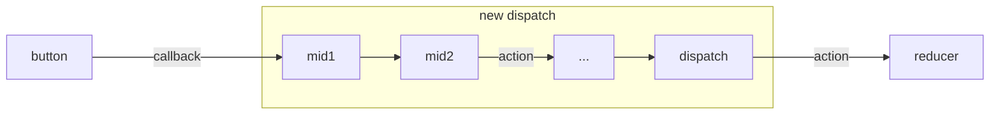
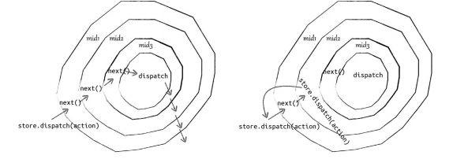

# redux

## 1. Flux模式
MVC架构的问题，随着项目越来越复杂，数据流动很混乱，所以有了Flux架构。
数据和逻辑永远是单向流动

```js
    _______________calls______________
    |                                 |
 __ ↓__     __________     _____     _|__
|Action|——>|dispatcher|——>|store|——>|view|
 ——————     ——————————     —————     ————

```


* dispatcher: 分发事件；
* store: 保存数据，响应事件更新数据；
* view: 订阅store中数据，渲染页面；

用户在view上的操作最终会映射为一类Action，Action传递给Dispatcher,再由Dispatcher执行注册在指定Action上的回调函数。最终完成对Store的操作，store中数据变化，view监听并作出反应。


## 2. Redux简介
Redux参考了Flux的设计，但是对Flux许多冗余部分（dispatcher）做了简化。提供若干API让我们使用reducer创建store，并能够更新store中的数据或获取store中的最新的状态。

## 3. Redux 三大原则
1. **单一数据源**
一个应用永远只有唯一的数据源。
2. **状态是只读的**
对直接修改store的状态限制的更加彻底，定义一个reducer，根据当前触发的action，对state进行迭代，并没有修改应用状态，而是返回了一份全新的状态。
3. **状态修改均有纯函数完成**
每一个reducer都是纯函数，意味着没有副作用，接收一定的输入，必定会得到一定的输出，使得reducer对状态的修改变得简单、纯粹、可测试。


## 4 使用

### 4.1 将多个reducer组合起来
举个例子：

```js
// reducer.js
/**
 * @file 应用状态变化响应actions
 * @author luyanhong 2019-09-25
 */
import { combineReducers } from 'redux';
import playReducer from './playMusic';
import loginReducer from './user';
export default combineReducers({
  playReducer,
  loginReducer
});
```
```js
// reducer/user.js
import defaultAvatar from 'assets/img/user.jpg';
import { LOGIN_TODO, LOGOUT_TODO } from '../actionTypes';
const defaultState = {
  userInfo: {
    avatarUrl: defaultAvatar,
    nickname: 'electron宝宝'
  },
  isLogin: false
};
const loginReducer = (state = defaultState, action) => {
  if (action.type === LOGIN_TODO) {
    const { userInfo } = action.payload;
    return Object.assign({}, state, {
      userInfo,
      isLogin: true
    });
  }
  if (action.type === LOGOUT_TODO) {
    return defaultState;
  }
  return state;
};
export default loginReducer;
```
唯一的store
```js
// store.js
import { createStore } from 'redux';
import reducer from './reducers';
const store = createStore(reducer);

export default store;
```

```js
// actions.js
// 普通的纯函数
export const loginAction = (payload) => ({
  type: LOGIN_TODO,
  payload
});
```

使用：
```js
function updateUserInfo (profile) {
    const payload = {
        userInfo: profile
    };
    store.dispatch(loginAction(payload));
}
```


### 4.2 action需要支持异步
reducer之前要请求数据，需要一个中间件来处理这种业务场景。
举个例子：

```js
// store.js
import {createStore, applyMiddleware} from 'redux';
import thunk from 'redux-thunk';
import {createLogger} from 'redux-logger';
import reducer from './reducers';
 // redux 中间件
const middleware = [thunk, createLogger];
const store = applyMiddleware(middlewares)(createStore)(reducer);
// 这种写法也可以，
// const store = createStore(reducers, applyMiddleware(middleware));
```


## 5. Redux middleware(重要)
由来：希望dispatch或reducer拥有异步请求的功能。需要可以组合的、自由插拔的插件机制，redux借鉴了koa里middleware的思想。通过串联不同的middleware实现变化多样的功能。

应用middleware后Redux处理事件的逻辑：





### 5.1 middleware机制

精炼的源码：

```js
function compose(...funcs) {
    return arg => funcs.reduceRight((composed, f) => f(composed), arg);
}
```
```js
import compose from './compose';
export default function applyMiddleware(...middlewares) {
    return (next) => (reducer, initialState) => {
        let store = next(reducer, initialState);
        let dispatch = store.dispatch;
        let chain = [];
        let middlewareAPI = {
            getState: store.getState,
            dispatch: (action) => dispatch(action)
        };
        // chain数组 [f1, f2, ..., fn]
        chain = middlewares.map(middleware => middleware(middlewareAPI));
        // 新dispatch执行，chain数组从右到左依次执行
        dispatch = compose(...chain)(store.dispatch);
        // 当compose执行完，假设n=3，dispath = f1(f2(f3(store.dispatch)));
        return {
            ...store,
            dispatch
        };
    }
}
```
说明 ：middlewareAPI中的dispatch为什么要用匿名函数包裹呢?
我们用 applyMiddleware 是为了改造 dispatch，所以 applyMiddleware 执行完后，dispatch 是 变化了的，而 middlewareAPI 是 applyMiddleware 执行中分发到各个 middleware 的，所以 必须用匿名函数包裹 dispatch，这样只要 dispatch 更新了，middlewareAPI 中的 dispatch 应 用也会发生变化。


1. 函数式编程思想
利用柯里化，好处：易串联和共享store。
2. 给middleware分发store
创建普通的store：
    ```js
    const store = applyMiddleware(mid1, mid2, mid3, ...)(createStore)(reducer, null);
    ```
    每个匿名函数都可以访问相同的store，即middlewareAPI.
3. 组合串联middleware


Q: 在middleware中调用store.dispatch()会发生什么？和调用next()有区别吗？

A：两者的不同：
```js
const logger = store => next => action => {
    console.log('dispatch', action);
    next(action);
    console.log('finish', action);
}
```
```js
const logger = store => next => action => {
    console.log('dispatch', action);
    store.dispatch(action);
    console.log('finish', action);
}
```


在middleware中调用next(), 效果是进入下一个middleware，如下图所示。在middleware中调用store.dispatch()和在其他任何地方调用的效果一样。  




### 5.2 Redux异步流
常用3个middleware来介绍发异步请求。

#### 5.2.1 redux-thunk
理论上发异步请求是在action，可是action都是同步情况，如何支持？
**Thunk函数**：针对多参数的柯里化，以实现对函数的惰性请求。只要参数有回调函数，都可以写Thunk函数形式。

**redux-thunk源码**：
```js
function createThunkMiddleware(extraArgument) {
    return ({dispatch, getState}) => next => action => {
        // 这里action即为一个Thunk函数
        if (typeof action === 'function') {
            return action(dispatch, getState, extraArgument);
        }
        return next(action);
    };
}
```


模拟请求一个天气的异步请求。action可以这么写：

```js
// actions.js
export function getWeather(url, params) {
    return (dispatch, getState) => {
        fetch(url, params)
            .then(result => {
                dispatch({
                    type: 'GET_WEATHER_SUCCESS',
                    payload: result
                });
            })
            .catch(err => {
                dispatch({
                    type: 'GET_WEATHER_ERROR',
                    error: err
                });
            });
    };
}
```

```js
import {getWeather} from 'src/redux/actions';
// 调用
store.dispatch(getWeather('http://xxx', {data: 133}));
```

#### 5.2.2 redux-promise
异步请求都是利用promise，可以抽象promise来解决异步流的问题。
源码：
```js
import {isFSA} from 'flux-standard-action';

function isPromise(val) {
    return val && typeof val.then === 'function';
}

export default function promiseMiddleware({dispatch}) {
    return next => action => {
        //
        if (!isFSA(action)) {
            return isPromise(action) ? action.then(dispatch): next(action);
        }
        // 判断action.payload是否为promise，是就执行then，返回的结果再发送一次dispatch
        return isPromise(action.payload) ?
        action.payload.then(
            result => dispatch({...action, payload: result}),
            error => {
                dispatch({...action, payload: error, error: true});
                return Promise.reject(error);
            }
        )
        : next(action);
    };
}
```


模拟请求一个天气的异步请求。action可以简化写：

```js
// actions.js
const fetchData = (url, params) => fetch(url, params);
export async function getWeather(url, params) {
    const result = await fetchData(url, params);
    if (result.error) {
        return {
            type: 'GET_WEATHER_ERROR',
            error: result.error
        };
    }
    return {
        type: 'GET_WEATHER_SUCCESS',
        payload: result
    };
}
```


### 5.3 解读Redux

#### 5.3.1 参数归一化
核心功能**createStore**
v3版本：
```js
export default function createStore(reducer, initialState, enhancer) {
    // ...
    // 第二个参数是函数，默认忽略了initialState，而传入了enhancer
    if (typeof initialState === 'function' && typeof enhancer === 'undefined') {
        enhancer = initialState;
        initialState = undefined;
    }
    if (typeof enhancer !== 'undefined') {
        if (typeof enhancer !== function) {
            throw new Error('Expected the enhancer to be a function');
        }
        return enhancer(createStore)(reducer, initialState);
    }
}
```

#### 5.3.2 初始状态以及getState

```js
// 当前reducer，支持store.replaceReducer动态替换reducer
var currentReducer = reducer;
var currentState = initialState;
// 监听store变化的监听器
var listeners = [];
// 某个action处于分发状态
var isDispatching = false;

function getState() {
    return currentState;
}

```

#### 5.3.3 subscribe
react-redux中的connect方法隐式完成了这个方法
```js
function subscribe(listener) {
    listeners.push(listener);
    var isSubscribed = true;
    return function unsubscribe() {
        if (!isSubscribed) {
            return;
        }
        isSubscribed = false;
        var index = listeners.indexOf(listener);
        listenders.splice(index, 1);
    }
}
```

#### 5.3.4 dispatch
在应用中经常直接 (store.dispatch({ type: 'SOME_ACTION' }))
```js
function dispatch(action) {
    if (!isPlainObject(action)) {
        throw new Error(
            'Actions must e plain object.' +
            'Use custom middleware for async actions'
        );
    }
    if (typeof action.type === 'undefined') {
        throw new Error('type 没了');
    }
    if (isDispatching) {
        throw new Error('Reducers may not dispatch actions');
    }
    try {
        // 设定标志位
        isDispatching = true;
        currentState = currentReducer(currentState, action);
    } finally {
        isDispatching = false;
    }
    // 依次调用监听者
    listeners.slice().forEach(listener => listener());
    return action;
}
```


### 5.4 解读react-redux

#### 5.4.1 Provider

简单代码：
```js
export default class Provider extends Component {
    getChilContext() {
        return {store: this.store}
    }

    // 拿到store，挂载到当前实例上
    constructor(props, context) {
        super(props, context);
        this.store = props.store;
    }
    render() {
        const {children} = this.props;
        return Children.only(children);
    }
}
```

#### 5.4.2 connect
可接受4个参数，每个参数有若干可选形式

伪代码：
```js
import hoistStatics from 'hoist-non-react-statics';

export default function connect(mapStateToProps, mapDispatchToProps, mergeProps, options = {}) {
    //...
    // 返回一个高阶组件
    return function wrapWithConnect(WrappedComponent) {
        // ...
        class Connect extends Component {
            //...
            render() {
                //...
                if (withRef) {
                    this.renderElement = createElement(WrappedComponent, {
                        ...this.mergedProps,
                        ref: 'wrappedInstance'
                    });
                } else {
                    this.renderedElement = createElement(WrappedComponent, this.mergedProps);
                }
                return this.renderedElement;
            }
        }
        // ...
        return hoistStatics(Connect, WrappedComponet);
    }
}
```


#### 1. mapStateToProps
需要从redux状态树中提取哪些部分当作props，传给当前组件。mapStateToProps一般返回一个对象，也可以优化缓存时候，返回一个函数。

部分伪代码：
```js
// 不传默认会是一个返回空对象的函数
const mapState = mapStateToProps || defaultMapStateToProps;
// ...
class Connect extends Component {
    configureFinalMapState(store, props) {
        // 一般是一个对象
        const mappedState = mapState(store.getState(), props);
        // 也可以是返回一个函数
        const isFactory = typeof mappedState === 'function';

        this.finalMapStateToProps = isFactory ? mappedState : mapState;
        this.doStatePropsDependOnOwnProps = this.finalMapStateToProps.length !== 1;

        if (isFactory) {
            // 返回缓存的
            return this.computeStateProps(store, props);
        }
        return mappedState;
    }
    // 计算出最终从redux提取的状态
    computeStateProps(store, props) {
        if (!this.finalMapStateToProps) {
            return this.configureFinalMapState(store, props);
        }

        const state = store.getState();
        // 执行函数
        const stateProps = this.doStatePropsDependOnOwnProps ? this.finalMapStateToProps(state, props): this.finalMapStateToProps(state);
        return stateProps;
    }

}
```

#### 2. 代码热替换
提供了replaceReducer，因为connect中也添加了相关的支持。

connect中部分代码：
```js
if (process.env.NODE_ENV !== 'production') {
    // 额外定义生命周期，判断当前版本与全局版本是否一致
    Connect.prototype.componentWillUpdate = function componentWillUpdate() {
        if (this.version === version) {
            return;
        }
    }
    this.version = version;
    // 重新订阅
    this.trySubscribe();
    this.clearCache();
}
```

```js
let nextVersion = 0;
export default function connect(mapStateToProps, mapDispatchToProps, mergeProps, options = {}) {
    // ...
    // 帮助追踪热重载,每次执行，nextVersion都+1
    const version = nextVersion++;
    return function wrapWithConnect(WrappedComponent) {
        //....
        class Connect extends Component {
            constructor(props, context) {
                // ...
                this.version = version;
            }
        }
    }
}
```


## 问题
### 1. 介绍 Redux 数据流的流程
### 2. Redux的设计思想
A: Redux 的设计采用了 Facebook 提出的 Flux 数据处理理念。
在 Flux 中通过建立一个公共集中数据仓库 Store 进行管理，整体分成四个部分即: View （视图层）、Action （动作）、Dispatcher (派发器)、Store （数据层）。
修改仓库的数据时，需要从 View 中触发 Action，由 Dispatcher 派发到 Store 修改数据，从而驱动视图更新。
这种设计的好处在于其数据流向是单一的，数据的修改一定是会经过 Action、Dispatcher 等动作才能实现，方便预测、维护状态的流向。


### 3. Redux 中异步的请求怎么处理？
A: 1、理解middleware机制。
Redux 提供了 applyMiddleware 方法来加载 middleware。middleware 的设计有点特殊，是一个层层包裹的匿名函数，这其实是函数式编程中的 currying，它是一种使用匿名单参数函数来实现多参数函数的方法。给 middleware 分发 store。而 store 的 getState 方法和 dispatch 方法又分别被直接和间接地赋值给 middlewareAPI 变量 store:
const middlewareAPI = {
    getState: store.getState,
    dispatch: (action) => dispatch(action),
};
chain = middlewares.map(middleware => middleware(middlewareAPI));
然后，让每个 middleware 带着 middlewareAPI 这个参数分别执行一遍。执行完后，获得 chain 数组 [f1, f2, ... , fx, ..., fn]，它保存的对象是第二个箭头函数返回的匿名函数。因为是闭包，每个匿名函数都可以访问相同的 store，即 middlewareAPI。

2。 使用middleware简化异步请求。
例如：redux-thunk，如果要发异步请求，在 Redux 定义中，最合适的位置是在 action creator 中实现。Thunk 函数实现上就是针对多参数的 currying 以实现对函数的惰性求值。当 action 为函数的时候，我们并没有调用 next 或 dispatch 方法，而是 返回 action 的调用。这里的 action 即为一个 Thunk 函数，以达到将 dispatch 和 getState 参数 传递到函数内的作用。


### 4. Redux 中间件· 中间件是怎么拿到 store 和 action？然后怎么处理？
A: 中间件通过柯里化的方式来获取store和action。
在Redux中，中间件接受三个参数store、next和action。
```js

const middleware = store => next => action => {
    // 中间件处理   
}
```
store：通过store，中间件可以获取当前的状态，调用store.getState()。分发新的action，调用store.dispatch(action)。
next：next是一个函数，用来调用下一个中间件。通过调用next(action)中间件可以将action传递给下一个中间件或reducer使用。
action：action是一个对象，包含type和payload等属性。中间件可以对action进行各种操作。
