# Vue2.0（早期的）
## 1 Vue的双向绑定
发布订阅模式 + Object.defineProperty  

简单伪代码：
1. 数据监听器Observer，对数据对象所有属性监听，有变化通知订阅者
2. Watcher订阅并收到每个属性变动的通知，执行指令绑定的相应回调函数，从而更新视图。 
```js
  let uid = 0；
  // 消息管理员
  class Dep {
    constructor () {
      this.id = uid ++; // 区分新的watcher和只改变值产生的watcher
      this.watchers = [];
    }
    // 触发target上的watcher中的addDep方法
    depend() {
      Dep.target.addDep(this);
    }
    // 添加订阅者
    addWatcher(watcher) {
      this.watchers.push(watcher);
    }
    // 通知所有订阅者，触发订阅者相应逻辑处理
    notify() {
      this.watchers.forEach((watcher) => {
        watcher.update();
      })
    }
  }
  Dep.target = null;

  function observe(value) {
    if (!value || typeof value !== 'object') {
      return;
    }
    return new Observe(value);
  }

  function defineReative(obj, key, val) {
    const dep = new Dep();
    // 给当前属性添加监听
    observe(val);
    Object.defineProperty(obj, key, {
      emumerable: true,
      configurable: true,
      get: () => {
        // 如果有target，将其添加到dep实例的watchers中
        // watcher实例化会读data属性，触发get方法
        Dep.target && dep.depend();
        return val;
      }
      set: (newVal) => {
        if (val === newVal) {
          return;
        }
        val = newVal;
        // 对新值监听
        observe(newVal);
        dep.notify();
      }
    })
  }
  // 监听者
  class Observer {
    constructor(value) {
      this.value = value;
      this.walk(value);
    }
    // 遍历属性并监听
    walk(value) {
      Object.keys(value).forEach((key) => {
        this.convert(key, value[key]);
      });
    }
    // 执行监听的具体方法
    convert(key, val) {
      defineReative(this.value, key, val);
    }
  }
  // 订阅者
  class Watcher {
    constructor(vm, expOrFn, cb) {
      this.depIds = {}; // 存订阅者id
      this.vm = vm;
      this.cb = cb;
      this.expOrFn = expOrFn; // 被订阅数据
      this.val = this.get(); // 维护更新数据
    }

    addDep(dep) {
      // 避免同id的watcher被多次存储
      if (!this.depIds.hasOwnProperty(dep.id)) {
        dep.addWatcher(this);
        this.depIds[dep.id] = dep;
      }
    }

    update () {
      const oldValue = this.val;
      this.val = this.get();
      this.cb.call(this.vm, this.val, oldValue);
    }

    get () {
      // 当前watcher被订阅数据更新后值，通知dep
      // 收集当前订阅者
      Dep.target = this;
      const val = this.vm._data[this.expOrFn];
      // 置空，用于下一个watcher调用
      Dep.target = null;
      return val;
    }
  }
```

### Array怎么进行侦测？
原理：继承原型，对继承后对象使用Object.defineProperty做拦截操作。
简要代码：
```js
class Observe {
  constructor(value) {
    ...
    if (Array.isArray(value)) {
      // 不想直接修改Array.prototype，只希望data的Array生效
      value._proto_ = arrayMethods;
      this.observeArray(value);
      
    } else {
      ...
    }
    ...
    const arrayProto = Array.prototype;
    const arrayMethods = Object.create(arrayProto);
    ['psuh', 'pop', 'shift', 'unshift', 'splice', 'sort', 'reverse'].forEach(function(method) {
      const original = arrayProto[method];
      def(arrayMethods, method, function mutator(...args) {
        const result = original.apply(this, args);
        const ob = this.__ob__;
        let inserted;
        // 3种会新增数组
        switch(method) {
          case 'push':
          case 'unshift':
            inserted = args;
            break;
          case 'splice':
            inserted = args.slice(2);
            break;
        }
        
        // 将新增元素也转换成被侦测数据
        if (inserted) {
          ob.observeArray(inserted);
        }
        // 调用实例发送通知
        ob.dep.notify();
        return result;
      });
    });
  }
}
```


## 2 Diff
主要策略：  
1. 按tree层级diff  
新旧节点树之间按层级进行diff得到差异，而非传统按照深度遍历搜索；复杂度o(n^2) => o(n)
2. 按类型进行diff  
只对相同类型的同一个节点diff  
类型改变？直接建新虚拟dom，替代原来
3. 列表diff  
更新：插入、移动、删除，设置key，调整diff更新排序，没有key只能按顺序进行对比。当key唯一稳定，diff的效率提高。


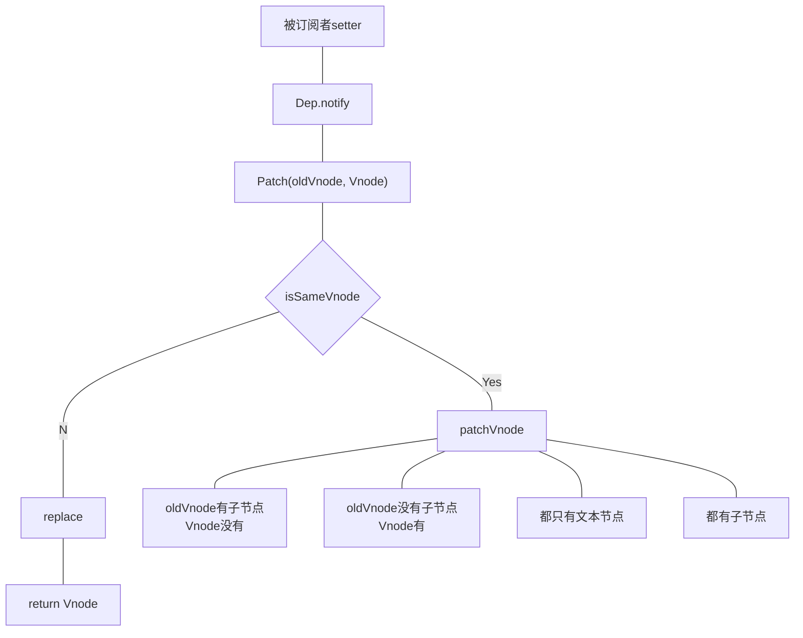

### 伪代码
```js

function sameVnode(a, b) {
  return a.key === b.key &&
    a.tag === b.tag &&
    a.isComment === b.isComment &&
    // 是否都绑定了data
    isDef(a.data) === isDef(b.data) &&
    sameInputType(a, b); // 当input，type要相同
}

function patchVnode(oldVnode, vnode) {
  const el = vnode.el = oldVnode.el;
  let i;
  let oldCh = oldVnode.children;
  let ch = vnode.children;
  // 都是文本节点
  if (oldVnode.text !== null && vnode.text !== null
  && oldVnode.text !== vnode.text) {
    api.setTextContent(el, vnode.text);
  } else {
    updateEle(el, vnode, oldVnode);
    // 都有子节点
    if (oldCh && ch && oldCh !== ch) {
      updateChildren(el, oldCh, ch);
      // 只有新节点
    } else if (ch) {
      createEle(vnode);
      // 只有老节点
    } else if (oldCh) {
      api.removeChild(el, oldCh);
    }
  }
}
function patch(oldVnode, vnode) {
  if (sameVnode(oldVnode, vnode)) {
    patchVnode(oldVnode, vnode);
  } else {
    const oEl = oldVnode.el;
    let parentEle = api.parentNode;
    // 根据vnode生成新元素
    createEle(vnode);
    if (parentEle !== null) {
      api.insertBefore(parentEle, vnode.el, api.nextSibling(oEl));
      // 移除旧元素节点
      api.removeChild(parentEle, oldVnode.el);
    }
  }
  return vnode;
}
```
**updateChildren**思路；
1. 将vnode子节点ch和oldVnode子节点oldCh提取出来
2. oldCh和ch各有头尾变量startIdx和endIdx, 2个变量相比较，若都没匹配，如果设置了key，用key比较。一旦startIdx > endIdx,
表明至少有一个遍历完了，则结束。


示意图：

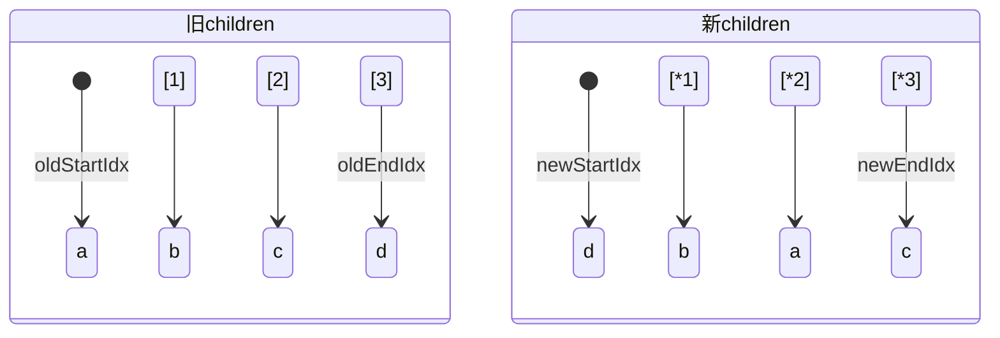

四步对比：有相同的key，即停，索引秦前移、后移一位。
* 首首对比；
* 尾尾对比；
* 首尾对比；
* 尾首对比；

1. 找到尾首d-d，将d对应真实dom移动最前方。

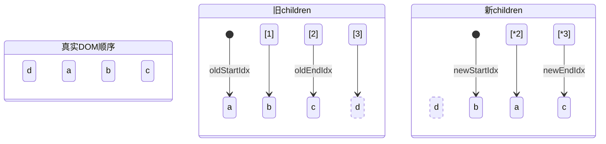

2. 找到c-c，都是尾尾，不用移动，直接patch，索引前移。


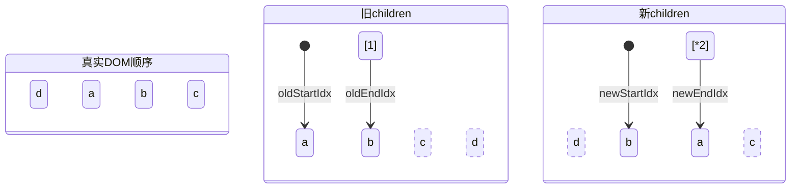

3. 首尾对比，找到a-a, a变成“最后一个子节点”，将oldStartIdx对应真实Dom移动到oldEndIdx对应真实DOM后。


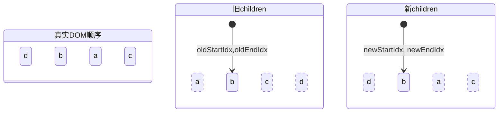

4. 找到首首对，b-b, 都是第一个，不用移动,patch即可。


#### 非理想情况下处理方式：4种。

##### 1. 例如

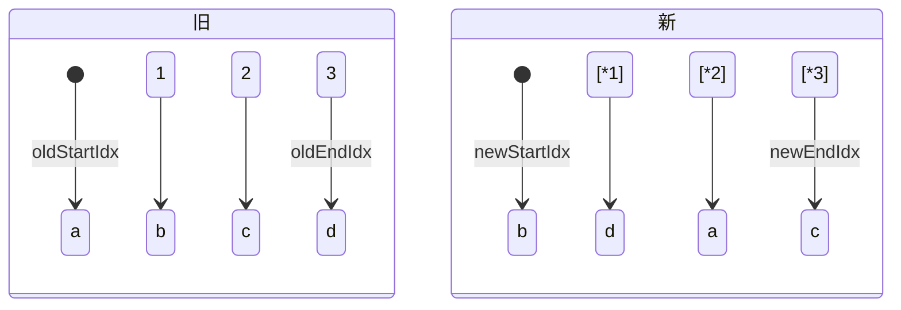
四步对比均没有，再旧中找到b所在索引，因为b已经在第一个。即把b对应真实DOM移到最前面。该节点置为undefined.


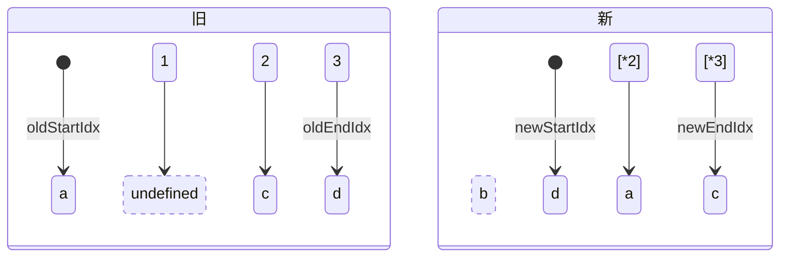
会导致oldStartVNode、oldEndVNode可能undefined, 可直接跳过这个位置。

##### 2. 新加元素

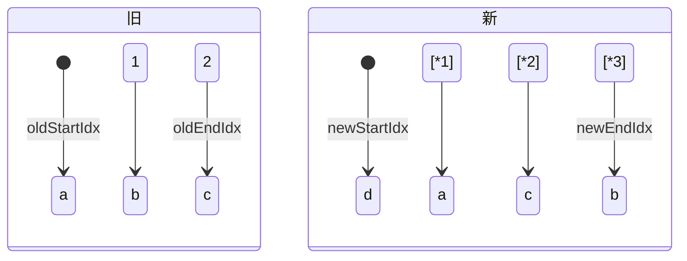
4步对比没有，d在旧中没有，即新节点。挂载在oldStartIdx位置节点对应真实DOM前面。

##### 3. 被遗忘的节点

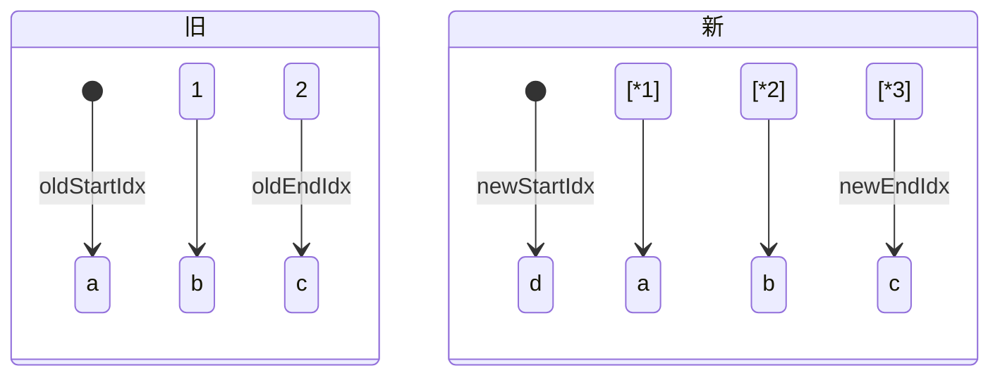
c->c 

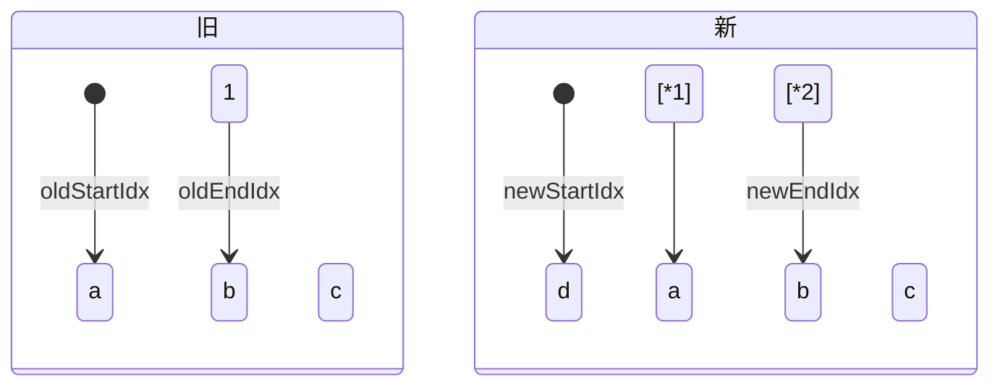
b-b

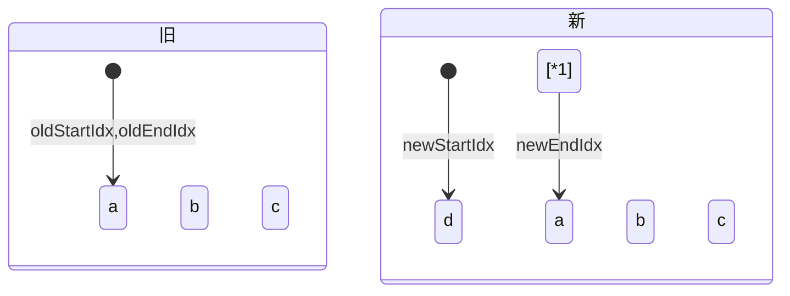
a-a  
oldEndIdx: -1, 但d被遗忘了。  
故循环结束，oldEndIdx < oldStartIdx, children中有没被处理的节点。 


##### 4. 移除不存在的元素


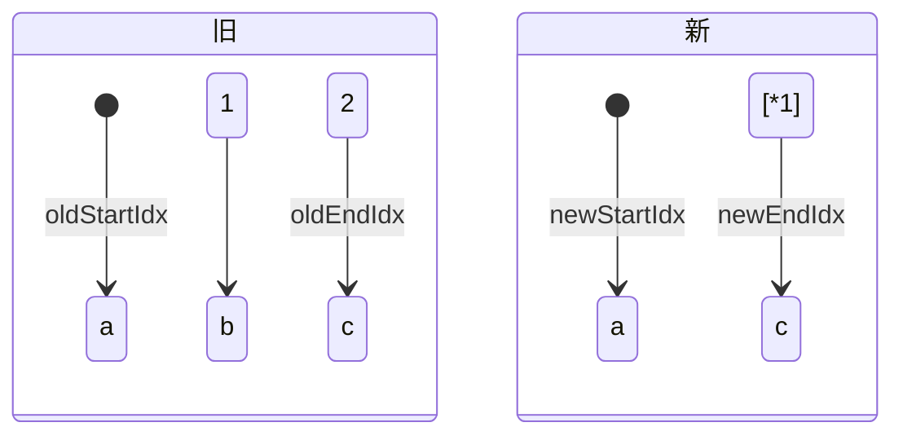
找到a-a, patch, 索引移位。

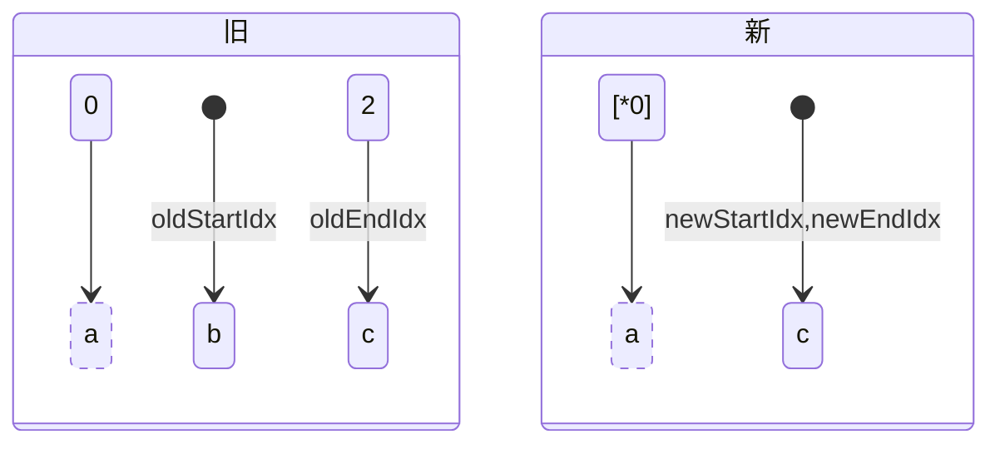

找到c-c，patch, 索引前移。

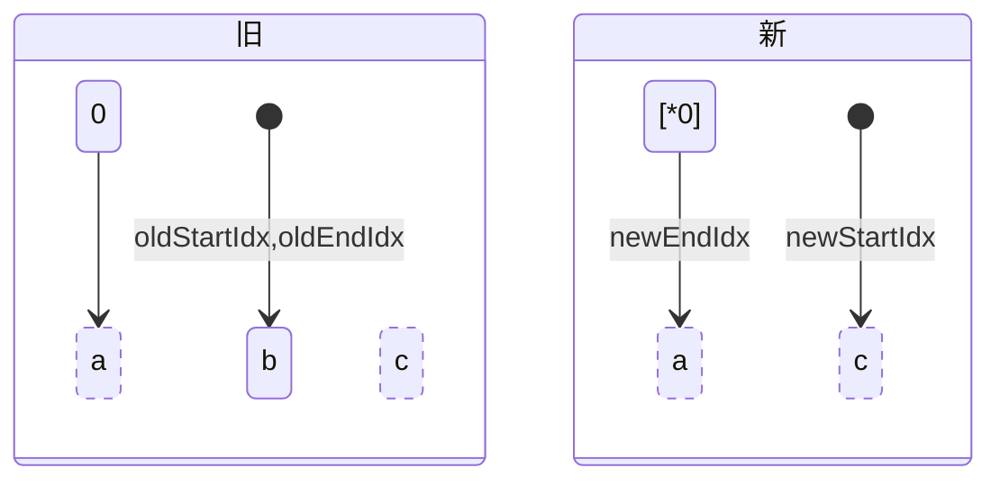

newEndIdx < newStartIdx, 但b没有被处理，应移除。


伪代码：
```js
let oldStartIdx = 0;
let oldEndIdx = prevChildren.length - 1;
let newStartIdx = 0;
let newEndIdx = nextChildren.length -1;

let oldStartVNode = prevChildren[oldStartIdx];
let oldEndVNode = prevChildren[oldEndIdx];
let newStartVNode = nextChildren[newStartIdx];
let newEndVNode = nextChildren[newEndIdx];

while (oldStartIdx <= oldEndIdx && newStartIdx <= newEndIdx) {
    if (!oldStartVNode) {
        oldStartVNode = prevChildren[++oldStartIdx];
    } else if (!oldEndVNode) {
        oldEndVNode = prevChildren[--oldEndIdx];
    } else if (oldStartVNode.key === newStartVNode.key) {
        // 首首对比
        // 调用patch更新，索引移后
        patch(oldStartVNode, newStartVNode, container);
        oldStartVNode = prevChildren[++oldStartIdx];
        newStartVNode = nextChildren[++newStartIdx];
    } else if (oldEndVNode.key === newEndVNode.key) {
        // 尾尾对比
        // patch更新、索引前移
        patch(oldEndVNode, newEndVNode, container);
        oldEndVNode = prevChildren[--oldEndIdx];
        newEndVNode = nextChildren[--newEndIdx];
    } else if (oldStartVNode.key === newEndVNode.key) {
        // 首尾对比，即第一个变成了最后一个
        patch(oldStartVNode, newEndVNode, container);
        // 将旧首的真实dom移动到旧尾真实dom后面
        container.insertBefore(oldStartVNode.el, oldEndVNode.el.nextSibling);
        // 更新索引
        oldStartVNode = prevChildren[++oldStartIdx];
        newEndVNode = nextChildren[--newStartIdx];
    } else if (oldEndVNode.key === newStartVNode.key) {
        // 尾首对比，最后一个变成了第一个
        patch(oldEndVNode, newStartVNode, container);
        // 最后一个子节点移动到最前面
        container.insertBefore(oldEndVNode.el, oldStartVNode.el);
        // 更新索引
        oldEndVNode = prevChildren[--oldEndIdx];
        newStartVNode = nextChildren[++newStartIdx];
    } else {
        // 4种对比无结果
        // 遍历旧，寻找与newStartVNode相同的key的
        const idxInOld = prevChildren.findIndex(node => node.key === newStartVNode.key);
        if (idxInOld >= 0) {
            // 找到的节点，对应的真实dom移到最前面，情况1
            const vnodeToMove = prevChildren[idxInOld];
            patch(vnodeToMove, newStartVNode, container);
            // 移动
            container.insertBefore(vnodeToMove.el, oldStartVNode.el);
            prevChildren[idxInOld] = undefined;
        } else {
            // 添加新元素, 情况2
            mount(newStartVNode, container, false, oldStartVNode.el);
        }
        newStartVNode = nextChildren[++newStartIdx];
    }
    // 情况3，被遗忘的节点
    if (oldEndIdx < oldStartIdx) {
        for (let i = newStartIdx; i <= newEndIdx; i++) {
            mount(nextChildren[i], container, false, oldStartVNode.el);
        }
    } else if (newEndIdx < newStartIdx) {
        // 情况4，不存在的元素
        for (let i = oldStartIdx; i <= oldEndIdx; i++) {
            container.removeChild(prevChlidren[i].el);
        }
    }
}
```


## 3. nextTick的实现原理
1. vue用异步队列的方式来控制DOM更新和NnextTick回调先后执行；
2. 微任务因为优先级高特性，能确保队列中的微任务在一次事件循环前被执行完毕；
3. 因为兼容问题，vue不得不做了微任务向宏任务降级方案；

## 4. computed实现？
计算属性如何与属性建立依赖关系？  
属性发生变化又如何通知到计算属性？
### 伪代码
```js
// 这里开始转换data的getter、setter，原始值已存入_ob_属性中
Object.defineProperty(obj, key, {
  enumerable: true,
  configurable: true,
  get: function reativeGetter() {
    const value = getter ? getter.call(obj): val;
    // 判断是否处于依赖收集状态
    if (Dep.target) {
      // 建立关系
      dep.depend();
    }
    return value;
  },
  set: function reactiveSetter(newVal) {
    // 依赖发生变化，通知计算属性重新计算
    dep.notify();
  }
});

// 计算属性初始化
function initComputed(vm, computed) {
  ...
  // 遍历computed计算属性
  for (const key in computed) {
    ...
    // 创建watcher实例
    watchers[key] = new Watcher(vm, getter || noop, noop, computeWatchOptions);
    // 创建属性vm.计算属性, 并将提供的函数当作属性vm.计算属性的getter
    // 最终computed与data会一起混合到vm下，所以当computed与data存在同名属性时会抛出警告
    defineComputed(vm, key, userDef);
    ...
  }
}

export function defineComputed(target, key, userDef) {
  // 创建set get 方法
  sharedPropertyDefinition.get = createComputedGetter(key);
  sharedPropertyDefinition.get = noop;
  ...
  // 创建属性vm.计算属性，并初始化getter setter
  Object.defineProperty(target, key, sharedPropertyDefinition);
}

function createComputedGetter(key) {
  return function computedGetter() {
    const watcher = this._computedWatchers && this._computedWatchers[key];
    if (watcher) {
      if (watcher.dirty) {
        // watcher暴露evaluate方法用于取值操作
        watcher.evaluate();
      }
      // 同第一步，判断是否处于依赖收集状态
      if (Dep.target) {
        watcher.depend();
      }
      return watcher.value;
    }
  }
}
```
1. data属性初始化getter setter
2. computed计算属性初始化，提供的函数将用作属性vm.计算属性的getter
3. 当首次获取计算属性的值时，Dep开始依赖收集
4. 在执行某个属性 getter方法时，如果Dep处于依赖收集状态，则判定该属性为计算属性的依赖，并建立依赖关系
5. 当 某个属性发生变化时，根据依赖关系，触发计算属性的重新计算


## 5. vue模板编译原理
1. 将模板字符串转换成elements ASTs(解析器)；
2. 对AST进行静态节点标记，主要用来做虚拟dom的渲染优化（优化器）；
3. 使用elements ASTs生成render函数代码字符串（代码生成器）

例如：
```html
<div><p>{{name}}</p></div>
```

elements AST:
```js
{
  // 以"<"开头截取的这段字符串是标签or文本
  tag："div",
  type: 1,
  staticRoot: false,
  parent: undefined,
  children: [
    {
      tag: "p",
      type: 1,
      staticRoot: false,
      static: false,
      children: [{
        type: 2,
        text: "{{name}}",
        static: false,
        ...
      }]
    }
  ]
}
```
### 截取文本；

```js
// 比如div解析后剩余模板字符串<p>{{name}}</p></div>
let textEnd = html.indexOf('<');
let text,rest, next;
if (textEnd >= 0) {
  rest = html.slice(textEnd);
  // 剩余部分html不符合标签格式暂定是文本
  // 并且是以<开头的文本
  const ncname = '[a-zA-Z][\\w\\-\\.]*';
  const qnameCapture = `((?:${ncname}\\:)?${ncname})`;
  const startTagOpen = new RegExp(`^<${qnameCapture}`);
  const startTagClose = /^\s*(\/?)>/;
  while(!endTag.test(rest) && !startTagOpen.test(rest) && ...) {
    next = rest.indexOf('<', 1);
    if (next < 0) {
      break;
    }
    textEnd += next;
    rest = html.slice(textEnd);
  }
  text = html.substring(0, textEnd);
  html = html.suustring(0, textEnd);
}
```
解析文本：
* 纯文本：直接将文本节点的ast push到parent的children中；
* 带变量：多一个const expression = parseText(text, delimiters);

结束标签的处理：
用当前标签名在stack从后往前找，将找到的stack中的位置往后的所有标签删除。

标记静态节点好处：
1. 每次重新渲染不需要为静态节点创建节点；
2. 在虚拟dom中patching过程跳过；

### 代码生成器：

elements ASTs ——> render函数代码
例如开头AST：
```js
render: `with(this) {
  return _c('div', [_c('p', [_v(_s(name))])])
}`

// 即
with(this) {
  return _c(
    'div',
    [_c(
      'p',
      [_v(_s(name))]
    )]
  )
}
// _c: createElement(创建一个元素)
// _v: 创建文本节点
// _s: 返回参数中字符串

function genData(el, state) {
  let data = '{';
  if (el.key) {
    data += `key:${el.key},`;
  }
  if (el.ref) {
    data += `ref:${el.ref},`;
  }
  if (el.refInFor) {
    data += `refInFor:true,`;
  }
  if (el.pre) {
    data += `pre:true,`;
  }
  // 类似...
  data = data.replace(/,$/, '') + '}';
  return data;
}

function genChildren(el, state) {
  const children = el.children;
  if (children.length) {
    return `[${children.map(c => genNode(c, state)).join(',')}]`;
  }
}

function genNode(node, state) {
  if (node.type === 1) {
    return genElement(node, state);
  }
  if (node.type === 3 && node.isComment) {
    return genComment(node);
  } else {
    return genText(node); // 带变量文本
  }
}

function genElement(el, state) {
  const data = el.plain ? undefined : genData(el, state);
  const children = el.inlineTemplate ? null ? genChildren(el, state, true);
  let node = `_c['${el.tag}'${data ? `,${data}`: ''} ${
    children ? `,${children}`: ''
  }]`;
  return node;
}
```


## 6. 组件通信
1. props：
子组件显示定义好从父组件接收的数据，父组件通过v-bind传递数据；  
不可直接改变子组件中的prop属性（单向传递）

优点： 简单灵活；  
缺点： props篡改（引用类型），跨层级通信、兄弟组件通信困难；

2. v-on、$emit：
父组件可在使用子组件模板用v-on来监听子组件触发的事件；
3. v-model：
父子组件的双向绑定；
4. sync：
语法糖，扩展为一个自动更新父组件属性的v-on侦听器。
```vue
<demo :foo.sync="something"></demo>
<demo :foo="something" @update:foo="val => something = val"></demo>

```
子组件更新：
```js
this.$emit('update:foo', newValue);
```

5. $attrs/$listeners:
简单的深层次数据传递。  
子组件：inheritAttrs: false(取消继承属性)
即父组件多传的props不会绑定在子组件根元素上，但可通过$attr接收父组件传入而子组件没在props显示接收的数据。
```vue
<demo :first="firstMsg" :second="secondMsg"></demo>
```
```js
// 子组件
props: ['first'], inheritAttrs: false
```
父 -> 子 -> 孙子
```js
// 子组件
<next-demo v-bind="$attrs"></next-demo>
```
孙子 -> 子 -> 父
```js
// 子
<next-demo v-on="$listeners"></next-demo>
```
$listeners整体接收监听事件，并传递到孙子组件中；
```js
// 孙子组件
<p @click="$listeners.changeData('change')"></p>
```  

  

6. 平级组件通信: 通过额外的实例进行简单的中央事件处理。
```js
// bus.js
import Vue from 'vue';
export default new Vue();
```
同级子组件A
```js
import Bus from './bus.js';
methods: {
  handleClick() {
    Bus.$emit('fromFirst', '来自A组件');
  }
}
```
同级子组件B
```JS
import Bus from './bus.js';
create() {
  Bus.$on('fromFirst', (Amsg) => {
    this.Bmsg = Amsg;
  });
}
```

优点：父子兄弟通信不受限制；
缺点：维护困难，谨小慎微命令规范、不利于组件化；


## 7. 设计VNode

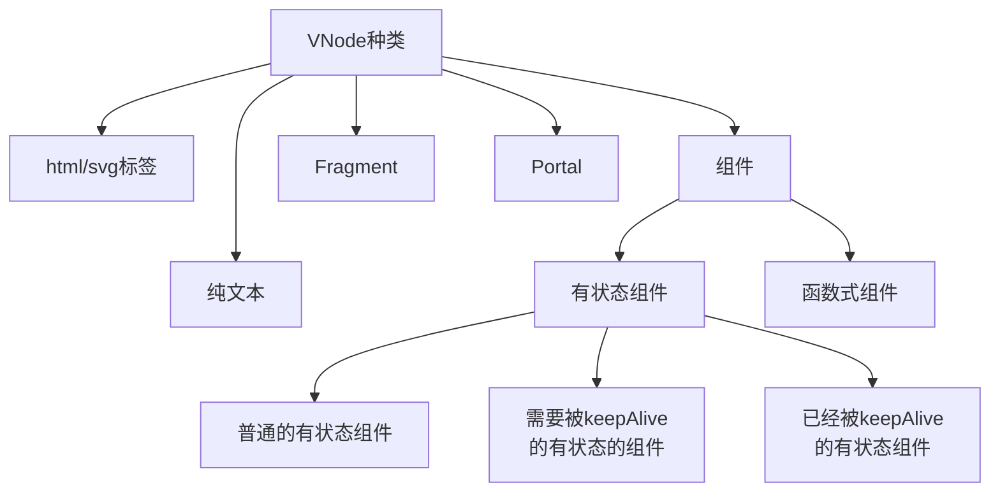

  

    

使用flags作为VNode标识（优化）

```js
const VNodeFlags = {
    // html标签
    ELEMENT_HTML: 1,
    // svg
    ELEMENT_SVG: 1<< 1,
    // 普通有状态组件
    COMPONENT_STATEFUL_NORMAL: 1<< 2,
    // 需被keepAlive有状态组件
    COMPONENT_STATEFUL_SHOULD_KEEP_ALIVE: 1<< 3,
    // 已被keepAlive有状态组件
    COMPONENT_STATEFUL_KEEP_ALIVE: 1<< 4,
    // 函数式组件
    COMPONENT_FUNTIONAL: 1<< 5,
    // 纯文本
    TEXT: 1<<6,
    //fragment
    FRAGMENT: 1<< 7,
    PORTAL: 1 << 8
}

VNode.ELEMENT = VNodeFlags.ELEMENT_HTML | VNode.ELEMENT.SVG;
// 按位运算
```

**childrenFlags**

```js
const ChildrenFlags = {
    UNKNOW_CHILDREN: 0, // 未知children
    NO_CHILDREN: 1, // 没有children
    SINGLE_CHILDREN: 1 <<1, // 单个children
    KEYD_VNODES: 1<< 2, // children是多个有key的Vnode
    NONE_KEYD_VNODES: 1<<3, // 多个无key的vnode
}
```

举个栗子：拥有多个有key的li的ul

```js
const elementVNode = {
    flags: VNodeFlags.ELEMENT_HTML,
    tag: 'ul',
    data: null,
    childrenFlags: ChildrenFlags.KEYD_VNODES,
    children: [
        {
            tag: 'li',
            data: null,
            key: 0
        },
        {
            tag: 'li',
            data: null,
            key: 1
        }
    ]
}
```

### 创建VNode的h函数
Fragment的tag 、纯文本的tag是null ？==> 唯一标识；  
Portal的tag也是字符串 ==> Portal标识

```js
const Fragment = Symbol();
const Portal = Symbol();

function h(tag, data = null, children = null) {
    let flags = null;
    if (typeof tag === 'string') {
        flags = tag === 'svg' ? VNodeFlags.ELEMENT_SVG: VNodeFlags.ELEMENT_HTML;
    } else if (tag === Fragment) {
        flags = VNodeFlags.FRAGMENT;
    } else if (tag === Portal) {
        flags = VNodeFlags.PORTAL;
        tag = data && tata.target;
    } else {
        // 兼容vue2 对象式组件
        if (tag !== null && typeof tag === 'object') {
            flags = tag.functional ?
            VNodeFlags.COMPONENT_FUNTIONAL: 
            VNodeFlags.COMPONENT_STATEFUL_NORMAL;
        } else if (typeof tag === 'function') {
            // vue3 类组件
            flags = tag.prototype && tag.prototype.render ? 
            VNodeFlags.COMPONENT_STATEFUL_NORMAL:
            VNodeFlags.COMPONENT_FUNTIONAL;
        }
    }
}
```


### 渲染器之挂载

|旧VNode|新VNode|操作|
|-------|-------|---|
|x|√|mount|
|√|x|移除dom|
|√|√|patch|


伪代码:
```js
function render(vnode, container) {
    const prevVNode = container.vnode;
    if (prevVNode === null) {
        if (vnode) {
            // 只有新无旧
            mount(vnode, container);
            container.vnode = vnode;
        }
    } else {
        if (vnode) {
            // 有旧有新
            patch(prevVNode, vnode, container);
            container.vnode = vnode;
        } else {
            // 有旧，新没了
            container.removeChild(prevVNode.el);
            container.vnode = null;
        }
    }
}
```


不同类型用不同挂载函数。

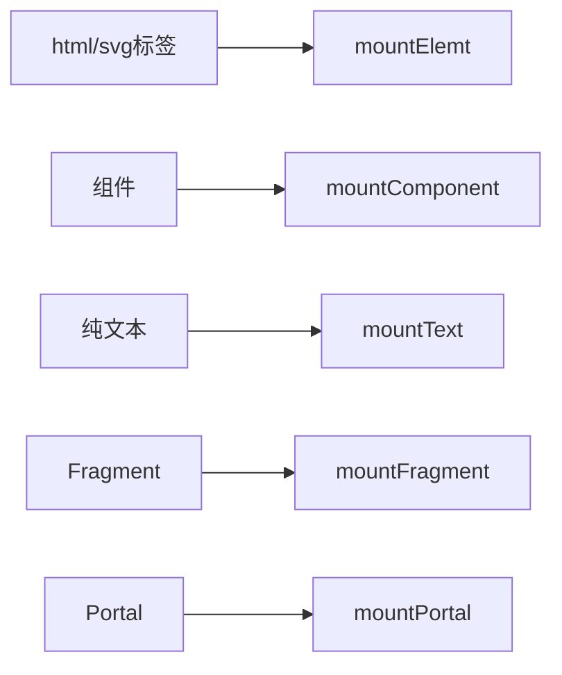

$$
VNodeData
\begin{cases}
style \\
class \\
attributes \\
DOM Properties \\
事件
\end{cases}
$$


#### 挂载元素
伪代码：
```js
function mountElement(vnode, container, isSVG) {
    isSVG = isSVG || vonode.flags && VNodeFlags.ELEMENT_SVG;
    // 引用真实dom
    const el = isSVG ? 
        document.createElementNS('http://www.w3.org/2000/svg', vnode.tag)
        : document.createElement(vnode.tag);
    vnode.el = el;
    const data = vnode.data;
    // 处理各种data,setAttribute函数为元素设置属性，都是字符串
    // 一些特殊的attribute，如checked，只要出现了
    // 对应的property初始化true，只有调用removeAttribute
    // 才会变成false
    const domPropsRE = /\[A-Z] | ^(?:value|checked|selected|muted)$/;
    if (data) {
        for (let key in data) {
            switch (key) {
                case 'style':
                    for (let k in data.style) {
                        el.style[k] = data.style[k];
                    }
                    break;
                case 'class':
                    if (isSVG) {
                        el.setAttribute('class', data[key]);
                    } else {
                        el.className = data[key];
                    }
                    break;
                default: 
                    // 事件要和其他属性区分开，以on开头
                    if (key[0] === 'o' && key[1] === 'n') {
                        el.addEventListener(key.slice(2), data[key]);
                    } else if (domPropsRE.test(key)) {
                        // 当作dom props处理
                        el[key] = data[key];
                    } else {
                        // 当作attr处理
                        el.setAttribute(key, data[key]);
                    }
                    break;
            }
        }
    }

    // 挂载子节点
    const childFlags = vnode.childFlags;
    if (childFlags !== ChildrenFlags.NO_CHILDREN) {
        if (childFlags & ChildrenFlags.SINGLE_VNODE) {
            mount(chidlren, el, isSVG);
        } else if (childFlags & ChildrenFlags.MULTIPLE_VNODE) {
            for (let i = 0; i < children.length; i++) {
                mount(children[i], el, isSVG);
            }
        }
    }
    container.appendChild(el);
}
```

#### 挂载纯文本

```js
function mountText(vnode, container) {
    const el = document.createTextNode(vnode.children);
    vnode.el = el;
    container.appendChild(el);
}
```


#### 挂载Fragment
children的flags根据不用类型挂载不同方式；  


$$
el
\begin{cases}
一个节点： el=该节点 \\
多个节点：el第一个节点的引用 \\
空片段：el=占位的空文本节点元素
\end{cases}
$$

伪代码：
```js
function mountFragment(vnode, container, isSVG) {
    const {children, childFlags} = vnode;
    switch (childFlags) {
        case Children.SINGLE_VNODE:
            mount(children, container, isSVG);
            // 单个节点
            vnode.el = children.el;
            break;
        case ChildrenFlags.NO_CHILDREN:
            const placeholder = createTextVnode('');
            mountText(placeholder, container);
            vnode.el = placeholder.el;
            break;
        default:
            for (let i = 0; i < children.length; i++) {
                mount(chidren[i], container, isSVG);
            }
            vnode.el = children[0].el;
    }
}
```


#### 挂载Portal
获取真正挂载点，而非container  
el ？ => 占位的DOM元素，来承接事件。

伪代码：

```js
function mountPortal(vnode, container) {
    const {tag, children, childFlags} = vnode;
    const target = typeof tag === 'string' ?
        document.querySelector(tag): tag;
    if (childFlags & ChildrenFlags.SINGLE_VNODE) {
        mount(children, target);
    } else if (childFlags & ChildrenFlags.MUTIPLE_VNODE) {
        for (let i = 0; i < children.length; i++) {
            mount(children[i], target);
        }
    }

    // 占位的空文本节点
    const placeholder = createTextVNode('');
    mountText(placeholder, container, null);
    // el属性引向该节点
    vnode.el = placeholder.el;
}
```


#### 挂载组件

```js
function mountComponent(vnode, container, isSVG) {
    if (vnode.flags & VNodeFlags.COMPONENT_STATEFUL_NORMAL) {
        mountStatefulComponent(vnode, container, isSVG);
    } else {
        mountFunctionalComponent(vnode, container, isSVG);
    }
}
```

```js
function mountStatefulComponent(vnode, container, isSVG) {
    // 创建组件实例
    const instance = new vnode.tag();
    // 渲染vnode
    instance.$vnode = instance.render();
    // 挂载
    mount(instance.$vnode, container, isSVG);
    // el属性值和组件实例的$el都引用组件的根元素
    instance.$el = vnode.el = instance.$vnode.el;
}

function mountFunctionalComponent(vnode, container, isSVG) {
    // 组件无实例， 更新函数放在vnode上
    vnode.handle = {
        prev: null,
        next: vnode,
        container,
        update: () => {
            // 已经挂载过，是更新
            if (vnode.handle.prev) {
                const prevVNode = vnode.handle.prev;
                const nextVNode = vnode.handle.next;
                // 旧组件产出vnode
                const prevTree = prevVNode.children;
                // 更新props
                const props = nextVNode.data;
                const nextTree = (nextVNode.children = nextVNode.tag(props));
                patch(prevVNode, nextVNode, vnode.handle.container);
            } else {
                // 初次挂载
                const props = vnode.data;
                const $vnode = (vnode.children = vnode.tag(props));
                // 挂载
                mount($vnode, container, isSVG);
                vnode.el = $vnode.el;
            }
        }
    }
    vnode.handle.update();
}
```

### 渲染器之patch
只有相同类型对别才有意义，否则直接repalce！！


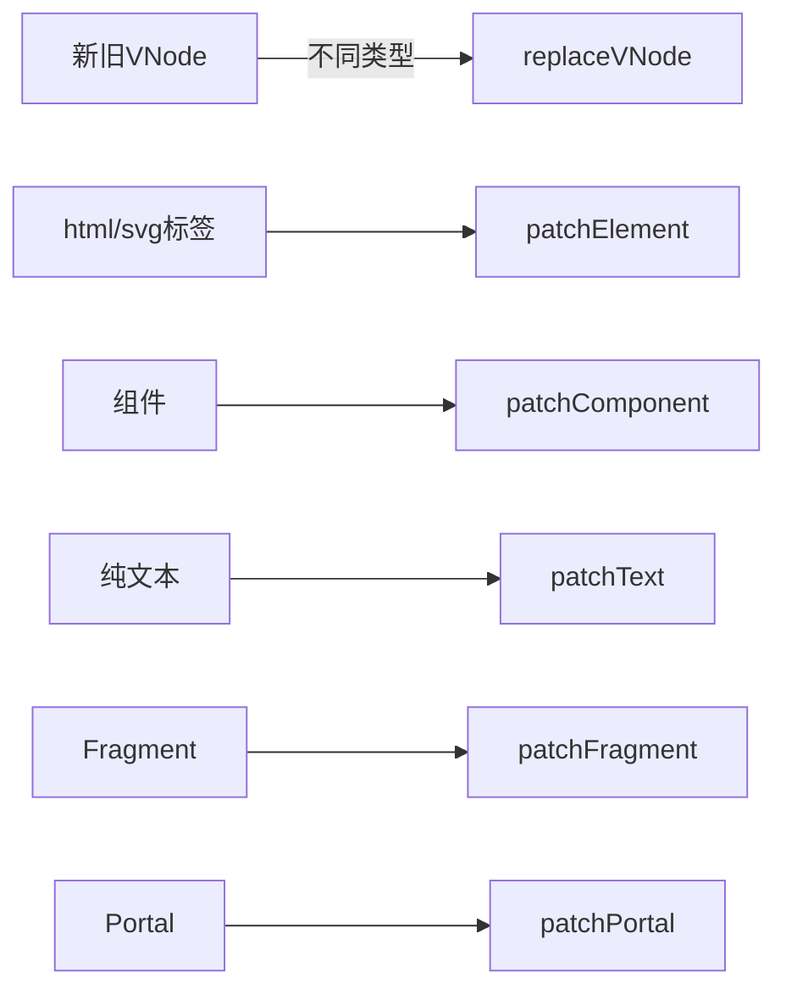


```js
function patch(prevVNode, nextVNode, container) {
    const nextFlags = nextVNode.flags;
    const prevFlags = prevVNode.flags;
    if (prevFlags !== nextFlags) {
        replaceVNode(prevVNode, nextVNode, container);
    } else if (nextFlags & VNodeFlags.ELEMENT) {
        patchElement(prevVNode, nextVNode, container);
    }
    ...
}

// 简易版repalce
function replaceVNode(prevVNode, nextVNode, container) {
    // 将旧vnode渲染的dom移除
    container.removeChild(prevVNode.el);
    // 挂载新的
    mount(nextVNode, container);
}
```


#### 更新标签元素
$$
标签元素
\begin{cases}
不同tag： repalce \\
相同tag
\begin{cases}
VNodeData: patchData \\
children: patchChildren
\end{cases}
\end{cases}
$$


##### patchData

* 遍历VNodeData;
* 根据新key，读取新旧值；
* 不同更新操作；


```js
export function patchData(el, key, prevValue, nextValue) {
    switch(key) {
        case 'style':
            for (let k in nextValue) {
                el.style[k] = nextValue[k];
            }
            for (let k in prevValue) {
                if (!nextValue.hasOwnProperty(k)) {
                    el.style[k] = '';
                }
            }
            break;
        case 'class':
            el.className = nextValue;
            break;
        default:
            if (key[0] === 'o' && key[1] === 'n') {
                // 事件
                el.addEventListener(key.slice(2), nextValue);
            } else if (domPropsRE.test(key)) {
                el[key] = nextValue;
            } else {
                el.setAttribute(key, nextValue);
            }
            break;
    }
}
```

##### patchChildren
3*3 = 9 种情况


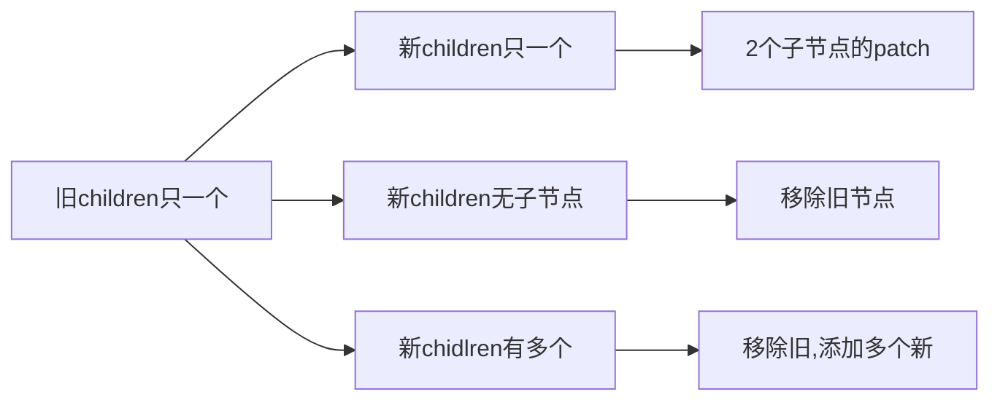
-----------------------------------
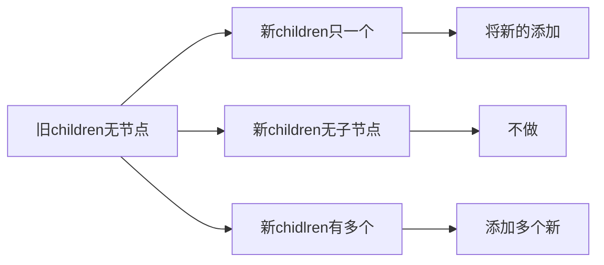

----------------------------


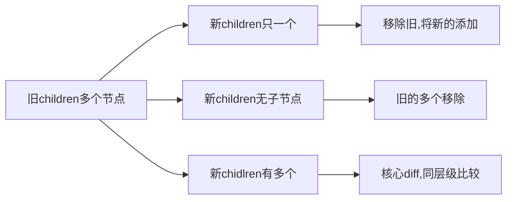


```js
function patchChildren(
    prevChildFlags,
    nextChildFlags,
    prevChildren,
    nextChildren,
    container
) {
    switch(prevChildFlags) {
        // 旧是单个
        case ChildrenFlags.SINGLE_VNODE:
            switch(nextChildFlags) {
                case ChildrenFlags.SINGLE_VNODE:
                    patch(prevChildren, nextChildren, container);
                    break;
                case ChildrenFlag.NO_CHILDREN:
                    container.removeChild(prevChildren.el);
                    break;
                default:
                    // 移除旧的单个节点
                    container.removeChild(prevChildren.el);
                    // 遍历多个节点，逐个挂载
                    for (let i = 0; i < nextChildren.length; i++) {
                        mount(netChildren[i], container);
                    }
                    break;
            }
            break;
        // 旧无节点
        case ChildrenFlags.NO_CHILDREN:
            switch(nextChildFlags) {
                case ChildrenFlags.SINGLE_VNODE:
                    // 新是单个
                    mount(nextChildren, container);
                    break;
                case ChildrenFlags.NO_CHILDREN:
                    // 什么都不做
                    break;
                default:
                    // 新的多个
                    for (let i = 0; i < nextChildren.length; i++) {
                        mount(nextChildren[i], container);
                    }
                    break;
            }
            break;
        default:
            switch(nextChildFlags) {
                case ChildrenFlags.SINGLE_VNODE:
                    for (let i = 0; i < prevChildren.length; i++) {
                        container.removeChild(prevChildren[i].el);
                    }
                    mount(nextChildren, container);
                    break;
                case ChildrenFlags.NO_CHILDREN:
                    for (let i = 0; i < prevChildren.length; i++) {
                        container.removeChild(prevChildren[i].el);
                    }
                    break;
                default:
                    // 核心diff算法
                    ...
                    break;
            }
            break;
    }
}
```


#### 更新文本节点
文本的内容不一致才更新

```js
function patchText(prevVNode, nextVNode) {
    // el指向
    const el = (nextVNode.el = prevVNode.el);
    if (nextVNode.children !== prevVNode.children) {
        el.nodeValue = nextVNode.children;
    }
}
```


#### 更新Fragment
* patchChildren
* 子节点不同，el指向不同

```js
function patchFragment(prevVNode, nextVNode, container) {
    patchChildren(
        prevVNode.childFlags,
        nextVNode.childFlags,
        prevVNode.children,
        nextVNode.children,
        contaienr
    );
    switch(nextVNode.childFlags) {
        case ChildrenFlags.SINGLE_VNODE:
            nextVNode.el = nextVNode.children.el;
            break;
        case ChildrenFlags.NO_CHILDREN:
            nextVNode.el = prevVNode.el;
            break;
        default:
            nextVNode.el = nextVNode.children[0].el;
            break;
    }
}
```


#### 更新Portal

* patchChildren；
* 挂载目标改变，更新后子节点在旧容器，旧容器内元素搬到新容器中；


```js
function patchPortal(prevVNode, nextVNode) {
    patchChildren(
        prevVNode.childFlags,
        nextVNode.childFlags,
        prevVNode.chidlren,
        nextVNode.children,
        prevVNode.tag  // container是旧的
    );
    // el属性始终是个占位的文本节点
    nextVNode.el = prevVNode.el;
    // 新旧容器不同才搬运
    if (nextVNode.tag !== prevVNode.tag) {
        // 获取新容器元素
        const container = typeof nextVNode.tag === 'string' 
            ? document.querySelector(nextVNode.tag)
            : nextVNode.tag;
        switch(nextVNode.childFlags) {
            case ChildrenFlags.SINGLE_VNODE:
                // 新portal是单个
                container.appendChild(nextVNode.children.el);
                break;
            case ChildrenFlags.NO_CHILDREN:
                break;
            default:
                // 新的多个节点，逐个搬运
                for (let i = 0; i < nextVNode.children.length; i++) {
                    container.appendChild(nextVNode.children[i].el);
                }
                break;
        }

    }
}
```


#### 更新有状态组件
* 主动更新：自身状态变化；
* 被动更新：外部状态变化；

重写mountStatefulComponent


```js
function mountStatefulComponent(vnode, container, isSVG) {
    // 创建组件
    const instance = new vnode.tag();
    instance._update = function() {
        // 渲染
        instance.$vnode = instance.render();
        // 挂载
        mount(instance.$vnode, container, isSVG);
        // el 引用根dom
        instance.$el = vnode.el = instance.$vnode.el;
        // 调用钩子
        instance.mounted && instance.mounted();
    }
    instance._update();
}

```
第二次更新应该为patch：新老vnode对比：

```js

function mountStatefulComponent(vnode, container, isSVG) {
    // 创建组件
    const instance = (vnode.children = new vnode.tag());
    instance._update = function() {
        // 已挂载，应更新
        if (instance._mounted) {
            // 旧vnode
            const prevVNode = instance.$vnode;
            const nextVNode = (instance.$vnode = instance.render());
            // patch
            patch(prevVNode, nextVNode, prevVNode.el, parentNode);
            // 更新el
            instance.$el = vnode.el = instance.$vnode.el;
        } else {

            // 渲染
            instance.$vnode = instance.render();
            // 挂载
            mount(instance.$vnode, container, isSVG);
            instance._mounted = true;
            // el 引用根dom
            instance.$el = vnode.el = instance.$vnode.el;
            // 调用钩子
            instance.mounted && instance.mounted();
        }
    }
    instance._update();
}
```

```js
function patchComponent(prevVNode, nextVNode, container) {
    // tag值是组件类
    if (nextVNode.tag !== prevVNode.tag) {
        replaceVNode(prevVNode, nextVNode, container);
    } else if (nextVNode.flags & VNodeFlags.COMPONENT_STATEFUL_NORMAL) {
        // 获取组件实例
        const instance = (nextVNode.children = prevVNode.children);
        // 更新props
        instance.$props = nextVNode.data;
        // 更新
        instance._update();
    } else {
        // 更新函数式组件
        const handle = (nextVNode.handle = prevVNode.handle);
        // 更新handle对象
        handle.prev = prevVNode;
        handle.next = nextVNode;
        handle.container = container;
        // 调用update
        handle.update();
    }
}
```

handle对象改变：

```mermaid
graph LR
    subgraph before
        a["`handle = {
                prev: null,
                next: prevVNode,
                container,
                update() {}
        }`"]
    end
    subgraph after
        b["`handle = {
            prev: prevVNode,
            next: nextVNode,
            container,
            update() {}
        }`"]
    end
    before --> after
    style a text-align: left
    style b text-align: left
```
