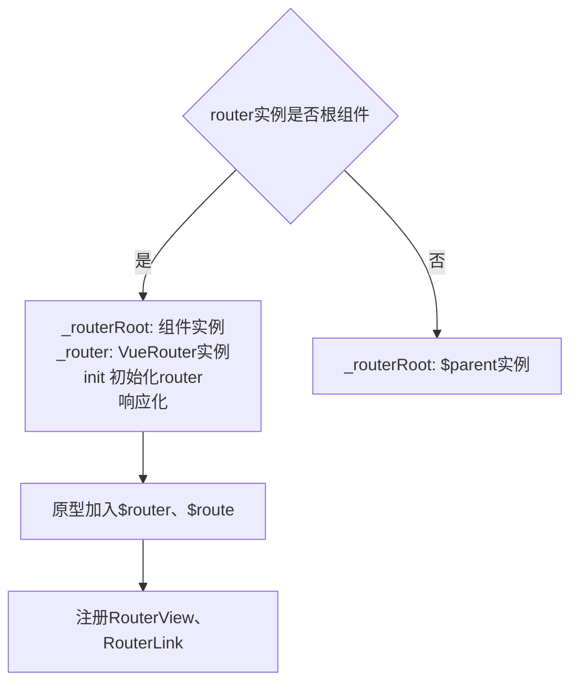
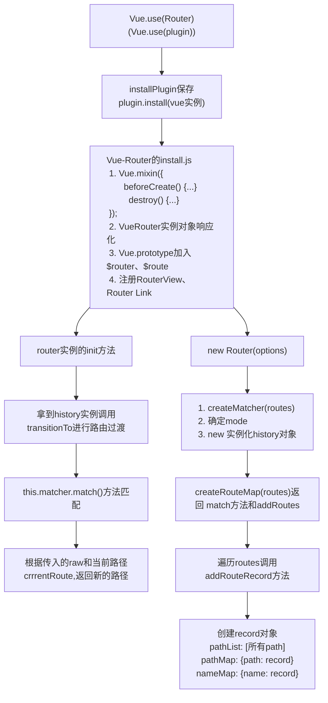

# spa路由系统

## hash路由
利用url的hash，hash值改变不会引起页面刷新，当url的hash改变，触发hashchange回调函数。
```js
// 伪代码
class Router {
  construtor() {
    this.routers = {};
    this.currentUrl = '';
  }
  route(path, callback) {
    this.routes[path] = callback || function () {};
  }
  updateView() {
    this.currentUrl = location.hash.slice(1) || '/';
    this.routes[this.currentUrl] && this.routes[this.currentUrl](); 

  }

  init() {
    window.addEventListener('load', this.updateView.bind(this), false);
    window.addEventListener('hashchange', this.updateView.bind(this), false);
  }
}
// 调用
const router = new Router();
router.init();
router.route('/id', () => {});
```

## History路由
罗列出所有可触发history改变的情况，并且将这些方式一一拦截，监听history变化。
url改变：
* 点击a标签
* history.push(replace)State函数

```js
class Router {
  constructor() {
    this.routes = {};
    this.currentUrl = '';
  }
  route(path, callback) {
    ...
  }
  updateView(url) {
    this.currentUrl = url;
    this.routes[url] && this.routes[url]();
  }

  bindLink() {
    const allLink = document.querySelectorAll('a[data-href]');
    for (let i = 0; i < allLink.length; i++) {
      const current = allLink[i];
      current.addEventListener('click', e => {
        e.preventDefault();
        const url = current.getAttriute('data-href');
        history.pushState({}, null, url);
        this.updateView(url);
      }, false);
    }
  }

  init() {
    this.bindLink();
    window.addEventListener('popstate', (e) => {
      this.updateView(window.location.pathname);
    }, false);
    window.addEventListener('load', () => {
      this.updateView('/');
    }, false);
  }
}
```


## vue-router解析

$$
vue-router
\begin{cases}
1、 Vue.use(Router) 注册插件 \\
2、 new Router(options) \\
3、 new Vue({router, ...})   挂载
\end{cases}
$$


### 1. Vue.use(Router)
部分源码：
```js
// 注册插件：执行插件的install方法，第一参数vue实例
export function initUse(Vue: GlobalAPI) {
    Vue.use = function(plugin: Funcion(Object)) {
        const installedPlugins = (this._installedPlugins || (this._installedPlugins = []));
        // 不重复复注册
        if (installedPlugins.indexOf(plugin) > -1) {
            return this;
        }
        // 获取第一个参数plugins以外参数
        const args = toArray(arguments, 1);
        // 将Vue实例添加到参数开头
        args.unshift(this);
        // 执行plugin的install方法，每个install方法第一个参数是vue实例
        if (typeof plugin.install === 'function') {
            plugin.install.apply(plugin, args);
        } else if (typeof plugin === "function") {
            plugin.apply(null, args);
        }
        // 保存在installedPlugins
        installedPlugins.push(plugin);
        return this;
    }
}
```
install.js 部分源码：
```js
// 保存Vue局部变量
export let _Vue;
export function install(Vue) {
    // 如果已安装
    if (install.installed && _Vue === Vue) {
        return;
    }
    install.installed = true;
    // 局部变量保存传入的Vue
    _Vue = Vue;
    const isDef = v => v !== undefined;
    const registerInstance = (vm, callVal) => {
        let i = vm.$options._parentVode;
        if (isDef(i) && isDef(i.data) && isDef(i = registerRouteInstance)) {
            i(vm.callVal);
        }
    }
    // 全局混入钩子函数
    Vue.mixin({
        beforeCreate() {
            if (isDef(this.$options.router)) {
                // new Vue时传入的根组件router
                // 根router
                this._routerRoot = this;
                this._router = this.$options.router;
                this._router.init(this);
                // 变响应式
                Vue.util.defineReactive(this, '_route', this._router.history.current);
            } else {
                // 非根组件访问根组件通过parent
                this._routerRoot = (this.$parent && this.$parent._routerRoot) || this;
            }
            reginsterInstance(this, this);
        },
        destroyed() {
            reginsterInstance(this);
        }
    });

    // 原型加入$router 和 $route
    Object.defineProperty(Vue.prototype, '$router', {
        get() {
            return this._routerRoot._router;
        }
    });
    Object.defineProperty(Vue.prototype, '$route', {
        get() {
            return this._routeRoot._route;
        }
    });
    // 全局注册
    Vue.component('RouterView', View);
    Vue.component('RouerLink', Link);
    // 获取合并策略
    const strats = Vue.config.optionMergeStrategies;
    ...
}
```
思路：使用mixin将每个组件都混入beforeCreate、destroyed两个生命周期。





### 2. new Router(options)
部分源码：
1. 确定当前路由使用的mode
2. 实例化对应的history

```js
constructor(options: RouterOptions = {}) {
    this.app = null;
    this.apps = [];
    this.options = options;
    this.beforeHooks = [];
    ...
    this.matcher = createMatcher(options.routes || [], this);
    // 一般分3种模式hash和history、抽象模式
    let mode = options.mode || 'hash';
    // 判断当前配置是否能用history模式
    this.fallback = mode === 'history' && !suportsPushState && options.fallback !== false;
    // 降级处理，退回hash
    if (this.fallback) {
        mode = 'hash';
    }
    if (!inBrowser) {
        mode = 'abstract';
    }
    this.mode = mode;
    // 根据模式实例化不同history
    switch(mode) {
        case 'history':
            this.history = new HTML5History(this, options.base);
            break;
        case 'hash':
            this.history = new HashHistory(this, options.base, this.fallback);
            break;
        case 'abstract':
            this.history = new AbstractHistory(this, options.base);
            break;
        default:
            if (process.env.NODE_ENV !== 'production') {
                assert(false, `invalidmode：${mode}`);
            }
    }
}
```


```js
init(app: any) {
    ...
    this.apps.push(app);
    if (this.app) {
        return;
    }
    this.app = app;
    const history = this.history;
    // 调用transitionTo进行路由过滤
    if (history instanceof HTML5History) {
        history.transitionTo(history.getCurrentLocation());
    } else if (history instanceof HashHistory) {
        const setupHashListener = () => {
            history.setupListener();
        }
        history.transitionTo(history.getCurrentLocation(), 
        setupHashListener,
        setupHashListener);
    }
}
// this.history去调用transitionTo进行路由过滤，
// 这个函数调用了this.matcher.match去匹配
```


$$
Matcher
\begin{cases}
createRouteMap: 生成pathMap、nameMap、pathList \\
addRoutes: 生成动态路由 \\
match: 传入的raw和currentRoute, 返回新路径
\end{cases}
$$

```js
export function createMatcher(
    routes: Array<RoueConfig>
    router: VueRouter
)： Matcher {
    // 创建映射表
    const {pathList, pathMap, nameMap} = createRouteMap(routes);
    // 动态路由
    function addRoutes(routes) {
        ...
    }
    // 计算新路径
    function match(
        raw: RawLocation,
        currentRoute?: Route,
        redirectedFrom?: Location
    ): Route {
        ...

    }
    return {
            match,
            addRoutes
    };
}


function createRouteMap(
    routes: Array<RouteConfig>,
    oldPathList?: Array<string>,
    oldPathMap?: Dictionary<RouteRecord>,
    oldNameMap?: Dictionary<RouteRecord>
): {
    pathList: Array<string>,
    pathMap: Dictionary<RouteRecord>,
    nameMap: Dictionary<RouteRecord>
} {
    // 记录所有path
    const pathList: Array<string> = oldPathList || [];
    // 记录path-Record map
    const pathMap: Dictionary<RouteRecord> = oldPathMap || object.create(null);
    const nameMap: Dictionary<RouteRecord> = oldNameMap || object.create(null);
    // 遍历route生成映射表
    routes.forEach(route => {
        addRoueRecord(pathList, pathMap, nameMap, route);
    });
    // 调整优先级
    for (let i = 0, l = pathList.length; i < l; i++) {
        if (pathList[i] === "*") {
            pathList.push(pathList.splice(i, 1)[0]);
            l--;
            i--;
        }
    }
    return {
        pathList,
        pathMap,
        nameMap
    }
}


```

**addRouteRecord**部分源码：

```js
// 解析路径
const pathToRegexpOptions : PathToRegexpOptions = route.pathToRegexpOptions || {};
// 拼接路径
const normalizePath = normalizePath(path, parent, pathToRegexpOptions.strict);
// 记录路由信息的关键对象
// 依此建映射表
const record: RouteRecord = {
    path: normalizePath,
    regex: compileRouteRegex(normalizedPath, pathToRegexpOptions),
    // routes对应组件
    components: route.components || {default: route.component},
    // 组件实例
    instances: {},
    name,
    parent,
    matchAs,
    redirect: route.redirect,
    beforeEnter: route.beforeEnter,
    meta: route.meta || {},
    props: route.props == null ? 
        {} : route.components ? 
            route.props 
        : {default: route.props}
}

// 再将record path保存进pathList、nameMap
if (!pathMap[record.path]) {
    pathList.psuh(record.path);
    pathMap[record.path] = record;
}
```





