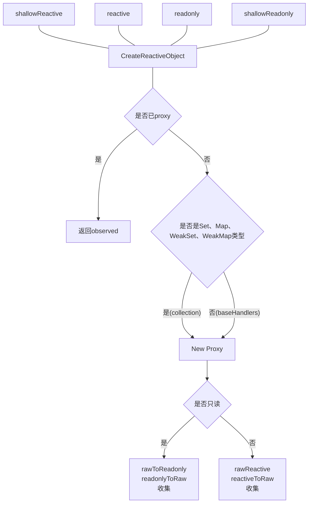
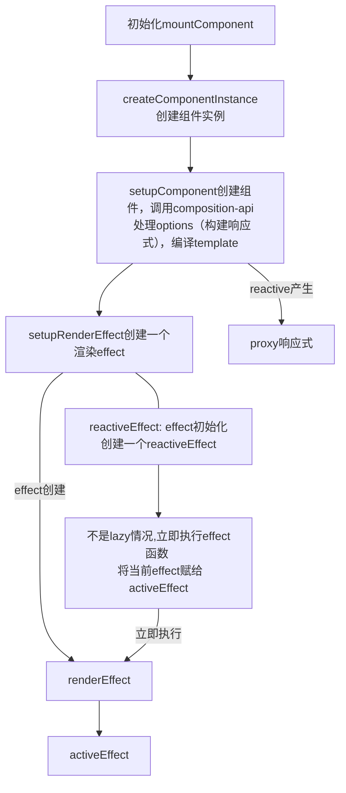
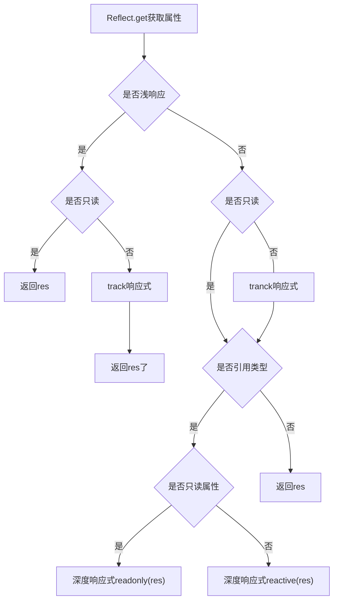
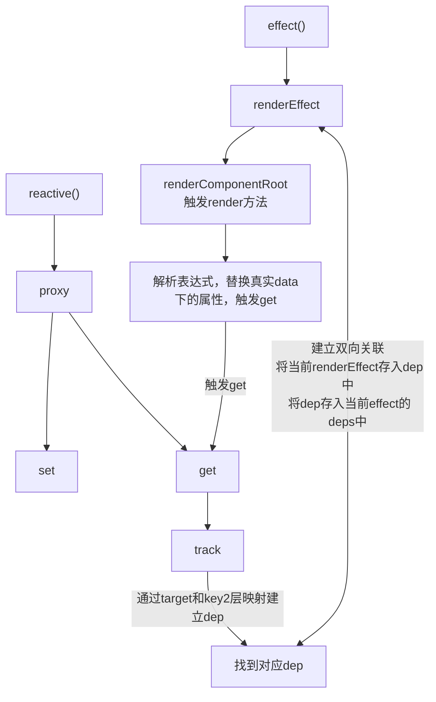
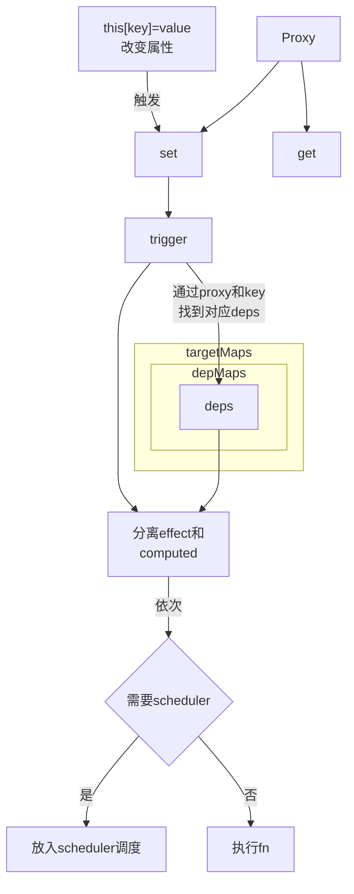
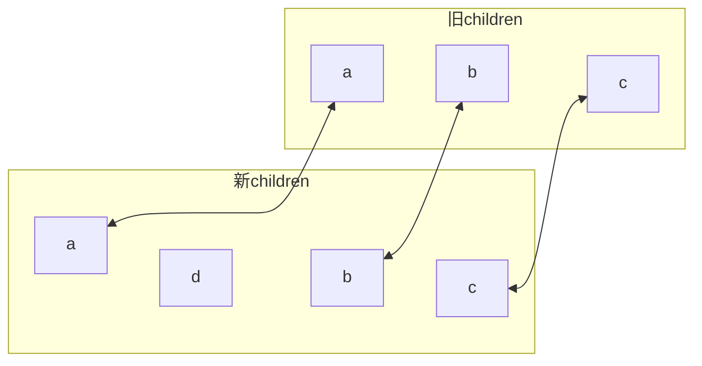

# Vue3.0

* 更好的性能：
* Tree-shaking支持；
* 组合API
* Fragment/Teleport/Susponse
* 更好的ts支持
* 暴露了自定义渲染API

## 1. 特性
### 更好的性能
compiler优化细节：
#### 1. 靶向更新

$$
靶向更新
\begin{cases}
BlockTree \\
PatchFlags
\end{cases}
$$

思路：跳过静态内容，只对比动态内容。

```vue
<div>
    <span />
    <span>{{msg}}</span>
</div>
```
编译成：
```js
import {createVNode as_createVNode, toDisplayString as _toDisplayString, openBlock as _openBlock, createBlock as _createBlock} from "vue";

export function render(_ctx, _code) {
    return (_openBlock(), _createBlock("div", null, [
        _createVNode("span", null, "static"),
        _createVNode("span", null, _toDisplayString(_ctx.msg), 1 /* Text */)
    ]));

}
```
在运行时会生成number（>0）的PatchFlag, 用作标记。
仅带PatchFlag标记节点被追踪，动态节点直接与Block根节点绑定。无需再遍历静态节点。

```js
9 /* Text, Props */ 既有Text变化，又有props变化
```

##### Block 
VNode, 带有dynamicChildren，避免传统diff(一层一层遍历)，更新准确知道该节点应用哪些更新动作（靶向更新）。

1. v-if的元素是作为Block
Block（DIV）
    --Block(Section v-if)
    --Block(Section v-else)


```js
const block = {
    tag: 'div',
    dynamicChildren: [
        {   tag: 'section', {key: 0},
            dynamicChildren: [...]
        },
        {
            tag: 'section', {key: 1},
            dynamicChildren: [...]
        }   
    ]
}
```
BlockTree => Dom结构不稳定；

2. v-for的元素作为Block
使用一个Fragment充当Block角色。但是仍面临不稳定，回退到传统diff。当v-for的表达式是常量，Fragment是稳定的。

#### 2. 提升静态节点
举个栗子

```vue
<div>
    <p>text</p>
</div>
```
```js
const hoist1 = createVNode('p', null, 'text');
function render() {
    return (openBlock(), createBlock('div', null, [hoist1]));
}
```


#### 3. 预字符串化
静态节点序列化为字符串并生成一个static类型的VNode。

```js
const hoistStatic = createStaticVNode('<p></p><p>...</p>');

render() {
    return(openBlock(), createBlock('div', null, [
        hoistStatic
    ]));
}
```
优点：
* 生成代码体积减少；
* 减少创建VNode开销；
* 减少内存占用；


#### 4. 事件监听缓存：cacheHandlers

```vue
<div>
    <span @click="onClick">
        {{msg}}
    </span>
</div>
```
开启cacheHandlers后:

```js
export function render(_ctx, _cache) {
    return (_openBlock(), _creaateBlock("div", null, [
        _createVNode("span", {
            onClick: _cache[1] || (_cache[1] = $event => (_ctx.onClick($event)))
        }, _toDisplayString(_ctx.msg), 1 /* Text */);
    ]));
}
```
自动生成并缓存一个内联函数，变为静态属性。


### PatchFlag
定义：

```js
export const enum PatchFlags {
    TEXT = 1, // 动态textContent
    CLASS = 1 << 1, // 动态class元素
    STYLE = 1<<2, // 动态样式
    PROPS = 1 << 3, // 动态非类
    FULL_PROS = 1<< 4, 
    HYDRATE_EVENTS = 1 << 5, // 带事件监听
    ...
}
```

### Fragment
render可返回数组了
 

### Teleport
类似之前的`<portal>`


### Composition API

$$
API
\begin{cases}
reactive \\
watchEffect \\
computed \\
ref\\
toRefs\\
hooks
\end{cases}
$$

举个栗子：
```js
import {reactive, computed} from 'vue';
export default {
    setup() {
        const state = reactive({
            a: 0
        });
        function increate() {
            state: a++
        }

        return {
            state,
            increate
        }
    }
}

//...
const double = computed(() => state.a + 3);
```

### 生命周期钩子对比


| vue2.x | vue3.x |
| -------|--------|
|beforeCreate|setup|
|created|setup|
|beforeMount|onBeforeMount|
|mounted|onMounted|
|beforeUpdate|onBeforeUpdate|
|updated|onUpdated|
|beforeDestory|onBeforeUnmount|
|destroyed|onUnmounted|
|errCaptured|onErrorCaptured|


## 2. 响应式原理

### reactive
Proxy：
1. 对属性的添加、删除动作的监听；
2. 对数组基于下标的修改，length修改的检测；
3. 对Map、Set、WeakMap、WeakSet支持；

建立响应式reactive:

$$
reactive 
\begin{cases}
reactive, 返回proxy对象，有递归 \\
shalllowReactive, 只一层响应 \\
readonly: 不可修改 \\
shallowReadonly
\end{cases}
$$

部分源码：
```js
export function reactive(target: object) {
    if (readonlyToRaw.has(target)) {
        return target;
    }
    return createReactiveObject({
        target,
        rawToReactive,
        reactiveToRaw,
        mutableHandlers, // 处理基于类型和引用类型，
        mutableCollectionHandlers // 处理set、map等类型
    });
}

```

```js
const collectionTypes = new Set<Function>([Set, Map, WeakMap, WeakSet]);

function createReactiveObject() {
    target: unknow,
    toProxy: WeakMap<any, any>,
    toRaw: WeakMap<any, any>,
    baseHandlers: ProxyHandler<any>,
    collectionLHandlers: ProxyHander<any>
} {
    // 目标对象是否被effect
    let observed = toProxy.get(target);
    if (observed !== void 0) {
        return observed;
    }
    if (toRaw.has(target)) {
        return target;
    }
    const handlers = collectionTypes.has(target.constructor) ? collectionHanders: baseHanders;
    // 创建响应式对象
    observed = new Proxy(target, handlers);
    toProxy.set(target, observed);
    toRaw.set(observed, target);
    return observed;
}
```



### effect
watcher(2.0) => effect(3.0)

```js
const mountComponent: MountComponentFn = (
    initialVNode,
    container,
    anchor,
    parentComponent,
    parentSuspense,
    isSVG,
    optimized
) => {
    const instance: ComponentIntervalInstance = (initialVNode.component = createComponentInstance(
        initialVNode,
        parentComponent,
        parentSuspense
    ));
    // 建立proxy
    setupComponent(instance);
    // 建立渲染effect，执行effect
    setupRenderEffect(
        instance, // 组件实例
        initialVNode,
        container,
        achor,
        parentSuspense,
        isSVG,
        optimized
    );
}
```

1. 创建component实例；
2. 初始化组件，建立proxy， 得到render函数；
3. 建立一个effect，执行effect；

```js
// 构建渲染effect
const setupRenderEffect: setupRenderEffectFn = (
    instance,
    initialVNode,
    container,
    achor,
    parentSuspense,
    isSVG,
    optimized
) => {
    instance.update = effect(function componentEffect() {
        // ...
    }, {scheduler, queueJob});
}
```
创建一个effect，赋给组件实例的update，作为渲染更新视图用。

```js
export function effect<T = ant>(
    fn: v => T,
    options: ReactiveEffectOptions = EMPTY_OBJ
): ReactiveEffect<T> {
    const effect = createReactiveEffect(fn, options);
    if (!options.lazy) {
        effect();
    }
    return effect;
}

function createReativeEffect<T = any>(
    fn: (...args: any[]) => T,
    options: ReativeEffectOptions
): ReactiveEffect<T> {
    const effect = function reativeEffect(...args: unknow[]): unkonw {
        try {
            enableTracking();
            effectStack.push(effect);
            activeEffect = effect;
            return fn(...args);
        } finally {
            effectStack.pop();
            resetTracking();
            // 将activeEffect还原
            activeEffect = effectStack[effectStack.length - 1];
        } as ReactiveEffect
        // 初始化参数
        effect.id = uid++;
        effect._isEffect = true;
        effect.active = true;
        effect.raw = fn;
        effect.deps = []; // 收集相关依赖
        effect.options = options;
        return effect;
    }
}
```
组件初始化阶段



vue2.0, 响应式在初始化就深层递归处理；  
vue3.0, 获取上一级get之后才触发下一级的深度响应；

### track
track, 找到与当前proxy和key对应的dep，dep与当前activeEffect建立里联系，收集依赖。

依赖收集器：
* targetMap：proxy：depsMapproxy，存放依赖dep的map映射；
* depsMap: deps存放effect的set数据类型

<font color="red">依赖收集，get做了什么？</font>




**依赖收集阶段**




1. 执行renderEffect，赋值给activeEffect，调用renderComponentRoot，触发render函数；
2. 根据render函数，解析经过compile，语法树处理后模板表达式，访问真实data属性，触发get；
3. get方法首先经过之前不同reactive，通过track方法进行依赖收集；
4. track方法通过当前proxy对象target、key找对应的dep；
5. 将dep与当前reactiveEffect建立起联系，将activeEffect压入dep数组中，dep中已含有当前组件的渲染effect，触发set，能在数组中找到对应effect，依次执行。


#### set触发更新流程



```js
export function trigger(
    target: object,
    type: TrrigerOpTypes,
    key?:unknow,
    newValue?:unknow,
    oldValue?: unknow,
    oldTarget ?: Map<unknow, unknow> | Set<unkoow>
) {
    const depsMap = targetMap.get(target);
    // 没有经过依赖收集的，直接返回
    if (!depsMap) {
        return;
    }
    // 钩子队列
    const effects = new Set<ReactiveEffect>(); 
    // 计算属性队列
    const computedRunners = new Set<ReactiveEffect>();
    const add = (effectsToAdd: Set<ReactiveEffect> | undefined) => {
        if (effectsToAdd) {
            effectsToAdd.forEach(effect=> {
                if (effect !== activeEffect || !shouldTrack) {
                    if (effect.options.computed) {
                        computedRunners.add(effect);
                    } else {
                        effects.add(effect);
                    }
                }
            });
        }
    }
    add(depsMap.get(key));
    const run = (effect: ReactiveEffect) => {
        if (effect.options.scheduler) {
            effect.options.scheduler(effect);
        } else {
            effect();
        }
    }
    // 必须首先运行计算属性更新
    computedRunners.forEach(run); // 依次执行回调
    effects.forEach(run);

}
```


## 3. Diff
借鉴了ivi和interno. 

### interno采用的核心Diff算法以及原理

相同的前缀和后缀

例子：


j: 新旧children中第一个节点索引；
prevEnd: 旧children最后一个节点索引；
nextEnd: 新children最后一个节点索引；

1. j > prevEnd, 并且j <= nextEnd   
旧已全更新，新的仍有剩余。 
2. j > nextEnd, 并且j <= prevEnd, 旧children中j到prevEnd
间节点应该删除。 

伪代码：

```js

let j = 0; // 指向新旧children中第一个节点
let prevVNode = prevChildren[j];
let nextVNode = nextChildren[j];
// 循环直到遇到不同key节点
outer: {
    // 更新相同后缀节点
    let prevEnd = prevChildren.length - 1;
    let nextEnd = nextChildren.length - 1;
    prevVNode = prevChildren[prevEnd];
    nextVNode = nextChildren[nextEnd];
    while(prevVNode.key === nextVNode.key) {
        patch(prevVNode, nextVNode, container);
        j++;
        if (j > prevEnd || j > nextEnd) {
            break outer;
        }
        prevVNode = prevChildren[j];
        nextVNode = nextChildren[j];
    }
    while (prevVNode.key === nextVNode.key) {
        patch(prevVNode, nextVNode, container);
        prevEnd--;
        nextEnd--;
        if (j > prevEnd || j > nextEnd) {
            break outer;
        }
        prevVNode = prevChildren[prevEnd];
        nextVNode = nextChildren[nextEnd];
    }
}
// 满足条件， j -> nextEnd之间应插入
if (j > prevVNode && j <= nextEnd) {
    // 所有新节点插入到位于nextPos节点前面
    const nextPos = nextEnd + 1;
    const refNode = nextPos < nextChildren.length ? nextChildren[nextPos].el : null;
    // 挂载
    while (j <= nextEnd) {
        mount(nextChildren[j++], container, false, refNode);
    }
} else if (j > nextEnd) {
    // j-> prevEnd之间节点移除
    while(j <= prevEnd) {
        container.removeChild(prevChildren[j++].el);
    }
} else {
    const nextLeft = nextEnd - j + 1; // 新中未被处理
    const source = [];
    for (let i = 0; i < nextLeft; i++) {
        source.push(-1);
    }
    ...
}
```


判断是否需要进行dom移动。
例如：

```js
     0    1   2    3    4   5
          ↓             ↓
旧   a    b   c    d    f   e
     |                      |
新   a    c   d    b    g   e
          ↑            ↑


indexMap = {c: 1, d: 2, b: 3, g: 4}
source =   [2     3     2     -1]
```

source: 未被patch的节点在旧children中的位置，-1代表该节点不存在旧的中。 
确定source一般用2层循环，引用indexMap降低时间复杂度。  
indexMap的key: 节点的key  
值： 在新children中的索引 
=> 快读定位新children中具有相同key的节点位置

用k 遍历新children中遇到的节点索引；
pos： 存遇到索引最大值；
moved: 后来遇到索引更小，即 k < pos , 需移动。

伪代码：

```js
const prevStart = j;
const nextStart = j;
let moved = false;
let pos = 0;
// 构建索引表
const keyIndex = {};
let patched = 0; // 更新过数据
for (let i = nextStart; i <= nextEnd; i++) {
    keyIndex[nextChildren[i].key] = i;
}

// 遍历旧children中剩余未处理节点
for (let i = prevStart; i <= prevEnd; i++) {
    prevVNode = prevChildren[i];
    // 通过索引表快速找到相同key的节点位置
    if (patched < nextLeft) {
        const k = keyIndex[prevVNode.key];
        if (k !== 'undefined') {
            nextVNode = nextChildren[k];
            patch(prevVNode, nextVNode, container);
            patched++;
            // 更新source数组
            source[k-nextStart] = i;
            // 是否需要移动
            if (k < pos) {
                moved = true;
            } else {
                pos = k;
            }
        } else {
            // 没找到
            container.removeChild(prevVNode.el);
        }
    } else {
        // 多余节点，应移除
        container.removeChild(prevVNode.el);
    }
}

// b有了， patched： 1
// c有了，patched: 2
// d 有了， patched: 3
// f 找不到remove
```

#### 怎么移动？

source => 最长递增子序列，用于DOM移动。  

最长递增子序列：[0, 8, 4, 12]
即[0, 8, 12] or [0, 4, 12]

例子：
```js
                                 ↓ i
                0     1    2     3    
                __________________
新children   a  |c    d    b    g | e
                ——————————————————
source         [ 2    3    1    -1]
lis            [0     1]
                      ↑j

```

剩余节点重新编号 0-3.  
[0 1]： 新chidlren剩余未处理节点， 0和1节点先后关系与旧children中相同， 即c和d不用移动。  

* i： 新children未处理节点最后一个节点位置
* j：最长递增子序列数组最后一个位置，i 与 Lis[j] 是否相等
    * 不同移动
    * 相同，不移动，j指向下一位置
* source[-1]: 挂载节点

```js
                          ↓ i
                0     1    2     3    
                __________________
新children   a  |c    d    b    g | e
                ——————————————————
source         [ 2    3    1    -1]
lis            [0     1]
                      ↑j

```
b的i = 2 => 2 !== Lis[j], 移动。  
找到b节点后一个节点g，将其插入到g前面。

```js
                    ↓ i
                0     1    2     3    
                __________________
新children   a  |c    d    b    g | e
                ——————————————————
source         [ 2    3    1    -1]
lis            [0     1]
                      ↑j

```
i = Lis[j], 不用移动，j--,以此类推。 

伪代码

```js
if (moved) {
    const seq = lis(source);
    // j指向最长递增子序列最后一个位置
    let j = seq.length - 1;
    // 从后向前遍历 新children中剩余节点
    for (let i = nextLeft -1; i >=0; i--) {
        if (source[i] === -1) {
            // 全新节点
            const pos = i + nextStart;
            const nextVNode = nextChildren[pos];
            // 该节点下一个节点位置索引
            const nextPos = pos + 1;
            mount(nextVNode, container, false, nextPos < nextChildren.length ? nextChildren[nextPos].el: null);
        } else if (i !== seq[j]) {
            // 移动
            // 该节点在新children中真实索引
            const pos = i + nextStart;
            const nextVNode = nextChildren[pos];
            // 该节点下一个节点位置索引
            const nextPos = pos + 1;
            container.insertBefore(nextVNode.el, 
            nextPos < nextChildren.length 
            ? nextChildren[nextPos].el: null);
        } else {
            // 位置节点不用移动, j指向下一个
            j--;
        }
    }
}

```

#### 最长递增子序列
例如：[0, 8, 4, 12, 2, 10]
取出最后一个数，单独作为一个序列[10]
[10]的递增子序列为其本身

```
 0  8   4 12 2 10
 _________________
|1 |1 |1 |1 |1 |1 |
 ——————————————————
```
每个数字分配一个格子，填充1. 
格子：所对应数字为开头的递增子序列的最大长度。 
[2, 10] 可看做[2] + [10], 长度为 1+ 1 =2.

```
 0  8   4 12 2 10
 _________________
|1 |1 |1 |1 |2 |1 |
 ——————————————————
```

[12, 2, 10]： 不变。
[4, 12, 2, 10]：
```
 0  8   4 12 2 10
 _________________
|1 |1 |2 |1 |2 |1 |
 ——————————————————
```

1. 拿格子对应数字a 与其后面所有格子对应数字b比较， a < b 时候，用数字b对应格子中的值加1，填到a对应格子。
2. 只当计算出的值 > a 所对应格子中的值，才更新。


```
 0  8   4 12 2 10
 _________________
|3 |2 |2 |1 |2 |1 |
 ——————————————————
```
格子中最大值 = 递增子序列最大长度  = 3；且以0开头。  
找到格子中对应2的值： 8， 4， 2  
如找到4： [0, 4]  
找到格子中对应1的值： 12， 10
[0, 4, 12] ,答案并非一个。 

最长递增子序列的长度：o(n * n)

```js
export default function deLongestIncreasingSubsequence(sequence) {
    // 先格子填1
    const lengthsArray = Array(sequence).fill(1);
    let prevIdx = 0;
    let currIdx = 1; // 当前元素索引
    while (currIdx < sequence.length) {
        // 前一个比较小
        if (sequence[prevIdx] < sequence[currIdx]) {
            const newLen = lengthsArray[prevIdx] + 1;
            // 新长度大于当前格子中的值才更新
            if (newLen > lengthsArray[currIdx]) {
                lengthsArray[currIdx] = newLen;
            }
        }
        // 以前格子索引后移
        prevIdx += 1;
        if (prevIdx === currIdx) {
            // 对比完了，当前索引后移
            currIdx += 1;
            prevIdx = 0;
        }
    }
    // 找出格子中最大的数即是最长递增子序列的长度
    let longestIncreasingLength = 0;
    for (let i = 0; i < lengthsArray.length; i+=1) {
        if (lengthsArray[i] > longestIncreasingLength) {
            longestIncreasingLength = lengthsArray[i];
        }
    }
    return longestIncreasingLength;
}
```
