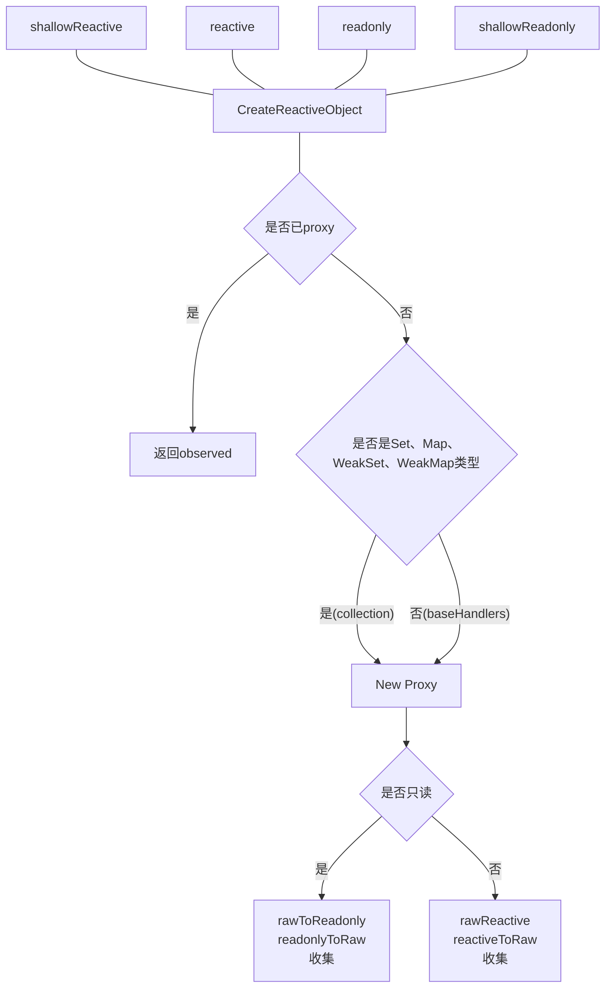
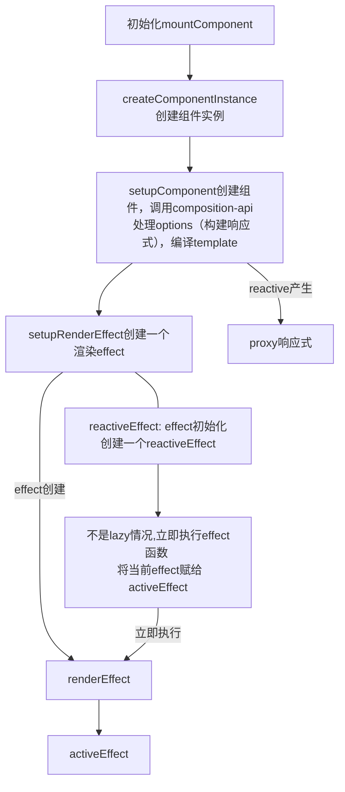
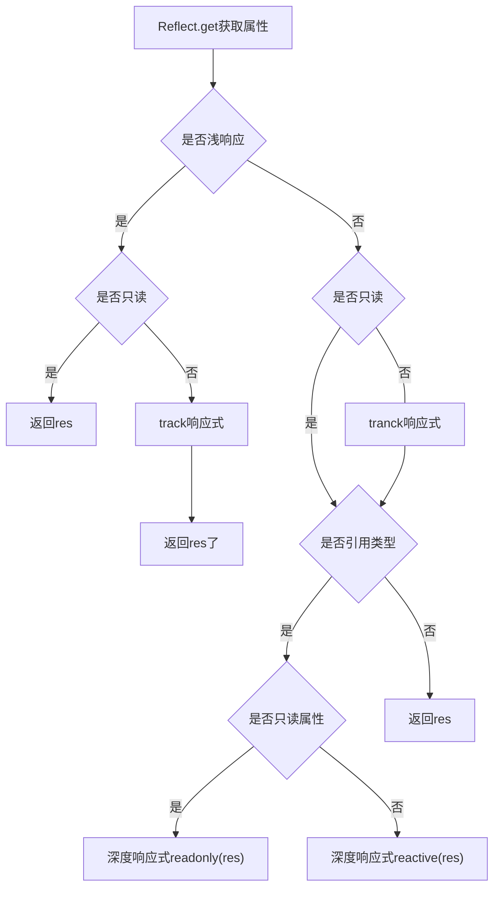

# Vue3.0

* 更好的性能：
* Tree-shaking支持；
* 组合API
* Fragment/Teleport/Susponse
* 更好的ts支持
* 暴露了自定义渲染API

## 1. 特性
### 更好的性能
1. 编译模板的优化

```vue
<div>
    <span />
    <span>{{msg}}</span>
</div>
```
编译成：
```js
import {createVNode as_createVNode, toDisplayString as _toDisplayString, openBlock as _openBlock, createBlock as _createBlock} from "vue";

export function render(_ctx, _code) {
    return (_openBlock(), _createBlock("div", null, [
        _createVNode("span", null, "static"),
        _createVNode("span", null, _toDisplayString(_ctx.msg), 1 /* Text */)
    ]));

}
```
在运行时会生成number（>0）的PatchFlag, 用作标记。
仅带PatchFlag标记节点被追踪，动态节点直接与Block根节点绑定。无需再遍历静态节点。

```js
9 /* Text, Props */ 既有Text变化，又有props变化
```

2. 事件监听缓存：cacheHandlers

```vue
<div>
    <span @click="onClick">
        {{msg}}
    </span>
</div>
```
开启cacheHandlers后:

```js
export function render(_ctx, _cache) {
    return (_openBlock(), _creaateBlock("div", null, [
        _createVNode("span", {
            onClick: _cache[1] || (_cache[1] = $event => (_ctx.onClick($event)))
        }, _toDisplayString(_ctx.msg), 1 /* Text */);
    ]));
}
```
自动生成并缓存一个内联函数，变为静态属性。


### PatchFlag
定义：

```js
export const enum PatchFlags {
    TEXT = 1, // 动态textContent
    CLASS = 1 << 1, // 动态class元素
    STYLE = 1<<2, // 动态样式
    PROPS = 1 << 3, // 动态非类
    FULL_PROS = 1<< 4, 
    HYDRATE_EVENTS = 1 << 5, // 带事件监听
    ...
}
```

### Fragment
render可返回数组了
 

### Teleport
类似之前的`<portal>`


### Composition API

$$
API
\begin{cases}
reactive \\
watchEffect \\
computed \\
ref\\
toRefs\\
hooks
\end{cases}
$$

举个栗子：
```js
import {reactive, computed} from 'vue';
export default {
    setup() {
        const state = reactive({
            a: 0
        });
        function increate() {
            state: a++
        }

        return {
            state,
            increate
        }
    }
}

//...
const double = computed(() => state.a + 3);
```

### 生命周期钩子对比


| vue2.x | vue3.x |
| -------|--------|
|beforeCreate|setup|
|created|setup|
|beforeMount|onBeforeMount|
|mounted|onMounted|
|beforeUpdate|onBeforeUpdate|
|updated|onUpdated|
|beforeDestory|onBeforeUnmount|
|destroyed|onUnmounted|
|errCaptured|onErrorCaptured|


## 2. 响应式原理

### reactive
Proxy：
1. 对属性的添加、删除动作的监听；
2. 对数组基于下标的修改，length修改的检测；
3. 对Map、Set、WeakMap、WeakSet支持；

建立响应式reactive:

$$
reactive 
\begin{cases}
reactive, 返回proxy对象，有递归 \\
shalllowReactive, 只一层响应 \\
readonly: 不可修改 \\
shallowReadonly
\end{cases}
$$

部分源码：
```js
export function reactive(target: object) {
    if (readonlyToRaw.has(target)) {
        return target;
    }
    return createReactiveObject({
        target,
        rawToReactive,
        reactiveToRaw,
        mutableHandlers, // 处理基于类型和引用类型，
        mutableCollectionHandlers // 处理set、map等类型
    });
}

```

```js
const collectionTypes = new Set<Function>([Set, Map, WeakMap, WeakSet]);

function createReactiveObject() {
    target: unknow,
    toProxy: WeakMap<any, any>,
    toRaw: WeakMap<any, any>,
    baseHandlers: ProxyHandler<any>,
    collectionLHandlers: ProxyHander<any>
} {
    // 目标对象是否被effect
    let observed = toProxy.get(target);
    if (observed !== void 0) {
        return observed;
    }
    if (toRaw.has(target)) {
        return target;
    }
    const handlers = collectionTypes.has(target.constructor) ? collectionHanders: baseHanders;
    // 创建响应式对象
    observed = new Proxy(target, handlers);
    toProxy.set(target, observed);
    toRaw.set(observed, target);
    return observed;
}
```



### effect
watcher(2.0) => effect(3.0)

```js
const mountComponent: MountComponentFn = (
    initialVNode,
    container,
    anchor,
    parentComponent,
    parentSuspense,
    isSVG,
    optimized
) => {
    const instance: ComponentIntervalInstance = (initialVNode.component = createComponentInstance(
        initialVNode,
        parentComponent,
        parentSuspense
    ));
    // 建立proxy
    setupComponent(instance);
    // 建立渲染effect，执行effect
    setupRenderEffect(
        instance, // 组件实例
        initialVNode,
        container,
        achor,
        parentSuspense,
        isSVG,
        optimized
    );
}
```

1. 创建component实例；
2. 初始化组件，建立proxy， 得到render函数；
3. 建立一个effect，执行effect；

```js
// 构建渲染effect
const setupRenderEffect: setupRenderEffectFn = (
    instance,
    initialVNode,
    container,
    achor,
    parentSuspense,
    isSVG,
    optimized
) => {
    instance.update = effect(function componentEffect() {
        // ...
    }, {scheduler, queueJob});
}
```
创建一个effect，赋给组件实例的update，作为渲染更新视图用。

```js
export function effect<T = ant>(
    fn: v => T,
    options: ReactiveEffectOptions = EMPTY_OBJ
): ReactiveEffect<T> {
    const effect = createReactiveEffect(fn, options);
    if (!options.lazy) {
        effect();
    }
    return effect;
}

function createReativeEffect<T = any>(
    fn: (...args: any[]) => T,
    options: ReativeEffectOptions
): ReactiveEffect<T> {
    const effect = function reativeEffect(...args: unknow[]): unkonw {
        try {
            enableTracking();
            effectStack.push(effect);
            activeEffect = effect;
            return fn(...args);
        } finally {
            effectStack.pop();
            resetTracking();
            // 将activeEffect还原
            activeEffect = effectStack[effectStack.length - 1];
        } as ReactiveEffect
        // 初始化参数
        effect.id = uid++;
        effect._isEffect = true;
        effect.active = true;
        effect.raw = fn;
        effect.deps = []; // 收集相关依赖
        effect.options = options;
        return effect;
    }
}
```
组件初始化阶段



vue2.0, 响应式在初始化就深层递归处理；  
vue3.0, 获取上一级get之后才触发下一级的深度响应；

### track
track, 找到与当前proxy和key对应的dep，dep与当前activeEffect建立里联系，收集依赖。

依赖收集器：
* targetMap：proxy：depsMapproxy，存放依赖dep的map映射；
* depsMap: deps存放effect的set数据类型

<font color="red">依赖收集，get做了什么？</font>


