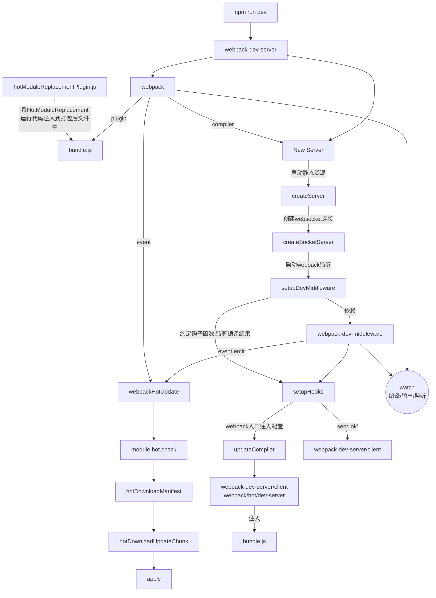

# webpack

## tree-shaking（摇树）
是无用代码移除（DCE, dead code elimination）的一个方法。找出需要的代码，灌入最终的结果。都是依赖ES6 modules的静态特性才得以实现。
静态特性：
* 模块顶层，不能出现在if/function里；
* import的模块名只能是字符串常量；
* 模块初始化时候所有import必须导入完成；
* import binding 是immutable的，类似const

## modules
打包后文件内容"框架"：
```js
(function(modules) {
  var installedModules = {};
  // 模块加载方法, 做了缓存优化
  function _webpack_require_(moduleId) {
    if (installedMudules[moduleId]) {
      return installedModules[moduleId].exports;
    }
    var module = installedModules[moduleId] = {
      i:moduleId,
      l: false,
      exports: {}
    };
    // 通过模块名找对应模块函数并执行
    modules[moduleId].call(module.exports, module, module.exports, _webpack_require_);
    module.l = true;
    return module.exports;
  }
  return _webpack_require_("./src/xx.js");
})({
  "./src/xx.js": (function(module, exports) {
      eval(...)
  })
})
```

Q: webpack中，module，chunk和bundle的区别是什么 ？


A:
1. 一份逻辑代码，都是module；
2. module源文件传到webpack打包，根据引用关系生成chunk文件；
3. 最后输出bundle文件，经过加载和编译的最终源文件，可直接在浏览器中运行。


## loader与plugin？
webpack是一个模块打包器，可以用loader和plugin扩展，基于tapable的插件架构。


### loader
默认情况下，在遇到import或者require加载模块的时候，webpack只支持对js 和 json 文件打包。
webpack中提供了一种处理多种文件格式的机制，这便是Loader。 我们可以把Loader当成一个转换器，它可以将某种格式的文件转换成Wwebpack支持打包的模块。  
我们常见的Javascript、CSS、Less、Typescript、Jsx、图片等文件都是模块，不同模块的加载是通过模块加载器来统一管理的，当我们需要使用不同的 Loader 来解析不同类型的文件。  
多个loader串联使用，执行顺序是最后一个到第一个：
* 最后loader首先调用，参数是source；
* 第一个loader最后调用，返回js代码；
* 中间的loader链式调用；

例如html-minify-loader:

```js
var loaderUtils = require('loader-utils');
// 可获取loader的options
var Minimize = require('minimize');
module.exports = function(source) {
    var options = loaderUtils.getOptions(this) || {};
    var minimize = new Minimize(options);
    return minimize.parse(source);
};
```


### plugin
在webpack运行的生命周期中会广播出许多事件，plugin可以监听这些事，在合适的时机通过webpack提供的API改变输出结果。

```js
class BasicPlugin {
  constructor(options) {
    ...
  }
  // webpack会调用BasicPlugin实例的apply方法
  // 给插件实例传入complier对象
  apply(complier) {
    complier.plugin('compilation', function(complilation) {
      ...
    });
  }
}
module.exports = BasicPlugin;
```
1. 执行new BasicPlugin(options)初始化一个BasicPlugin获得实例；
2. 调用apply给插件实例传入complier对象；
3. 通过complier.plugin(事件名，回调)监听webpack广播事件，通过complier对象操作webpack；
* complier: 包含了options、loaders、plugins、全局唯一，webpack实例；
* complilation:包含当前模块资源、编译生成资源、变化的文件等，开发环境时，一个文件变化 => 一次新的complilation被创建。


webpack通过Tapable的事件流机制，插件只需监听它所关心的事件。
```js
// 广播出事件
complier.apply('event-name', params);
// 监听名为event-name的事件，事件发生触发回调
complier.plugin('event-name', function(params) {});
```

在开发插件是经常需要知道是哪个文件发生了变化导致了新的complilation。
```js
compiler.plugin('watch-run', (watching, callback) => {
  // 获取发生变化的文件列表
  const changedFiles = watching.Complier.watchFilesSystem.watcher.mtimes;
  if (changedFiles[filePaht] !== undefined) {
    // filePath对应的文件发生了变化
  }
  callback();
});
```


### 区别
1. 从概念上
loader 是文件加载器，能够加载资源文件，并对这些文件进行一些处理，诸如编译、压缩等，最终一起打包到指定的文件中；
plugin 赋予了 webpack 各种灵活的功能，例如打包优化、资源管理、环境变量注入等，目的是解决 loader 无法实现的其他事；

2. 运行时机上
loader 运行在打包文件之前；
plugins 在整个编译周期都起作用；


## Tapable机制

webpack本质是一种事件流机制，核心是Tapable。
Tapable：
* complier 编译
* compilation 创建bundles

Tapbale 1.0:
* Sync
    * SyncHook
    * SyncBailHook
    * SyncWaterfailHook
    * SyncLoopHook
* Async
    * AsyncParaller
    * AsyncSeries

即暴露出很多钩子
hook伪代码：
```js
class Hook {
    construtor(args) {
        if (!Array.isArray(args)) args = [];
        // 实例钩子的string变数组
        this._args = args;
        // 消费者
        this.taps = [];
        this.interceptors = [];
        // 以sync类型方式来调用钩子
        this.call = this._call = this._createCompileDelegate("call", "sync");
        this.promise = this._promise = this._createCompileDelegate("promies", "promise");
        this.callAsync = this._callAsync = this._createCompileDelegate("callAsync", "async");
        this._x = undefined;
    }
    _createCall(type) {
        return this.compile({
            taps: this.taps,
            interceptors: this.interceptors,
            args: this._args,
            type
        });
    }
    _createCompileDelegate(name, type) {
        const lazyCompileHook = (...args) => {
            this[name] = this._createCall(type);
            return this[name](...args);
        };
        return lazyCompileHook;
    }
    // 调用tap类型注册
    tap (options, fn) {
        //...
        options = Object.assign({
            type: 'sync',
            fn
        }, options);
        // ...
        this._insert(options);
    }
    // 注册async类型的钩子
    tapAsync(options, fn) {
        //...
        options = Object.assign({
            type: "async",
            fn
        }, options);
        // ...
        this._insert(options);
    }
    // 注册promise类型钩子
    tapPromise(options, fn) {
        //...
        options = Object.assign({
            type: 'promise',
            fn
        }, options);
        this._insert(options);
    }
}
```

每次都是调用tap、tapSync、tapPromise注册不同类型的插件钩子，通过调用call、callAsync、promise方式调用。
按照一定的执行策略执行，调用compile方法快读编译出一个方法来执行插件。


### 1. sync类型的钩子：
插件只按顺序执行；只注册tap;

伪代码：
```js
const fatory = new Sync*CodeFactory();
class Sync* extends Hook {
    tapAsync() {
        throw new Error('topAsync is not supported on a Sync *');
    }
    tapPromise() {
        throw new Error("tapPromise is not supported on a Sync *");
    }
    // 编译按一定策略执行Plugin
    compile(options) {
        factory.setup(this, options);
        return factory.create(options);
    }
}
```

### 2. Async* 类型钩子支持tap、tapPromise、tapAsync注册
伪代码；
```js
class AsyncParallerHook extends Hook {
    construtor(args) {
        super(args);
        this.call = this._call = undefined;
    }
    compile(options) {
        factory.setup(this, options);
        return factory.create(options);
    }
}
```

### 3. 工厂函数Sync*CodeFactory
伪代码：
```js
class Sync*CodeFactory extends HookCodeFactory {
    construtor({onError, onResult, onDone, throwIfProssible}) {
        return this.callTapsSeries({
            onError: (i, err) => onError(err);
            onDone,
            throwIfPossible
        });
    }
}
class HookCodeFactory {
    construtor(ccofig) {
        this.config = config;
        this.options = undefined;
    }
    create(options) {
        this.init(options);
        switch(this.options.type) {
            // 结果直接返回
            case "sync":
                return new Function(this.args(), "\"use strict\"; \n" + this.header() + this.content({
                    //...
                    onResult: result => `return ${result};\n`,
                    // ...
                }));
            // async类型，异步执行，将调用插件执行结果来调用callback
            case "async":
                return new Function(this.args({
                    after: "_callback"
                }), "\"use strict\", \n" + this.header() + this.content({
                    //...
                    onResult: result => `_callback(null, ${result});\n`,
                    onDone: () => "_callbck();\n"
                }));
            // 返回promise类型，将结果放在resolve中
            case "promise":
                //...
                code += "return new Promise((_resolve, _reject) => {\n";
                code += "var _sync = true;\n";
                code += this.header();
                code += this.content({
                    //...
                    onResult: result => `_resolve(${result}), \n`,
                    onDone: () => "_resolve();\n"
                });
                // ...
                return new Function(this.args(), code);
        }
    }
    // callTap执行插件，并将结果返回
    callTap(tapIndex, {onError, onResult, onDone, rethrowIfPossible}) {
        let code = "";
        let hasTapcached = false;
        // ...
        code += `var _fn${tapIndex}=${this.getTapFn(tapIndex)};\n`;
        const tap = this.options.taps[tapIndex];
        switch(tap.type) {
            case "sync":
                // ...
                if (onResult) {
                    code += `var _result${tapIndex}=_fn${tapIndex}(${this.args({
                        before: tap.context ? "_context" : undefined
                    })}); \n`;
                } else {
                    code += `_fn${tapIndex}(${this.args({
                        before: tap.context ? "_context": undefined
                    })});\n`;
                }
                if (onResult) {
                    code += onResult(`_result${tapIndex}`);
                }
                // 通知插件执行完毕，可执行下一个插件
                if (onDone) {
                    code += onDone();
                }
                break;
            // 异步执行，插件运行完再将结果通过执行callback透传
            case "async":
                let cbCode = "";
                if (onResult) {
                    cbCode += `(_err${tapIndex}, _result${tapIndex}) => {\n`;
                } else {
                    cbCode += `_err${tapIndex} =>{\n`;
                }
                cbCode += `if(_err${tapIndex}) { \n`;
                cbCode += onError(`_err${tapIndex}`);
                cbCode += "} else {\n";
                if (onResult) {
                    cbCode += onResult(`_result${tapIndex}`);
                }
                cbCode += "}\n";
                cbCode += "}";
                code += `_fn${tapIndex}(${this.args({
                    before: tap.context ? "_context": undefined,
                    after: cbCodde // cbCode将结果透传
                })});\n`;
                break;
            case "promise":
                ...
        }
        return code;
    }

    // 按插件注册顺序，递归调用执行插件
    callTapSeries({onError, onResult, onDone, rethrowIfPossible}) {
        // ...
        const firstAsync = this.options.taps.findIndex(t => t.type !== "sync");
        const next = i => {
            // ...
            const done = () => next(i+1);
            // ...
            return this.callTap(i, {
                // ...
                onResult: onResult && ((result) => {
                    return onResult(i, result, done, doneBreak);
                });
                // ...

            });
        };
        return next(0);
    }
    // 并行调用插件执行
    callTapParalllel({onError, onResult, onDone, rethrowIfPossible, onTap=(i, run) => run()}) {
        // 遍历注册所有插件，并调用
        for (let i = 0; i < this.options.taps.length; i++) {
            // ...
            code += "if (_counter <= 0) break;\n";
            code += onTap(i, 1) => this.callTap(i, {
                // ...
                onResult: onResult && ((result) => {
                    let code = "";
                    code += "if (_counter > 0) { \n";
                    code += onResult(i, result, done, doneBreak);
                    code += "}\n";
                    return code;
                }),
                // ...
            }), done, doneBreak);
        }
        // ...
        return code;
    }
}
```

### syncBailHook
syncBailHook中一旦某个返回结果不为undefined,结束执行列表中插件

```js
class SyncBailHookCodeFactory extends HookCodeFactory {
    content({onError, onResult, onDone, rethrowIfPossible}) {
        return this.callTapsSeries({
            // ...
            onResult: (i, result, next) => `if (${result} !== undefined {\n
                ${onResult(result)};\n} else {\n
                    ${next(i)}}\n`,
            // ...
        });
    }
}
```

### 调用
```js
const {
    SyncHook,
    SyncBailHook,
    SyncWaterfailHook,
    ...
    AsyncParallelHook,
    AsyncSeriesHook,
    ...
} = requiere("tapable");
class Order {
    construtor() {
        this.hooks = {
            goods: new SyncHook(["goodsId", 'number']),
            consumer: new AsyncParallelHook(['userId', 'orderId'])
        }
    }

    queryGoods(goodsId, number) {
        this.hooks.goods.call(goodsId, number);
    }
    consumerInfoPromise(userId, orderId) {
        this.hooks.consumer.promise(userId, orderId)
            .then(() => {
                // todo
            });
    }
    consumerInfoAsync(userId, ordereId) {
        this.hooks.consumer.callAsync(userId, orderId, (err, data) => {
            // todo
        });
    }
}
// 调用tap方法注册一个consumer
order.hooks.goods.tap('QueryPlugin', (goodsId, number) => {
    return fetchGoods(goodsId, number);
});
order.hooks.goods.tap('LoggerPlugin', (goodsId, number) => {
    logger(goodsId, number);
});

// 调用
order.queryGoods('10000', 1);
```

通过tap添加消费者，通过call来触发钩子的顺序执行。
```js
order.hooks.consumer.tapAsync('LoginCheckPlugin', (userId, orderId, callback) => {
    LoginCheck(usesrId, callback);
});
```
Tapable用法：
* 插件注册数量
* 插件注册类型(sync, async, promise)
* 调用方式(sync, async, promise)


## 原理
本质上是一种事件机制，工作流程即将各个插件串联起来，通过Tapable。
* 负责编译：Complier,包含了webpack环境所有配置信息，全局唯一。整个webpack从启动到关闭的生命周期。
* 负责创建bundles:Compilation，包含了当前模块资源、编译生成资源、变化的文件等。开发模式时，检测到一个文件变化，一个新的compliation被创建。

### webpack 入口文件
```js
const webpack = (options, callback) => {
    // ...
    // 验证options正确性
    // 预处理options
    options = new WebpackOptionsDefaulter().process(options);
    compiler = new Compiler(options.context);
    // 若options.watch === true && callback则开启watch线程
    compiler.watch(watchOptions, callback);
    compiler.run(callback);
    return compiler;
}
```
webpack的编译的钩子调用顺序：
* before-run 清除缓存；
* run 注册缓存数据钩子
* before-compile
* compile 开始编译
* make 从入口分析依赖以及间接依赖模块，创建模块对象
* build-module 模块构建
* seal 构建结果封装，不可再更改
* after-compile 完成构建，缓存数据
* emit 输出到dist目录


### 编译构建流程
伪代码：
```js
class Compliation extends Tapable {
    constructor(compiler) {
        super();
        this.hooks = {
            //
        };
        // ...
        this.compiler = compiler;
        // template
        this.mainTemplate = new MainTemplate(this.outputOptions);
        this.chunkTemplate = new ChunkTemplate(this.outputOptions);
        ...
        this.runtimeTemplate = new RuntimeTemplate(this.outputOptions, this.requestShortener);
        this.moduleTemplates = {
            javascript: new ModuleTemplate(this.runtimeTemplate),
            webassanbly: new ModuleTemplate(...)
        };
        // 构建生成资源
        this.chunks = [];
        this.assets = {};
        this.modules = [];
        ...
    }

    buildModule(module, optional, origin, dependencies, thisCallback) {
        // 调用module.build方法进行编译代码，利用acorn生成AST
        this.hooks.buildModule.call(module);
        module.build(...);
    }
    // 将模块添加到列表中，并编译模块
    _addModuleChain(context, dependency, onModule, callback) {
        // ...
        // 创建模块，利用loader处理文件，生成模块对象
        moduleFactory.create({
            contextInfo: {
                issuer: "",
                compiler: this.compiler.name
            },
            context,
            dependencies: [dependency]
        }, (err, module) => {
                const addModuleResult = this.addModule(module);
                ...
            }
        });
    }
    // 添加入口模块，开始编译代码&构建
    addEntry(content, entry, name, callback) {
        ...
        this._addModuleChain(context, entry, module => {
            this.entries.push(module);

            }
            //...
        );
    }
    // 生成assets资源并保存到Compilation.assets中给webpack
    // 写插件的时候会用到
    createModuleAssets() {
        for (let i = 0; i < this.modules.length; i++) {
            const module = this.modules[i];
            if (module.buildInfo.assets) {
                for(const assetName of Object.keys(module.buildInfo.assets)) {
                    const fileName = this.getPath(assetName);
                    this.assets[fileName] = module.buildInfo.assets[assetName];
                    this.hooks.moduleAsset.call(module, fileName);
                }
            }
        }
    }
}
```


1. 根据配置中的 entry 找出所有的入口文件: 
就开始从Entry入口文件开始读取，主要执行_addModuleChain()函数;
2. build module 完成模块编译
这里主要调用配置的loaders，将我们的模块转成标准的JS模块
在用 Loader 对一个模块转换完后，使用 acorn 解析转换后的内容，输出对应的抽象语法树（AST），以方便 Webpack 后面对代码的分析。
从配置的入口模块开始，分析其 AST，当遇到require等导入其它模块语句时，便将其加入到依赖的模块列表，同时对新找出的依赖模块递归分析，最终搞清所有模块的依赖关系

3. seal 输出资源
seal方法主要是要生成chunks，对chunks进行一系列的优化操作，并生成要输出的代码webpack 中的 chunk ，可以理解为配置在 entry 中的模块，或者是动态引入的模块。根据入口和模块之间的依赖关系，组装成一个个包含多个模块的 Chunk，再把每个 Chunk 转换成一个单独的文件加入到输出列表

4. emit 输出完成
在确定好输出内容后，根据配置确定输出的路径和文件名

```js
class Compiler extends Tapable {
    constructor(context) {
        super();
        this.hooks = {
            beforeRun: new AsyncSeriesHook(["compilation"]),
            run: new AsyncSeriesHook(["compilation"]),
            beforeCompile: new AsyncSeriesHook(["params"]),
            compile: new SyncHook(["params"]),
            make: new AsyncParallerHook(["compilation"]),
            afterCompile: new AsyncSeriesHook(["compilation"]),
            compilation: new AsyncSeriesHook(["compilation", "params"]),
            emit: new AsyncSeriesHook(["compilation"]),
            afterEmit: new AsyncSeriesHook(["compilation"]),
            //...
        };
        // ...
    }
    run(callback) {
        const startTime = Date.now();
        const onCompiled = (err, compilation) => {
            //...
            this.emitAssets(compilation, err => {
                if (err) return callback(err);
                if (compilation.hooks.needAdditionalPass.call()) {
                    compilation.needAdditionalPass = true;
                    const state = new Stats(compilation);
                    state.startTime = startTime;
                    state.endTime = Date.now();
                    this.hooks.done.callAsync(state, err => {
                        if (err) return callback(err);
                        this.hooks.addtionalPass.callAsync(err => {
                            if (err) return callback(err);
                            this.compile(onCompiled);
                        });
                    });
                    return;
                }
            });
        };
        this.hooks.beforeRun.callAsync(this, err => {
            if (err) callback(err);
            this.hooks.run.callAsync(this, err => {
                //...
                this.readRecord(err => {
                    // ...
                    this.compile(onCompiled);
                });
            });
        });
    }
    compile(callback) {
        const params = this.newCompilationParams();
        this.hooks.beforeCompile.callAsync(params, err=> {
            if (err) return callabck(err);
            this.hooks.compile.call(params);
            const compilation = this.newCompilation(params);
            this.hooks.make.callAsync(compilation, err => {
                if (err) return callback(err);
                compilation.finish();
                // make后调用seal生成资源
                compilation.seal(err => {
                    if (err) return callback(err);
                    this.hooks.aftrCompiler.callAsync(compilation, err => {
                        // ...
                        return callback(null, compilation);
                    });
                });
            });
        });
    }
}
```


## 热更新
### 编译过程
第一次, hash值xxx123
第二次：
* 新hash：xxx256
* 新json文件：xxx123.hot-update.json
* 新js文件：index.xxx123.hot-update.js

浏览器发出请求：
* xxx123.hot-update.json
* index.xxx123.hot-update.js

json:
* h: xxx56 (本次新hash)
* c: {index: true} (更新文件对应index模块)

### 热更新原理
#### 1. 启动本地服务
伪代码：
```js
// webpack-dev-server/bin/webpack-dev-server.js

// ...
try {
    compiler = webpack(config);
} catch(err) {
    ...
}
try {
    server = new Server(compiler, options, log);
} catch(e) {
    ...
}

// web-dev-server/lib/Server.js
class Server {
    constructor(compiler, options={}, _log) {
        ...
        this.setupApp();
        ...
        this.createServer();
    }
    setupApp() {
        // 用了express
        this.app = new express();
    }
    createServer() {
        // 假设不用http2
        this.listeningApp = http.createServer(this.app);
    }
    listen(port, hostname, fn) {
        this.hostname = hostname;
        return this.listenApp.listen(port, hostname, (err) => {
            this.createSocketServer();
            // 启动express后启动websocket服务
        });
    }
}
```

1. 启动webpack， 生成compiler实例
2. 使用express启动本地服务，可请求本地资源；
3. 启动websocket服务，建立本地服务与浏览器的双向通信，当本地文件变化，通知浏览器可热更新了


#### 2.修改webpack.config.js的entry配置
* 获取websocket客户端代码路径；
* webpack热更新代码路径；

修改后entry：
```js
{
    entry: {
        index: [
            // client Entry
            'xxx/node-modules/webpack-dev-server/client/index.js?http://localhost:8080',
            // hot Entry
            // 检查更新逻辑
            'xxx/node-modules/webpack/hot/dev-server.js',
            './src/index.js'
        ]
    }
}
```
多了webpack-dev-server/client/index.js
即把websocket客户端代码偷偷塞到开发代码中。

#### 3. 监听编译结束
伪代码
```js
class Server {
    ...
    // 绑定监听事件
    setupHooks() {
        const addHooks = (compiler) => {
            const {compile, invalid, done} = compiler.hooks;
            ...
            // 监听done钩子
            done.tap('webpack-dev-server', (stats) => {
                this._sendStats(this.sockets, this.getStats(stats));
                this._stats = stats;
            });
        }
        ...
        addHooks(this.compiler);
    }
    // 通过websocket给客户端发消息
    _sendStats(sockets, stats, force) {
        ...
        this.sockWrite(sockets, 'hash', stats.hash);
        ...
        this.sockWrite(sockets, 'ok');
    }
}
```

#### 4. 监听文件变化：setupDevMiddleware
即webpack-dev-middleware  
伪代码：

```js
// webpack-dev-middleware/index.js
const content = createContext(compiler, options);
// 通过“momory-fs”打包后写入内存
setFs(context, compiler);
// 添加一系列hooks
context.compiler.hooks.run.tap('WebpackDevMiddleware.invalid');
context.compiler.hooks.done.tap('WebpackDevMiddleware.done');
context.compiler.hooks.watchRun.tap('WebpackDevMiddleware', (comp, callback) => {
    invalid(callback);
})
```

#### 5. 浏览器接收到热更新通知
<font color="red">'xxx/node-modules/webpack-dev-server/client/index.js?http://localhost:8080'</font>  
打包到bundle.js中，运行在浏览器中。伪代码：

```js
var socketMessage = {
    // ...
    hash: function hash(_hash) {
        status.currentHash = _hash;
    }
    // ...
    ok: function ok() {
        sendMessage('ok');
        // 进行更新检查等操作
        reloadApp(options, status);
    }
}
// 连接服务地址socketUrl
socket(socketUrl, onSocketMessage);
```


<font color="red">'xxx/node-modules/webpack/hot/dev-server.js'</font>  
同样打包到bundle.js中， 伪代码：

```js
if (module.hot) {
    ...
    var check = function check() {
        module.hot.check(true)
            .then(function(updateModule) {
                // 容错，直到刷新页面
                if (!updateModule) {
                    ...
                    window.location.reload();
                    return;
                }
                // 热更新结束，打印信息
                if (!lpToDetail()) {
                    check();
                }

                ...
            });
    }
    var hotEmitter = require('./emiter');
    hotEmitter.on('webpackHotUpdate', function(currentHash) {
        lastHash = currentHash;
        check();
    });
}
```

#### 6. HotModuleReplacementPlugin
多了 
```js
var module = installedModule[moduleId] = {
    ...
    hot: hotCreateModule(moduleId),
    ...
};
```
还是塞了很多代码在bundle.js中。

#### 7. module.hot.check开始热更新
* 利用上一次保存的hash，发送请求ajax；
* 请求获取更新模块、下次hash；

即通过jsonp，发送xxx/hash.hot-update.js请求获取的代码直接执行。

```js
window["webpackHotUpdate"] = function(chunkId, moreModules) {
    hotAddUpdateChunk(chunkId, moreModuels);
};

function hotAddUpdateChunk(chunkId, moreModules) {
    for (var moduleId in moreModules) {
        if (Object.prototype.hasOwnProperty.call(moreModules, moduleId)) {
            hotUpdate[moduleId] = moreModules[moduleId];
        }
    }
    // 调用hotApply进行模块的替换
    hotUpdateDownloadod();
}
```

#### 8. hotApply热更替模块
伪代码：

```js
// webpack/lib/HotModuleReplacement.runtime.js
// 1. 删除过期模块
var queue = outdateModule.slice();
while(queue.length) {
    moduleId = queue.pop();
    module = installedModules[moduleId];
    // 从缓存中删除过期模块
    delete outdateDependencies[moduleId];
    outdatedSelfAcceptedModules.push({
        module: moduleId
    });
}

// 2. 新模块添加到modules中
// 3. 通过_webpack_require执行相关模块代码
```




## 问题
Q: webpackPrefetch、webpackPreload和webpackChunkName ？
A: import文件时，以注释形式为chunk取别名。
如果import的时候，添加webpackPrefetch，

```js
await import(/* webpack ChunkName: "lodash" */ /* webackPrefetch: true */ 'lodash');

// 即
<link rel="prefetch" as="script" href="xx.bundle.js" >
```
父chunk完成加载后，webpack在闲时加载lodash文件。
区别：
* preload: chunk在父chunk加载时，并行加载；
* prefetch：chunk在父chunk加载结束后开始加载；
* preload：中等优先级，并立即下载；
* prefetch: 浏览器闲时下载；


Q: hash、chunkHash、contenthash有什么不同？  
A:
* hash: 计算是跟整个项目的构建有关，只改动了某一文件，但文件都是用同一份hash，hash变化，缓存失效。
* chunkHash: 为了解决这个问题，根据入口文件进行依赖解析，构建对应的chunk，生成对应哈希值。

* contentHash: index.js和index.css同一个chunk，index.js变动，index.css没变动，打包后hash均变化，对css文件来说是浪费。利用contenthash, 对资源内容创建出唯一hash。

